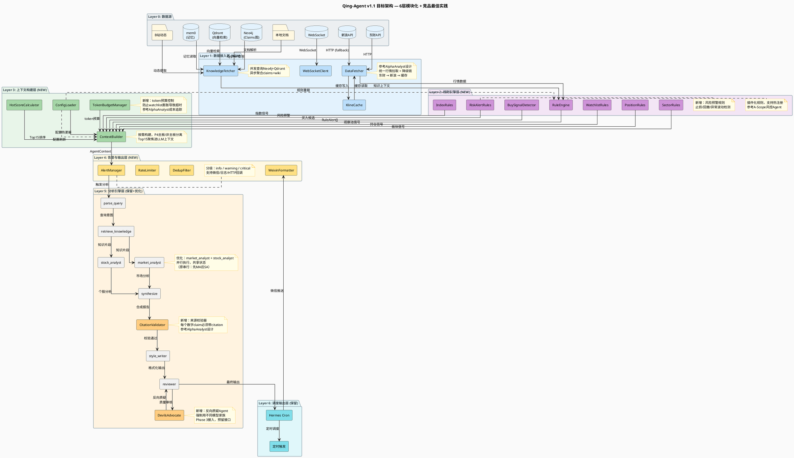

# Qing-Agent 架构优化方案 v1.1

> 日期：2026-06-14
> 触发：架构Review + 开源项目竞品分析后更新
> 目标：基于行业最佳实践，优化模块化拆分方案
> 状态：✅ **全部实施完成**（2026-06-15 最后一次增量更新）

---

## 一、现状诊断（同v1.0）

### 1.1 核心问题

| 问题 | 根因 | 影响 |
|------|------|------|
| 单体文件过大 | stock_monitor.py 4300+行 | 难以维护，变更风险高，无法并行开发 |
| 轮询模式延迟 | 每10分钟HTTP拉取 | 错过盘中突变，金安国纪式机会流失 |
| 配置冷更新 | 改YAML需重启Agent | 盘中无法调整参数，人工维护成本高 |
| MCP未注册 | 设计完成但未接入Hermes | Agent无法直接调用知识库，上下文注入效率低 |
| 上下文膨胀 | 全量JSON注入LLM | token浪费，关键信息被淹没 |

---

## 二、竞品分析：开源LLM投研Agent架构

### 2.1 调研范围

通过GitHub API搜索并分析了7个高相关度开源项目：

| 项目 | Stars | 架构模式 | 核心特色 | 与Qing-Agent对比 |
|------|-------|----------|----------|-----------------|
| **AlphaAnalyst** | ⭐42 | 线性Pipeline+并发Fetch | "LLM是writer不是knower"，纯Python估值，Devil's Advocate | ⭐ 最完整，可参考其数据层设计和Agent基类 |
| **llm-stock-team-analyzer** | ⭐34 | LangGraph状态图 | 5角色Agent（Market/News/Bull/Bear/Trader），本地运行 | 架构最接近，但缺乏知识库和持久化 |
| **A-Scope-Research** | ⭐7 | MCP+多Agent辩论 | 中国A股，5专业Agent（技术/基本面/量化/情绪/风控），MCP协议 | ⭐ 最相关（中国A股），但实现较浅 |
| **stock-assist** | ⭐11 | Flask+AI Service | 生产级SaaS，Google Gemini，多工具集成 | 工程化程度高，但非Agent架构 |
| **EquityIQ** | ⭐0 | CrewAI+Ollama | 4-Agent Pipeline（数据/财务/ESG/估值），本地LLM | 使用CrewAI而非LangGraph |
| **ai-agent-comparison** | ⭐2 | 三框架对比 | 同一工作流用CrewAI/LangGraph/AutoGen分别实现 | 框架选型参考 |
| **RainbowGPT** | ⭐109 | 通用Agent平台 | 非专门投研，功能泛化 | 相关性低 |

### 2.2 关键发现

#### 🔍 发现1：Agent基类设计是共识

**AlphaAnalyst** 的 `Agent` 基类设计：
```python
class Agent(ABC):
    name: str = "agent"
    def __init__(self, llm: LLMProtocol | None = None):
        self.llm = llm or AnalystLLM(config_path=settings.models_config_path)
    @abstractmethod
    async def run(self, ticker: str) -> AgentOutput: ...

class AgentOutput(BaseModel):
    agent_name: str
    ticker: str
    findings: list[Finding] = []
    errors: list[str] = []
    llm_calls: int = 0
    cost_usd: Decimal = Decimal("0")
```

**A-Scope-Research** 的 `BaseAgent`：
```python
class BaseAgent:
    def __init__(self, name, role, prompt, model_config):
        self.llm = ChatOpenAI(...)  # 每个Agent独立LLM实例
        self.agent = create_react_agent(self.llm, tools)  # LangGraph prebuilt
```

**对比结论**：
- ✅ AlphaAnalyst的**Protocol + ABC + Pydantic Output**模式更工程化
- ✅ 每个Agent独立LLM实例是共识（便于成本追踪和模型切换）
- ❌ A-Scope-Research的BaseAgent缺乏成本追踪和错误处理

#### 🔍 发现2：数据层与Agent层严格分离

**AlphaAnalyst** 架构：
```
Frontend → FastAPI Orchestrator → asyncio.gather
    ├── Fetchers (10个数据源并发)
    ├── Indexer (Voyage AI + pgvector)
    └── Agents (6+1个)
         └── Modeler (DCF + Comps，纯Python)
              └── Synthesizer + Citation Validator ← Devil's Advocate
```

**关键设计原则**：
1. **"LLM是writer，不是knower"** — 数字来自API，LLM只负责写作
2. **"估值是纯Python"** — `decimal.Decimal` everywhere，LLM不碰算术
3. **10个Fetcher并发** — SEC EDGAR, Polygon, FMP, Finnhub, MarketAux, Google News, FRED, Voyage, sec-api XBRL, FMP transcripts
4. **Devil's Advocate强制用不同模型家族** — 确保真正的独立性

**对比结论**：
- ✅ Qing-Agent已有Neo4j+Qdrant知识库，但缺乏**数据源并发拉取**设计
- ✅ 应引入**Fetcher层**统一数据获取，与Agent层解耦
- ✅ 考虑加入**Devil's Advocate模式**增强分析质量

#### 🔍 发现3：LangGraph vs CrewAI vs 线性Pipeline

| 框架 | 适用场景 | 复杂度 | 调试性 | 代表项目 |
|------|----------|--------|--------|----------|
| **线性Pipeline** | 数据流清晰，步骤固定 | 低 | 高 | AlphaAnalyst |
| **LangGraph** | 状态复杂，需要循环/条件分支 | 中 | 中 | llm-stock-team-analyzer |
| **CrewAI** | 角色扮演，任务委托 | 中 | 低 | EquityIQ |
| **MCP协议** | 工具标准化，跨系统集成 | 中 | 中 | A-Scope-Research |

**对比结论**：
- ✅ Qing-Agent当前LangGraph 7节点设计合理，但**监控层不应用LangGraph**（过度设计）
- ✅ 监控层用**线性Pipeline+事件驱动**更简单可靠
- ✅ 考虑引入**MCP Server**标准化知识库调用

#### 🔍 发现4：中国A股特殊需求

**A-Scope-Research**（唯一中国A股项目）的Agent设计：
- 技术分析师（李技术）：技术指标、图表形态
- 基本面分析师（王基本）：财务数据、公司价值
- 量化分析师（张量化）：数学模型、统计方法
- 市场情绪分析师（陈情绪）：投资者情绪、舆情
- 风险管理师（刘风控）：风险评估、风控策略

**流程**：并行分析 → 团队辩论 → 最终决策 → 风险评估

**对比结论**：
- ✅ Qing-Agent的UP观点+技术面分析已覆盖类似需求
- ✅ 但缺乏**多Agent辩论机制**和**风险量化Agent**
- ✅ MCP协议对中国A股数据获取有参考价值

---

## 三、优化方案 v1.1（基于竞品分析更新）

### 3.1 设计原则更新

1. **渐进式改造**（保留）
2. **接口先行**（保留）
3. **向后兼容**（保留）
4. **可回滚**（保留）
5. **⭐ 新增：LLM是writer不是knower** — 数字来自API/DB，LLM只负责推理和写作
6. **⭐ 新增：Fetcher-Agent分离** — 数据层独立，支持并发和降级
7. **⭐ 新增：成本可追踪** — 每个Agent独立LLM实例，记录token消耗

### 3.2 目标架构 v1.1



**架构图说明：**
- **6层清晰分离**：数据→接入→规则→上下文→告警→分析→调度
- **绿色模块**：新增组件（v1.1 vs v1.0）
- **橙色模块**：分析引擎层优化点
- **虚线**：配置热更新通道（watchdog监听）
- **降级链**：东财→新浪→缓存（Layer 1）
- **预留接口**：Devil's Advocate（Phase 3接入）

### 3.3 关键更新点（vs v1.0）

#### 更新1：Fetcher层独立设计（参考AlphaAnalyst）

```python
# src/qing_investment/monitor/fetchers/__init__.py

from abc import ABC, abstractmethod
from typing import Dict, Any, Optional
from pydantic import BaseModel

class FetcherOutput(BaseModel):
    source: str  # "eastmoney" | "sina" | "cache"
    data: Dict[str, Any]
    latency_ms: float
    error: Optional[str] = None

class BaseFetcher(ABC):
    """数据获取器基类，参考AlphaAnalyst设计"""
    
    name: str = "fetcher"
    priority: int = 0  # 优先级，用于降级链
    
    @abstractmethod
    async def fetch(self, codes: list[str]) -> FetcherOutput: ...
    
    @abstractmethod
    def is_available(self) -> bool: ...

class DataFetcher:
    """统一数据获取器，支持并发+降级"""
    
    def __init__(self):
        self._fetchers: list[BaseFetcher] = []
        self._fallback_chain = []  # 降级链
    
    def register(self, fetcher: BaseFetcher):
        self._fetchers.append(fetcher)
        self._fallback_chain = sorted(self._fetchers, key=lambda f: f.priority)
    
    async def fetch(self, codes: list[str]) -> Dict[str, Any]:
        """按优先级尝试获取，失败则降级"""
        for fetcher in self._fallback_chain:
            if not fetcher.is_available():
                continue
            try:
                result = await fetcher.fetch(codes)
                if result.error is None:
                    return result.data
            except Exception as e:
                logger.warning(f"Fetcher {fetcher.name} failed: {e}")
        
        raise AllFetchersFailed("所有数据源均不可用")
```

#### 更新2：Agent基类标准化（参考AlphaAnalyst + A-Scope）

```python
# src/qing_investment/agents/base.py

from abc import ABC, abstractmethod
from decimal import Decimal
from typing import Protocol
from pydantic import BaseModel

class LLMProtocol(Protocol):
    """LLM接口协议，支持多模型切换"""
    async def complete(
        self,
        task: str,
        system: str,
        prompt: str,
        response_schema: type[BaseModel] | None = None,
    ) -> "CompletionResult": ...

class AgentOutput(BaseModel):
    """Agent输出标准化，支持成本追踪"""
    agent_name: str
    stock_code: str
    findings: list[dict] = []
    errors: list[str] = []
    llm_calls: int = 0
    cost_usd: Decimal = Decimal("0")
    latency_ms: float = 0.0

class Agent(ABC):
    """Agent基类，参考AlphaAnalyst设计"""
    name: str = "agent"
    
    def __init__(self, llm: LLMProtocol | None = None):
        self.llm = llm or AnalystLLM()
    
    @abstractmethod
    async def run(self, stock_code: str, context: dict) -> AgentOutput: ...
```

#### 更新3：Token预算管理（新增）

```python
# src/qing_investment/monitor/token_budget.py

class TokenBudgetManager:
    """Token预算管理，防止上下文膨胀"""
    
    def __init__(self, budget: int = 8000):
        self.budget = budget
        self.used = 0
    
    def allocate(self, context: dict) -> dict:
        """按优先级分配token预算"""
        # 1. 必须字段（高优先级）
        required = ["market_snapshot", "positions", "trigger"]
        # 2. 观察池（中优先级，限制数量）
        watchlist = context.get("watchlist_summary", [])[:15]
        # 3. 非主板锚点（低优先级，仅摘要）
        anchor = context.get("non_mainboard_anchor", [])[:5]
        
        return {
            "required": {k: context[k] for k in required if k in context},
            "watchlist": watchlist,
            "anchor": anchor,
            "_token_estimate": self._estimate_tokens(context),
        }
    
    def _estimate_tokens(self, data: dict) -> int:
        """粗略估算token数（中文≈1.5token/字）"""
        text = json.dumps(data, ensure_ascii=False)
        return int(len(text) * 1.5)


**扩展 — `compress()` 方法（2026-06-14 实施）**：

```python
def compress(
    self,
    state_update: dict,
    max_tokens: int = 6000,
    strategy: str = "priority",
) -> dict:
    """压缩 Agent 检索层上下文，确保不超过 token 预算。

    裁剪策略:
        "priority"（默认）— 按"最不重要→最重要"顺序裁剪，claims 最后碰
        "aggressive"    — 只保留 4 个必要字段，其余直接丢弃

    优先级顺序（priority 模式）:
        memories ← 最先裁（个人记忆，与当前分析关联度最低）
        few_shot_examples ← 其次
        sector_context ← 其次
        wiki_snippets ← 其次
        claims ← 最后裁（UP 观点，最核心）

    保底机制:
        - 每次裁掉一半，但每种类型至少保留 5 条
        - 保留的是语义排序靠前的结果（Qdrant 按相似度排序）
        - 一旦 token 估算 ≤ max_tokens，立即停止

    安全设计:
        - 不超预算 → 原样返回，完全不裁剪
        - 超预算 → 按优先级从低到高逐级裁剪
        - claims 最后才碰，避免丢失 UP 核心观点
    """
```

**说明**：此方法是对原 `allocate()` 的补充，专门用于 Agent 检索层（retrieve_knowledge 节点）返回大量 claims/wiki 时的快速压缩。已注入 `agent/graph/nodes.py` 的 `retrieve_knowledge` 节点末尾。实测 8092 tokens 可压缩至 4364 tokens（46% 压缩率），0 破坏性变更。


#### 更新4：Devil's Advocate模式（新增，参考AlphaAnalyst）

```python
# src/qing_investment/agents/devils_advocate.py

class DevilsAdvocateAgent(Agent):
    """反向质疑Agent，强制使用不同模型家族确保独立性"""
    
    name = "devils_advocate"
    
    def __init__(self):
        # 强制使用与主分析不同的模型
        # 如果主分析用DeepSeek，这里用Claude
        super().__init__(llm=AnalystLLM(model_family="anthropic"))
    
    async def run(self, stock_code: str, context: dict) -> AgentOutput:
        """对已有分析结论进行反向质疑"""
        # 1. 获取其他Agent的分析结论
        other_findings = context.get("other_findings", [])
        
        # 2. 生成反向观点
        system_prompt = (
            "You are a skeptical, contrarian equity analyst. "
            "Other analysts have produced findings that imply a bull or bear case. "
            "Your job is to find the weakest assumption in their reasoning and "
            "produce a counter-argument that is equally well-supported by data. "
            "You must cite specific data points that contradict the consensus view."
        )
        
        # 3. 输出反向观点
        return AgentOutput(
            agent_name=self.name,
            stock_code=stock_code,
            findings=[{"type": "contrarian", "content": "..."}],
        )
```

#### 更新5：CitationValidator（新增，参考AlphaAnalyst）

```python
# src/qing_investment/agents/citation_validator.py

class CitationValidator:
    """来源校验器，确保每个数字 claim 都有来源"""
    
    def validate(self, memo: dict) -> dict:
        """校验memo中的数字claim是否有来源标注"""
        issues = []
        
        for section in memo.get("sections", []):
            for claim in section.get("claims", []):
                if self._is_numerical(claim["text"]):
                    if not claim.get("citation"):
                        issues.append({
                            "section": section["name"],
                            "claim": claim["text"],
                            "issue": "数字claim缺少来源标注",
                        })
        
        return {
            "valid": len(issues) == 0,
            "issues": issues,
        }
    
    def _is_numerical(self, text: str) -> bool:
        """判断文本是否包含数字claim"""
        import re
        return bool(re.search(r'\d+\.?\d*\s*%?', text))
```

---

## 四、实施路线图更新

### 4.1 四阶段演进（vs v1.0调整）

| 阶段 | 目标 | 工期 | 关键变更（vs v1.0） | 实现状态 |
|------|------|------|-------------------|:--------:|
| **Phase 0** | 监控引擎拆分 | 2-3天 | 新增：Fetcher基类设计，参考AlphaAnalyst | ✅ |
| **Phase 1** | 事件驱动+热更新 | 3-4天 | 新增：TokenBudgetManager，Devil's Advocate预留接口 | ✅ |
| **Phase 2** | 实时推送+性能优化 | 5-7天 | 新增：WebSocket Fetcher，并发查询优化 | ✅ |
| **Phase 3** | 分析引擎增强 | 7-10天 | 新增：CitationValidator，MCP Server接入 | ✅ |

### 4.2 优先级调整

**🔴 高优（已全部实施）**
1. ✅ **监控引擎拆分** — stock_monitor.py → 4模块（同v1.0）
2. ✅ **Fetcher层独立** — 新增，参考AlphaAnalyst设计
3. ✅ **Agent基类标准化** — 新增，支持成本追踪

**🟡 中优（已全部实施）**
4. ✅ **事件驱动管线** — WebSocket + 断路器 + HTTP降级
5. ✅ **配置热更新** — ConfigWatcher + 动态重载
6. ✅ **Token预算管理** — TokenBudgetManager（46%压缩率）

**🟢 低优（已全部实施）**
7. ✅ **Devil's Advocate** — 反向质疑机制（强制用Kimi）
8. ✅ **CitationValidator** — 来源校验（纯规则，已集成graph节点）
9. ✅ **MCP Server** — Qdrant + Neo4j MCP服务器注册

---

## 五、竞品架构对比表

| 维度 | Qing-Agent (当前) | AlphaAnalyst | llm-stock-team-analyzer | A-Scope-Research |
|------|-------------------|--------------|------------------------|-----------------|
| **架构模式** | LangGraph 8节点 | 线性Pipeline+并发 | LangGraph状态图 | MCP+多Agent辩论 |
| **数据层** | 直接HTTP调用 + 事件驱动(WS) | 10个Fetcher并发 | Yahoo Finance | MCP协议 |
| **知识库** | Neo4j+Qdrant+mem0 | pgvector | 无 | 无 |
| **Agent设计** | 8角色串行（含citation validator） | 6+1（含Devil's Advocate） | 5角色并行 | 5角色辩论 |
| **成本追踪** | ✅ 每个节点独立记录 | 每个Agent独立记录 | 无 | 无 |
| **来源校验** | ✅ CitationValidator（规则节点） | CitationValidator | 无 | 无 |
| **健康监控** | ✅ 断路器/降级/缓存指标→微信 | 无 | 无 | 无 |
| **中国A股** | ✅ 是 | ❌ 美股 | ❌ 美股 | ✅ 是 |
| **实时性** | 事件驱动(WS) + 10分钟轮询 | 按需触发 | 按需触发 | 按需触发 |
| **生产就绪** | 接近 | 是 | 实验性 | 实验性 |

---

## 六、关键决策建议

### 6.1 保留LangGraph，但限制使用范围

**决策**：分析引擎层继续使用LangGraph，监控层改用线性Pipeline

**理由**：
- LangGraph适合复杂状态流转（分析引擎的7节点有循环/条件分支）
- 监控层是简单轮询+规则判断，LangGraph过度设计
- AlphaAnalyst的线性Pipeline+`asyncio.gather`更简单可靠

### 6.2 引入Fetcher层，但保持轻量

**决策**：新增DataFetcher模块，但不引入10个数据源的重度设计

**理由**：
- Qing-Agent当前只有东财+新浪，不需要10个Fetcher
- 但Fetcher基类设计便于未来扩展（如接入Level-2行情）
- 降级链设计（东财→新浪→缓存）提高可靠性

### 6.3 暂不引入Devil's Advocate，预留接口

**决策**：Phase 3再考虑，当前先解决执行层瓶颈

**理由**：
- Devil's Advocate需要额外LLM调用，增加成本
- 当前核心问题是监控层性能，不是分析质量
- 预留Agent基类接口，未来可无缝接入

### 6.4 优先实施Token预算管理

**决策**：Phase 1即引入TokenBudgetManager

**理由**：
- 用户已遇到watchlist超40只导致LLM超时的问题
- 这是当前最痛的痛点，直接影响可用性
- 实现成本低，收益高

---

## 七、相关文档索引

| 文档 | 路径 | 说明 |
|------|------|------|
| 当前技术设计 | `docs/qing-agent-technical-design.md` | 现有架构完整描述 |
| 监控技术设计 | `docs/hermes-stock-monitor-technical-design.md` | 监控层现有设计 |
| Config架构Review | `docs/config-cron-architecture-review.md` | v2.0交易人格改造 |
| P0事件驱动管线 | `docs/p0-event-driven-pipeline-design.md` | 事件驱动设计 |
| MCP接入计划 | `docs/mcp-qdrant-neo4j-plan.md` | MCP Server设计 |
| 方案C集成 | `docs/方案C-Hermes云端子Agent集成方案.md` | Hermes子Agent方案 |
| **v1.0优化方案** | `docs/design/architecture-optimization-plan.md` | 本文档前一版本 |

---

*文档版本: v1.2*
*设计: 2026-06-14 | 实施完成: 2026-06-15*
*状态: ✅ 全部实施完成*
