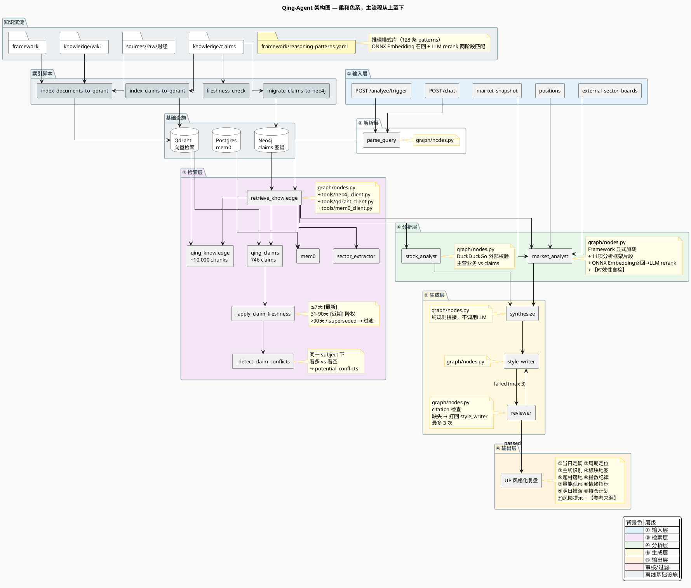

# Qing-Agent 技术设计文档

> 版本: 2026-06-12  (v3)
> 对应 Commit: `当前` (§4.6 指数K线管线 + §4.7 日志系统)
> 最后更新：新增 §4.6 指数多级别K线数据管线（MACD/九转/斐波那契）架构、注入方式、使用边界

---

## 1. 概述

Qing-Agent 是 Hermes 股票监控系统的"大脑"，负责把原始行情数据、博主知识库、外部板块行情统一分析，输出 UP（青枫浦上Q）风格的投资复盘与操作建议。

核心设计原则：
- **数据诚实**：外部数据源不可用时直接报错，不让 LLM 虚空编造板块涨跌
- **多源降级**：板块数据走 "东方财富 → 新浪 → 报错" 的级联 fallback
- **结构化输出**：市场分析强制 JSON，持仓计划带具体价格位
- **UP 人格一致性**：风格化层将专业草稿改写为 UP 口吻，周期自适应语气

---

## 2. 整体架构

Qing-Agent 基于 **LangGraph** 构建有向图工作流，共 7 个节点 + 1 条条件边。



**简化版数据流：**

```
输入层 (Chat/Trigger) ──▶ parse_query ──▶ retrieve_knowledge ──┬──▶ market_analyst ──┐
                                                                   └──▶ stock_analyst ───┼──▶ synthesize ──▶ style_writer ──▶ reviewer ──▶ END
                                                                (时效过滤+矛盾检测)     (UP风格+来源标注)   (citation检查,最多3次打回)
```

**`/chat` 端点数据流**（2026-06-12 修正 — 不走 LangGraph 流水线，是独立的检索→构建→LLM 流程）：

```
用户消息
    │
    ├── mem0 记忆检索：mem0.search(message, session_id)
    │   （获取用户历史上下文）
    │
    ├── Qdrant 语义检索：qing_knowledge(wiki 8条) + qing_claims(8条)
    │   （向量语义检索 wiki 文档和 claims）
    │
    ├── Neo4j 图遍历检索：
    │   ├── 如消息含股票代码 → get_claims_with_evolution(code)（图遍历，含演化关系）
    │   ├── 无代码但有板块关键词 → get_claims_by_keyword(keyword)（关键词匹配）
    │   └── 图遍历补充：get_related_claims(claim_id)（共享实体发现关联 claims）
    │
    ├── 实时数据获取：
    │   ├── 指数行情（上证/深证/创业板/科创50）
    │   ├── 板块数据（东财/新浪，如查询与板块/市场相关）
    │   ├── 个股实时价（如匹配到股票代码）
    │   ├── 90日 K线 + 当日分时（如个股查询）
    │   └── 持仓匹配（positions.yaml 中匹配标的）
    │
    ├── 时效过滤 + 分组：
    │   ├── apply_claim_freshness() 按天数打时效标签
    │   ├── 方法论类 claim 不分时效 → 独立块
    │   ├── 最新(≤7天) / 近期(8-30天) / 历史(31-90天) 三级分组
    │   └── 个股查询时过滤 low intensity claim
    │
    ├── Prompt 组装（六步分析框架，hardcode 在 main.py）：
    │   ① 市场周期判断 → ② 板块主线判断 → ③ 个股地位判断 →
    │   ④ UP 历史引用（时效配对数据）→ ⑤ 技术面+资金面 → ⑥ 证伪条件
    │
    ├── 直接调用 LLM：llm.invoke(prompt)
    │   （⚠️ 不走 graph.ainvoke，无 synthesize/style_writer/reviewer 节点）
    │
    └── ChatResponse {reply, memories_used}
```

**核心区别**：/chat 不走 LangGraph 流水线，不经过 market_analyst/stock_analyst 等节点。是一个独立的"检索+构建+LLM"流程，prompt 中的六步框架直接嵌入 main.py 代码中，不依赖任何 prompt 模板文件。

**`/analyze/trigger` 端点数据流**（Hermes cron 调用）：

```
stock_monitor.py --agent-json-context
    │  {trigger, alerts, buy_signal_candidates, market_snapshot, positions, watchlist, sector_strengths, external_sector_boards}
    ▼
Qing-Agent /analyze/trigger
    │
    ├── 1. parse_query ──▶ analysis_type=market/stock/portfolio
    │
    ├── 2. retrieve_knowledge ──▶ Qdrant: qing_knowledge(wiki 10条) + qing_claims(12条)
    │       mem0: user_memories(2条)
    │       sector_extractor: sector_context(3条，若有)
    │       [_apply_claim_freshness] 时效过滤
    │       [_detect_claim_conflicts] 矛盾检测
    │
    ├── 3. market_analyst ──▶ 核心分析节点（必走）
    │       ├── 板块数据可用性守卫（external_sector_boards.available=false
    │       │   → 不再拒绝分析，注入 _data_missing_note 继续，LLM基于知识库降级）
    │       ├── Framework 显式加载 + 11项分析框架片段
    │       ├── 推理模式匹配（ONNX Embedding召回Top5 → LLM rerank Top1-3）
    │       ├── watchlist_entry_zones 注入（Phase 8 新增：从watchlist提取price_range
    │       │   + method+confirm_signal，供机会扫描附价格区间，禁模糊表述）
    │       ├── 行情截断：quotes>50只保留指数+持仓/观察池+涨跌幅TOP15
    │       └── 输出 market_context JSON + 持久化 daily_state.json
    │
    ├── 4. synthesize ──▶ 拼接草稿，注入【参考来源】、持仓操作计划
    │
    ├── 5. style_writer ──▶ UP 口吻风格化（人格 prompt + 口头禅）
    │
    ├── 6. reviewer ──▶ 事实核查、禁用词检测、citation 检查
    │       └── 不通过 → 回 style_writer（最多 3 次）
    │
    └── 7. TriggerResponse {final_output, claims_cited, data_sources, confidence, review_passed}
    │
    └── hermes_stock_monitor_agent.py 收到 final_output → 微信推送
        若 Qing-Agent 不可达 → fallback: stock_monitor.py --agent-context-on-trigger（纯文本 LLM 降级）
```

**与 `/chat` 的核心区别**：

| 维度 | `/analyze/trigger` | `/chat` |
|------|-------------------|---------|
| 调用方 | Hermes cron（`stock_monitor.py` 采集的结构化数据） | 用户直接对话 |
| 输入来源 | `stock_monitor.py --agent-json-context` 输出的 JSON | 自然语言文本 |
| 记忆检索 | 不查询 mem0 用户记忆 | 查 mem0 + Neo4j 图遍历 |
| 板块数据 | 外部传入 `external_sector_boards`（必填） | Agent 自行实时获取 |
| 实时行情 | 传入 `market_snapshot` 快照 | Agent 自行抓取 |
| daily_state | 写入 `config/stock_monitor/daily_state.json` | 不写入 |
| 降级路径 | Qing-Agent 离线 → 纯文本 LLM fallback | 无降级，直接报错 |

| 节点 | 职责 | 是否调用 LLM |
|------|------|-------------|
| `parse_query` | 意图解析：提取 stock_code / analysis_type / urgency | ✅ |
| `retrieve_knowledge` | 从 Neo4j/Qdrant/mem0 检索知识 | ❌（本地查询） |

**检索层详解**（2026-06-06 升级后）：

```
query ──▶ Neo4j (claims 图遍历) ──┐
         Qdrant (wiki+claims 语义) ──┼──▶ AgentState (claims, wiki_snippets, sector_context,
         mem0 (memory) ──────────────┘        external_sector_boards, memories)
```

**Neo4j 图查询**（个股查询时）：
- `get_claims_with_evolution(stock_code)` → 返回该股票的所有 claims，包含：
  - `supersedes`: 该 claim 取代了哪些旧观点
  - `superseded_by`: 该 claim 被哪些新观点取代
  - `contradicts`: 与该 claim 矛盾的观点
- 比关键词匹配更精准，避免"中国石油"等噪音

**Qdrant 向量检索**（所有查询）：
- `qing_knowledge`: wiki + framework + raw 文档的语义检索
- `qing_claims`: claims 的语义检索（与 Neo4j 结果合并去重）
| `market_analyst` | 大盘/板块维度分析，输出结构化 JSON | ✅ |
| `stock_analyst` | 个股地位、多空证据、触发/失效条件 | ✅ |
| `synthesize` | 将 market + stock 分析合成为统一草稿 | ❌（规则拼接） |
| `style_writer` | 改写为 UP 口吻，注入人格特征 | ✅ |
| `reviewer` | 事实核查：禁用词检测、claims 引用验证 | ✅ |
| `review_router` | 审核通过则 END，不通过则回写 style_writer（最多 3 次） | ❌ |

> **⚠️ reviewer 局限性**（2026-06-11 补充）：reviewer 不做数值事实核查。它只验证禁用词、claim ID 引用和【参考来源】段落是否存在。🟡 不检查价格准确性，🟡 不检查数据时效性，🟡 不交叉验证事实声明。数值和时效性保护由 Hermes 集成层的 Fix A/B/C 承担（见 §4.5 幻觉防御层）。

---

## 3. 各节点详解

### 3.1 parse_query

**输入**: `query` (用户原始问题或 Hermes 触发标题)  
**输出**: `parsed_intent` JSON

```json
{
  "stock_code": "300394",
  "analysis_type": "stock",
  "urgency": "scheduled",
  "focus": "分析一下天孚通信"
}
```

- `analysis_type` 决定后续分析路径：
  - `stock` → 走 `stock_analyst`
  - `market` / `portfolio` → 跳过 `stock_analyst`，纯市场分析

### 3.2 retrieve_knowledge

**知识库四层架构**（2026-06 升级后）：

| 存储 | 内容 | 用途 | 检索方式 |
|------|------|------|---------|
|| **Qdrant `qing_knowledge`** | 499 文件 → ~10,000 chunks（wiki + framework + raw） | 向量语义检索原始文档和方法论片段 | ONNX 语义嵌入（512维），按来源类型 boost 排序 |
|| **Qdrant `qing_claims`** | 746 claims 的语义向量索引 | claims 语义搜索（替代原 `CONTAINS` 字符串匹配） | ONNX 语义嵌入 |
| **Neo4j** | claims 图数据库（节点+关系） | 按股票代码精确查询、关联 claims 遍历 | Cypher 查询 |
| **mem0** | 本地记忆（框架 + 活跃 claims） | 长期方法论上下文 | 关键词匹配 |

**来源类型 Boost 排序**（Phase 3 新增）：
检索后对 wiki_snippets 按来源路径加权，确保高可信度内容优先：

| 来源前缀 | Boost |
|----------|-------|
| `framework/` | +0.15 |
| `wiki/投资方法论` | +0.10 |
| `wiki/市场分析` | +0.05 |
| `sources/raw` | +0.00 |

**Claims 双索引策略**（Phase 3.3 新增）：
1. **向量召回**：用 Qdrant `qing_claims` 做语义搜索，召回相关 claims
2. **图验证**：用 Neo4j 查召回 claims 的关联 claims（同一主题、同一股票）
3. **时效衰减过滤**（P0 新增）：
   - ≤7 天：标 `[最新]`，优先使用
   - 8-30 天：正常展示
   - 31-90 天：标 `[近期]`，降权使用
   - >90 天 或 `superseded`：**直接过滤**，不返回给 Agent
   - 按 `days_ago` 排序，最新的 claim 排最前
4. **同一主题矛盾检测**（P1 新增）：
   - 按 `subject` 分组，检测同一组内是否存在方向相反的 active claims
   - 方向词表：`_BULLISH_WORDS`（看多/主线/加仓等）vs `_BEARISH_WORDS`（看空/回避/减仓等）
   - 若检测到矛盾，在 `potential_conflicts` 中列出矛盾 claims 的 ID、日期和方向
   - Agent 在 prompt 中被要求必须处理这些矛盾，给出判断依据

**动态板块提取** (`sector_extractor.py`)：
- 扫描 `sources/raw/财经/` 最近 3 天文档
- 命中预定义板块关键词（光互连/CPO、半导体、PCB 等 13 个板块）
- 对识别出的 Top-K 板块调用 DuckDuckGo 搜索最新新闻

**外部板块数据** (`sector_data.py`)：
- 从 state 透传 `external_sector_boards`（见第 5 章）

### 3.3 market_analyst

**核心逻辑**：
1. **可用性检查**：`analysis_type` 为 `market`/`portfolio` 时，若 `external_sector_boards.available == false`，注入 `_data_missing_note` 降级说明，LLM 基于知识库继续分析（不再拒绝生成）
2. **Framework 显式加载**（Phase 1 新增）：根据 `analysis_type` 从 `framework/` 目录加载对应的 playbook 文件（如 `market-cycle-framework.md`、`sector-diffusion-framework.md`），截断到 4000 字符注入 prompt
3. **推理模式匹配**（Phase 4 新增）：通过 `_load_reasoning_patterns()` 从 `framework/reasoning-patterns.yaml`（128 条 patterns）中匹配当前分析主题。使用 ONNX Embedding 召回 Top 5 → LLM rerank Top 1-3 的两阶段匹配，注入 prompt context
4. **动态分析框架片段**（Phase 3 新增）：通过 `_load_analysis_framework()` 加载 `market_analysis_framework.txt` 中的 11 项分析框架，替换 prompt 中的 `{analysis_framework}` 占位符
5. **Prompt 截断**：`market_snapshot.quotes` 超过 50 条时，只保留指数 + 持仓/观察池 + 涨跌幅 TOP15，减少 token
6. **时效性自检**（P0 新增）：prompt 强制要求 Agent 检查 claim 的 `freshness_label`，标注过时观点，处理 framework 与实时数据的矛盾
7. **强制 JSON 输出**：包含以下字段

```json
{
  "market_summary": "当日定调",
  "market_phase": "回暖期",
  "phase_reasoning": "...",
  "main_themes": ["PCB", "MLCC"],
  "sector_map": {
    "主攻层": [{"name": "...", "status": "...", "key_stocks": [], "logic": "..."}],
    "上游层": [...],
    "防御层": [...],
    "其他": []
  },
  "themes_in_focus": [{"theme": "...", "catalyst": "...", "risk": "..."}],
  "index_discipline": {"support": "4033", "resistance": "4130", ...},
  "volume_note": "...",
  "emotion_signals": {"涨停": 50, "跌停": 8},
  "tomorrow_watch": [...],
  "position_plans": [
    {
      "code": "600246.SH",
      "name": "万通发展",
      "trigger": "站稳19元持有",
      "invalidation": "跌破18.5元减仓",
      "position_advice": "5-6成"
    }
  ],
  "risk_notes": "...",
  "citations": ["claim-xxx", "sources/raw/财经/..."]
}
```

**板块结构地图的数据来源优先级**：
1. `external_sector_boards`（东方财富/新浪完整板块涨跌）
2. `sector_context`（UP  raw 文档动态 + 网络新闻）
3. `sector_strengths`（项目内部持仓相关板块，样本量小，仅作持仓参考）

### 3.4 stock_analyst

**触发条件**：`analysis_type == "stock"` 且 `stock_code` 存在。

**外部标的业务校验**（P2 新增）：
1. `_get_stock_name()` 从 `market_snapshot.quotes` 或 `watchlist` 中提取股票名称
2. `_fetch_stock_external_info()` 用 DuckDuckGo 搜索 `{股票名} {代码} 主营业务 最新`
3. 搜索结果作为 `external_validation` 注入 prompt
4. Agent 被强制要求：如果 claims 中对标的的描述（如"CPO 龙头"）与外部搜索结果不一致，必须指出不一致并说明判断依据

输出 JSON 包含：
- `stock_role`: 龙头/中军/跟风/独立
- `bullish_evidence` / `bearish_evidence`: 多空证据列表
- `trigger_conditions` / `invalidation_conditions`: 触发与失效条件
- `technical_position`: 技术位置描述

**market/portfolio 查询自动跳过**，避免浪费 LLM token。

### 3.5 synthesize

**纯规则拼接，不调用 LLM**，确保速度和确定性。

- **个股模式** (`stock` 分支)：组合 `market_context` + `stock_analysis`，追加持仓计划
- **市场模式** (`market`/`portfolio` 分支)：组合板块地图、题材落地、指数纪律、量能观察、情绪信号、明日跟踪、风险提示

**【参考来源】注入**（Phase 3 新增）：
synthesize 在 draft 末尾追加【参考来源】段落，包含：
- `market_context.citations` 中引用的 claim IDs 和 wiki 路径
- `framework_rules` 中使用的 playbook 文件名
- 格式：`\n\n【参考来源】\n- claim-xxx\n- framework/market-cycle-framework.md\n- ...`

**持仓计划注入**：
- 从 `market_context.position_plans` 提取
- 按持仓股逐条输出：触发条件 / 失效条件 / 仓位建议
- 若 LLM 未生成 plan，fallback 为"待补充"占位

### 3.6 style_writer

**UP 人格注入**：
- 口头禅："不见长虹不回头"、"先把弹药留出来"
- 周期自适应语气：
  - 冰点期 → 安抚鼓励
  - 回暖期 → 谨慎乐观
  - 高潮期 → 劝退警示
  - 退潮期 → 收缩防御

**持仓处理规则**：
- 每日复盘 **必须包含**【持仓操作计划】
- 使用具体价格位（如"站稳19元"、"跌破18.5元且30分钟不收回应减仓"）
- 禁止无条件"买入"/"卖出"指令

**数据诚实规则**：
- 草稿中标注"数据不可用"的板块必须保留，不得编造

### 3.7 reviewer + review_router

**审核维度**：
- 禁用词检测（"无条件买入"、"一定涨"等）
- claims 引用验证（输出中引用的 claim ID 是否在检索列表中）
- **citation 完整性检查**（Phase 3 新增）：检查输出是否包含【参考来源】段落。若缺失，标记 `review_passed = false`，将 `review_notes` 回写至 `style_writer`，要求补充来源标注。最多打回 **3 次**。

**路由逻辑**：
- `review_passed == true` → END
- `review_passed == false` 且 `_retry_count < 3` → 回写 `review_notes` 到 `style_writer`
- `_retry_count >= 3` → 强制 END（避免死循环）

---

## 4. 数据流详解

### 4.1 输入层 (AgentState)

| 字段 | 来源 | 说明 |
|------|------|------|
| `query` | 用户输入 / Hermes 触发标题 | 分析意图 |
| `trigger` | Hermes | 触发类型、时间、原因 |
| `alerts` | Hermes 规则引擎 | 风控/减仓/板块轮动信号 |
| `market_snapshot` | Hermes 行情接口 | 实时行情快照（quotes 会被截断） |
| `positions` | Hermes `positions.yaml` + 实时 quote | 持仓列表，含 `latest` / `pct_change` |
| `watchlist` | Hermes `watchlist.yaml` | 观察池标的及条件 |
| `sector_strengths` | Hermes 内部板块计算 | 项目定义的 sector_groups 涨跌 |
| `external_sector_boards` | `sector_data.py` | 东财/新浪完整板块数据 |

### 4.2 检索层

```
query ──▶ Neo4j (claims) ──┐
         Qdrant (wiki) ────┼──▶ AgentState (claims, wiki_snippets, sector_context,
         mem0 (memory) ────┘        external_sector_boards, memories)
```

### 4.3 分析层

```
claims + wiki + sector_context + external_sector_boards + market_snapshot +
reasoning_patterns (Phase 4: ONNX Embedding 召回 Top 5 → LLM rerank Top 1-3)
    ──▶ market_analyst ──▶ market_context (JSON)

claims + wiki + positions
    ──▶ stock_analyst ──▶ stock_analysis (JSON)
```

### 4.4 生成层

```
market_context + stock_analysis + position_plans
    ──▶ synthesize ──▶ draft_analysis (结构化文本)

draft_analysis + tone + examples
    ──▶ style_writer ──▶ styled_output (UP 口吻)

styled_output + claims
    ──▶ reviewer ──▶ final_output (审核后文本)
```

### 4.5 幻觉防御层（2026-06-11 新增）

LLM 固有幻觉可能导致价格错误、时间错误、事实错误。Hermes 集成层和输入层建立三层拦截，详见独立文档 [`docs/hallucination-defense-layers.md`](hallucination-defense-layers.md)：

| 层级 | 名称 | 位置 | 职责 | 效果 |
|------|------|------|------|------|
| Fix A | 输出侧拦截 | `scripts/hermes_stock_monitor_agent.py` | 检测年份幻觉（2025），走 fallback | ✅ 拦截 2025 年季报 |
| Fix B | 输入侧注入 | `stock_monitor.py` `_agent_context_data()` | Watchlist 注入 `latest/pct_change` | ✅ LLM 不再记忆旧价 |
| Fix C | Prompt 约束 | `stock_monitor.py` `format_*_context()` | 显式"实时价优先"指令 | ✅ 防止 LLM 忽略实时数据 |

**防御链**：

```
LLM 输出 → Fix A [年份检测] → 通过 → Fix B [含实时价的上下文] → Fix C [优先级指令] → 微信推送
                  │ 失败
                  ▼
          fallback: 本机 LLM + 实时行情
```

**与 §3.7 reviewer 的关系**：

| 层 | 位置 | 检查范围 | 异常处理 |
|----|------|---------|---------|
| Fix A | Hermes wrapper | 年份幻觉 | 丢弃输出，走 fallback |
| Fix B+C | Hermes 上下文构造 | 价格准确性（提供数据+约束） | LLM 不强制遵守）
| Reviewer | Qing-Agent | 风格/引用合规 | 回 style_writer 重写 |

**缺口**：Fix A 只检测年份幻觉，缺少通用事实校验层。

### 4.6 指数多级别K线数据管线（MACD/九转/斐波那契）— 2026-06-12 新增

#### 4.6.1 为什么需要

UP（青枫浦上Q）的大盘分析方法论核心之一是多级别顶底结构判断：
- **MACD 多级别背离/金叉/死叉** → 判断大盘的顶底结构（日线/120min/90min/60min/30min）
- **神奇九转（TD Sequential）** → 判断涨跌持续时间，辅助MACD确认顶底（高9/低9）
- **斐波那契数列** → 判断时间窗口是否到位（8/13/21/34/55交易日）

这些数据**只用于大盘（全A指数/上证指数）顶底判断，不用于个股分析**。个股技术分析使用：成交量、换手率、支撑位、压力位、K线形态、分时图。

#### 4.6.2 数据管线架构

```
┌─────────────────────────────────────────────────────────────────┐
│ 数据源：东方财富 API (push2.eastmoney.com)                       │
│ klt=30 (30分钟) / 60 (60分钟) / 120 (120分钟) / 101 (日线)       │
│ secid=1.000001 (上证) / 1.000985 (中证全指)                      │
└───────────────────────────┬─────────────────────────────────────┘
                            │ pre_fetch (每天06:30) + 盘中增量 (每30min)
                            ▼
┌─────────────────────────────────────────────────────────────────┐
│ SQLite 缓存层：infra/data/kline_cache.db                         │
│ 表 index_klines: (code, timeframe, bar_time, O/H/L/C, volume,   │
│                   dif, dea, macd_hist)                           │
│ 90分钟由3根30分钟K线合并（东财不支持原生klt=90）                  │
│ 规模：4指数 × 5时间级别 × ~160根K线 = 2,428+ 条                  │
└───────────────────────────┬─────────────────────────────────────┘
                            │ 读取
                            ▼
┌─────────────────────────────────────────────────────────────────┐
│ 读取层：kline_cache.py                                           │
│                                                                  │
│ format_multi_tf_macd_report()  → 精简MACD快照（536字符）          │
│   - 每个指数一行：{级别}{柱方向}(DIF值)，五级别紧凑排列              │
│   - 中证全指日线+60分钟各最近5根详细                               │
│   - 默认只处理 sh000001(上证) + sh000985(全A)，不分析深证/创业板   │
│                                                                  │
│ calculate_td_sequential_multi_tf()  → TD9报告                     │
│   - 五级别（日线/120min/90min/60min/30min）的TD9买/卖信号          │
│   - 包含当前计数和状态                                              │
│                                                                  │
│ calculate_fibonacci_time_window()  → 斐波那契时间窗口报告          │
│   - 从最近高/低点计算距8/13/21/34/55交易日的差值                   │
│   - 标记到期的窗口                                                 │
└───────────────────────────┬─────────────────────────────────────┘
                            │ 注入 AgentState
                            ▼
┌─────────────────────────────────────────────────────────────────┐
│ Agent 上下文注入：graph/nodes.py market_analyst 节点              │
│                                                                  │
│ macd_multi_tf_report   →  str  (精简MACD快照)                     │
│ td_sequential_report   →  str  (九转报告)                         │
│ fibonacci_time_report  →  str  (斐波那契时间窗口)                 │
│                                                                  │
│ 三个字段注入到 AgentState，market_analyst 节点通过 prompt          │
│ 中的 Step 2（多级别顶底结构）使用这些数据。                          │
└───────────────────────────┬─────────────────────────────────────┘
                            │ LLM 使用约束
                            ▼
┌─────────────────────────────────────────────────────────────────┐
│ Prompt 层（使用边界约束）                                         │
│                                                                  │
│ market_analysis_framework.txt Step 2 — 大盘分析框架：             │
│   "⚠️ MACD/九转/斐波那契数据只用于大盘（全A/上证）顶底判断"         │
│   "个股技术分析用：成交量/换手率/支撑位/压力位/K线形态/分时图"       │
│   "MACD/九转/斐波那契分析结果不是独立段落，融入【综合判断】中"       │
│                                                                  │
│ stock_analyst.txt 技术位置分析 — 个股分析框架：                   │
│   "⚠️ 严禁在个股分析中使用MACD/九转/斐波那契"                     │
│   "个股技术分析使用：成交量、换手率、支撑位、压力位、K线形态、分时图"  │
└─────────────────────────────────────────────────────────────────┘
```

#### 4.6.3 文件清单与链接

| 文件 | 职责 | 说明 |
|------|------|------|
| [`src/qing_investment/kline_cache.py`](../../src/qing_investment/kline_cache.py) | K线缓存+MACD计算+九转+斐波那契 | 核心数据层，包含所有读取和计算函数 |
| [`src/qing_investment/agent/graph/nodes.py`](../../src/qing_investment/agent/graph/nodes.py) | Agent节点实现，注入三个数据字段 | 搜索 `macd_multi_tf_report` / `td_sequential_report` / `fibonacci_time_report` 定位注入点 |
| [`scripts/qing_pre_fetch_klines.py`](../../scripts/qing_pre_fetch_klines.py) | 开盘前预拉取脚本 | cron `30 6 * * 1-5` |
| [`scripts/update_index_klines_intraday.py`](../../scripts/update_index_klines_intraday.py) | 盘中增量更新脚本 | cron `*/30 9-15 * * 1-5` |
| [`prompts/system/market_analysis_framework.txt`](../../src/qing_investment/agent/prompts/system/market_analysis_framework.txt) | 大盘分析框架（Step 2规则+边界） | 含MACD/九转/斐波那契判断规则及使用边界说明 |
| [`prompts/system/stock_analyst.txt`](../../src/qing_investment/agent/prompts/system/stock_analyst.txt) | 个股分析prompt | 含明确禁止MACD/九转的条款 |
| [`prompts/system/market_analyst.txt`](../../src/qing_investment/agent/prompts/system/market_analyst.txt) | 市场分析主prompt | 所有市场分析最终都由这个节点执行 |

#### 4.6.4 数据使用规则（严格约束）

1. **适用范围**：MACD/九转/斐波那契 → 仅用于**全A指数(000985)和上证指数(000001)**的顶底判断
2. **格式要求**：分析结果**不独立成段**（如单独的【MACD结构】段落），必须融入大盘判断的综合结论中
3. **个股禁用**：个股分析使用 成交量/换手率/支撑位/压力位/K线形态/分时图，**严禁使用MACD**
4. **数据量**：MACD报告已压缩至 536 字符（五级别快照+日线+60min详），直接注入 LLM 上下文免LLM自行计算
5. **仅两个指数**：深证成指、创业板指不做多级别MACD分析——只分析上证和中证全指

#### 4.6.5 关键实现细节

**90分钟数据合成**（东财不支持原生klt=90）：
- 取最近3根30分钟K线（klt=30）
- 合并规则：O=第一根O, H=三根max(H), L=三根min(L), C=最后一根C, V=三根sum(V)
- MACD 用最后一根30分钟的数据代表

**每日数据更新时序**：
1. 06:30 — 预拉取：全量拉取5指数×4时间级别×~160根K线
2. 09:30~15:00 — 盘中增量（每30分钟）：只拉取最新数据，INSERT OR REPLACE 去重
3. MACD 在写入时由 SQLite 存储，读取时不再重复计算

#### 4.6.6 后续扩展方向

- 增加60分钟级别TD9的94%柱线信号过滤（当前只有9转基础计数）
- 增加全A日线级别的双低9统计（已有基础数据）
- 跨指数MACD背离比较（全A vs 上证分化判断）

### 4.7 日志系统（Phase 8 新增 — 2026-06-12）

**位置**：`main.py` 启动时配置 RotatingFileHandler → `logs/qing-agent.YYYY-MM-DD.log`
**轮转**：按天轮转，保留30天。`logs/.gitignore` 已有保护不提交。

**关键节点日志**：

| 节点 | 日志内容 | 定位 |
|------|---------|------|
| `market_analyst` | framework加载数、推理模式匹配数、claims过滤统计、watchlist_entry_zones注入数 | 追踪数据源是否正常注入 |
| `synthesize` | has_stock/positions/opportunity_scan/themes数量 | 检查各节点产出是否为空 |
| `style_writer` | draft长度、market_phase、has_vague_terms模糊词标记、review_round | 定位观察池模糊表述问题 |
| `main.py` | 服务启动、日志初始化路径 | 确认日志系统工作 |

**环境变量**：
- `QING_AGENT_LOG_LEVEL=DEBUG` — 开启模块级 DEBUG 日志（`nodes`, `builder`, `llm_client`, `neo4j_client`, `qdrant_client`）

---

## 5. 板块数据源设计（核心）

### 5.1 为什么需要外部板块数据

项目内部 `sector_groups` 只包含 10+ 只成分股，样本量过小，无法代表全市场板块真实涨跌。例如：
- 内部 "光通信/CPO" 只跟踪 3 只龙头股
- 东方财富概念板块有 486 个概念，覆盖全市场

### 5.2 双源级联 Fallback

```
┌─────────────────┐     失败     ┌─────────────┐     失败     ┌─────────────────┐
│  东方财富 API   │─────────────▶│  新浪 API   │─────────────▶│ SectorDataUnavailableError │
│  (概念+行业)    │   重试3次    │ (概念+行业) │   重试3次    │   (明确报错，不编造)       │
└─────────────────┘              └─────────────┘              └─────────────────┘
```

**东方财富 API** (`push2.eastmoney.com`)：
- 概念板块：`fs=m:90+t:3`（板块指数涨跌幅，已排序）
- 行业板块：`fs=m:90+t:2`
- 字段：`f12` 代码, `f14` 名称, `f3` 涨跌幅, `f6` 成交额

**新浪 API** (`money.finance.sina.com.cn`)：
- 返回 JS 变量，GBK 编码，需正则提取 JSON
- 字段：成分股平均涨跌幅（非板块指数，数据粒度不同但可作参考）

**降级行为**：
- 东财超时/断开 → 自动切新浪
- 新浪也失败 → 抛出 `SectorDataUnavailableError`
- Agent 捕获后：market 分析返回 `"数据不可用"`，明确告知用户

### 5.3 Agent 侧的可用性守卫

```python
if analysis_type in ("market", "portfolio") and not esb.get("available"):
    return {
        "market_context": {
            "market_phase": "数据不可用",
            "risk_notes": "外部行情源板块数据缺失，本次分析被中止...",
            ...
        }
    }
```

---

## 6. 持仓操作建议机制

### 6.1 数据 enrichment

`stock_monitor._agent_context_data` 自动为每个 `position` 和 `watchlist` 条目注入：
- `latest`: 实时最新价
- `pct_change`: 当日涨跌幅

这样 market_analyst 能看到每只持仓的实时盈亏状态。

### 6.2 LLM 生成结构化计划

`market_analyst` prompt 强制要求输出 `position_plans`：

```json
{
  "code": "600246.SH",
  "name": "万通发展",
  "shares": 300,
  "cost": 16.203,
  "latest": 18.87,
  "trigger": "板块联动且站稳19元持有/加仓；放量突破19.5元可小幅加仓",
  "invalidation": "跌破18.5元且30分钟不收回应减仓；跌破18元风控",
  "position_advice": "5-6成内，不追高"
}
```

### 6.3 合成与风格化

`synthesize` 将 `position_plans` 格式化为 Markdown 列表，注入 draft。

`style_writer` 确保：
- 每日复盘 **必须保留**【持仓操作计划】段落
- 使用 UP 口头禅和具体价格位
- 禁止无条件买卖指令

---

## 7. 知识库层

### 7.1 Neo4j（图数据库）

**节点类型**：`Claim`, `Stock`, `Sector`, `Theme`, `Macro`, `Methodology`, `SourceDocument`, `WikiPage`, `MethodologyPage`  
**关系类型**：`ABOUT`, `SUPERSEDES`, `CONTRADICTS`, `CITED_IN`, `EXTRACTED_FROM`

**数据规模**（2026-06-12）：
- Claims: 746（9 种 claim_type）
- Stock: 38（含 code + name 属性）
- Sector: 167
- Theme: 465
- Macro: 102
- Methodology: 118
- SUPERSEDES 关系: 21
- CONTRADICTS 关系: 8

**查询方式**：
- `get_claims_about_stock(stock_code)` → 某股票相关的历史观点（Cypher: `MATCH (c:Claim)-[:ABOUT]->(s:Stock {code: $code})`）
- `get_claims_by_keyword(keyword)` → 按关键词查询（用于 market/sector 查询）
- `get_claims_with_evolution(stock_code)` → 获取某股票的所有 claims，包含 SUPERSEDES/CONTRADICTS 演化关系（2026-06-06 新增）
- `get_related_claims(claim_id)` → 获取与某 claim 共享实体的相关 claims（2026-06-06 新增）

**图遍历在 /chat 中的应用**：
- 个股查询时，用 `get_claims_with_evolution` 替代关键词匹配，精准获取该股票的所有 claims
- 返回结果包含 `superseded_by` 和 `contradicts` 字段，prompt 中显示演化关系标记
- 示例：中国长城(000066) → 返回 3 条 claims，包含 stock-view 和 sector-theme 类型

### 7.2 Qdrant（向量数据库）

**Collection `qing_knowledge`**（文档向量）：
- Chunk 级别：paragraph-level，共 10,685 chunks（557 文件）
- Embedding: **ONNX Runtime** + `Xenova/bge-small-zh-v1.5`（量化版，512维）
- 用途：语义检索 wiki、framework、raw 文档片段
- 来源 boost：`framework/` +0.15, `wiki/投资方法论` +0.10, `wiki/市场分析` +0.05

**Collection `qing_claims`**（claims 语义索引，Phase 3.3 新增）：
|- 746 claims 的向量索引（与 Neo4j 图数据同步）
- Embedding: 同上 ONNX 模型
- 用途：claims 语义搜索，与 Neo4j 图查询协同
- Payload: `id`, `subject`, `statement`, `status`, `source_date`, `claim_type`, `intensity`, `freshness_label`

**Neo4j + Qdrant 协同策略**（2026-06-06）：

| 场景 | Qdrant | Neo4j | 协同方式 |
|------|--------|-------|---------|
| 个股查询 | `qing_claims` 语义召回 Top 8 | `get_claims_with_evolution(stock_code)` 图遍历 | 合并去重，Neo4j 结果优先（精准） |
| 板块/市场查询 | `qing_knowledge`(wiki) + `qing_claims`(语义) | `get_claims_by_keyword(keyword)` 关键词匹配 | 双保险，Qdrant 语义 + Neo4j 关键词 |
| 通用问题 | `qing_knowledge`(wiki) + `qing_claims`(语义) | 无 | 纯向量语义检索 |

**Embedding 统一**：索引脚本和检索使用同一 `OnnxEmbeddingModel`，消除了之前 hash embedding 的语义断层。

### 7.3 mem0（记忆层）

- 本地 JSON fallback: `infra/data/local_memories.json`
- 内容：13 个 framework 文件 + 50 条活跃 claims → 63 条记忆
- 用途：长期方法论和博主核心观点的上下文

---

## 8. API 接口

### 8.1 核心端点

```
GET  /health                              ← 健康检查（健康检查脚本 `check_qing_agent.sh` 每 5 分钟调用）
POST /analyze/trigger                     ← Hermes cron 调用（完整 LangGraph 分析流水线）
POST /chat                                ← 用户对话（带记忆检索 + 实时数据获取 + Neo4j 图遍历）
POST /memory/add?session_id=&content=     ← 追加用户记忆
```

### 8.2 TriggerRequest 字段详解

| 字段 | 类型 | 必填 | 来源 | 说明 |
|------|------|------|------|------|
| `query` | string | ✅ | Hermes | 分析标题，如"每日收盘复盘"；空时从 `trigger.title` + `trigger.reason` 拼接 |
| `analysis_type` | string | ❌ | Hermes | `market`（默认） / `stock` / `portfolio` |
| `session_id` | string | ❌ | Hermes | 默认 `"default"`，Hermes 传入 `"hermes-{timestamp}"` |
| `trigger` | dict | ✅ | `stock_monitor.py` | `{title, reason, type, time_frame, urgency}` — 触发条件与控制参数 |
| `alerts` | list[dict] | ❌ | `stock_monitor.py` | 规则信号：`[{type, message, stock_code, priority}]` |
| `market_snapshot` | dict | ❌ | `stock_monitor.py` | 行情快照：`{timestamp, quotes, index_quotes, limit_up_stocks, limit_down_stocks}` |
| `positions` | list[dict] | ❌ | `positions.yaml` | 当前持仓：`[{code, name, shares, cost, current_price, profit_pct, position_ratio}]` |
| `watchlist` | list[dict] | ❌ | `strategy_pack.yaml`（实时价由 API 注入） | 观察池标的：`[{code, name, latest, pct_change, watch_reason}]`。⚠️ `latest`/`pct_change` 由 Hermes 在构造 JSON 时从实时行情 API 注入，非 YAML 存储。LLM 应优先使用 API 实时价而非记忆中的旧价（见 §4.5 Fix B）。 |
| `sector_strengths` | list[dict] | ❌ | 内部样本 | 板块强弱（基于 `sector_groups`）：`[{sector_name, strength, top_stocks}]` |
|| `external_sector_boards` | dict | ✅ | 东财/新浪 | **外部全量板块数据**：`{available: bool, concept: {...}, industry: {...}}`。`market`/`portfolio` 分析时 `available` 必须 `true` |
|| `buy_signal_candidates` | list[dict] | ❌ | `stock_monitor.py`（Hermes poll 规则引擎） | 买入信号候选列表。`trigger.kind=buy_signal_candidate` 时触发个股买入确认分析 |
|
**必填约束**：`query` + `external_sector_boards`（market/portfolio 时 `available=true`）
**输入来源**：所有字段由 `hermes_stock_monitor_agent.py` 通过 `stock_monitor.py --agent-json-context` 采集并转发。

### 8.3 TriggerResponse 字段详解

| 字段 | 类型 | 说明 |
|------|------|------|
| `final_output` | string | **核心输出** — UP 风格化最终分析文本，直接作为微信推送内容 |
| `claims_cited` | list[string] | 引用的 claim IDs（追溯分析依据） |
| `data_sources` | list[string] | 数据来源列表 |
| `confidence` | string | 置信度：`"high"` / `"medium"` / `"low"` |
| `review_passed` | bool | 事实核查是否通过（reviewer 最多打回 3 次） |
| `reasoning_steps` | list[string] | 分析思考步骤（调试用） |

**响应处理**（`hermes_stock_monitor_agent.py`）：
- `response.final_output` 非空 → 打印 `[Qing-Agent ✓]` + UP 风格文本
- 不可达/超时 → 打印 `[Qing-Agent ✗ FALLBACK]` + 纯文本降级输出
- 无 trigger → 静默退出（空输出 = cron 不推送）

---

## 9. Hermes 集成

### 9.1 数据流向

```
┌─────────────────┐     --agent-json-context     ┌──────────────┐
│ stock_monitor.py│─────────────────────────────▶│ hermes_stock │
│                 │  (JSON: quotes/positions/    │ _monitor_    │
│                 │   sector_strengths/           │ agent.py     │
│                 │   external_sector_boards)     │              │
└─────────────────┘                                └──────┬───────┘
                                                          │ POST
                                                          ▼
                                                   ┌──────────────┐
                                                   │ qing-agent   │
                                                   │ /analyze/    │
                                                   │ trigger      │
                                                   └──────────────┘
```

### 9.2 关键调用链

1. `stock_monitor.py --agent-json-context` 触发
2. `_agent_context_data()` 构建结构化数据：
   - 获取实时行情（东财 quote API）
   - 获取外部板块数据（`sector_data.py`）
   - Enrich positions + watchlist（注入 latest/pct_change，见 §4.5 Fix B）
3. `hermes_stock_monitor_agent.py` 读取 JSON，执行 Fix A 包装器：
   - POST 到 `qing-agent`
   - 若 qing-agent 返回包含年份幻觉（2025）→ 标记 HALLUCINATION，走 fallback
   - 若正常运行 → 检查 JSON 获取实时行情
4. `qing-agent` 运行 LangGraph，返回 `final_output`
5. 若 qing-agent 不可用，fallback 输出原始监控上下文

---

## 10. 部署与配置

### 10.1 环境变量

```bash
export LLM_PROVIDER=deepseek          # 或 kimi
export DEEPSEEK_API_KEY=sk-xxx
export KIMI_API_KEY=sk-xxx            # 若使用 kimi
export QING_AGENT_URL=http://127.0.0.1:8000/analyze/trigger
export QING_AGENT_TIMEOUT=45          # 注意：完整链路约 30-40s
```

### 10.2 启动服务

```bash
cd learning-investment-strategies
uv run uvicorn qing_investment.agent.main:app --host 127.0.0.1 --port 8000
```

### 10.3 依赖容器

| 服务 | 端口 | 用途 |
|------|------|------|
| qing-neo4j | 7474/7687 | Claims 图数据库 |
| qing-qdrant | 6333 | 文档向量检索 |
| qing-postgres | 5432 | mem0 存储 |

---

## 11. 性能与优化

### 11.1 当前耗时分布（典型 market 分析）

| 阶段 | 耗时 | 说明 |
|------|------|------|
| `retrieve_knowledge` | 3-10s | Qdrant(wiki+claims) + Neo4j + mem0（ONNX 本地嵌入） |
| `market_analyst` | 15-25s | DeepSeek 调用，prompt 最大（含 framework 文件 + 分析框架片段） |
| `style_writer` | 10-15s | DeepSeek 调用 |
| `reviewer` | 5-10s | DeepSeek 调用（含 citation 检查，可能触发 1-3 次 retry） |
| **总计** | **35-60s** | 含知识检索 + 3 次 LLM 调用 + reviewer retry |

### 11.2 已做的优化

1. **Quotes 截断**：market_snapshot 从 154 只截断到 ~30 只（指数+持仓+TOP15），减少 60%+ token
2. **stock_analyst 跳过**：market/portfolio 查询不调用个股分析，节省 1 次 LLM
3. **Prompt 缓存**：system prompt 从文件读取后复用

### 11.3 待优化

1. **Embedding 缓存**：Qdrant 查询每次都重新编码，可缓存高频 query 向量
2. **异步并行**：Neo4j / Qdrant(wiki+claims) / mem0 / sector_data 可并行查询
3. **LLM 调用合并**：reviewer 和 style_writer 可考虑合并为一次调用
4. **预热机制**：早盘前预生成 sector_context 和 external_sector_boards
5. **API Embedding 迁移**：若 ONNX 术语召回率不足，可迁移至 OpenAI/Zhipu API embedding（需重建 collection）

---

## 12. 文件清单

| 文件 | 职责 |
|------|------|
| `src/qing_investment/agent/main.py` | FastAPI 入口，/analyze/trigger |
| `src/qing_investment/agent/models/schemas.py` | Pydantic 模型 |
| `src/qing_investment/agent/graph/builder.py` | LangGraph 组装 |
| `src/qing_investment/agent/graph/state.py` | AgentState TypedDict |
| `src/qing_investment/agent/graph/nodes.py` | 7 个节点实现（parse_query, retrieve_knowledge, market_analyst, stock_analyst, synthesize, style_writer, reviewer） |
| `src/qing_investment/agent/graph/edges.py` | review_router |
| `src/qing_investment/agent/tools/sector_data.py` | 外部板块数据源（东财+新浪） |
| `src/qing_investment/agent/tools/sector_extractor.py` | 动态板块识别+网络搜索 |
| `src/qing_investment/agent/tools/neo4j_client.py` | Claims 图数据库（含 get_claims_with_evolution / get_related_claims） |
| `src/qing_investment/agent/tools/qdrant_client.py` | 文档向量检索（REST API 兼容 Qdrant 1.9.7，支持本地模式 fallback） |
| `src/qing_investment/agent/tools/mem0_client.py` | 记忆层 |
| `src/qing_investment/agent/tools/llm_client.py` | LLM 统一封装 + Embedding 工厂（ONNX 优先） |
| `src/qing_investment/kline_cache.py` | 指数K线缓存+MACD/TD9/斐波那契计算（§4.6 核心数据层） |
| `scripts/pre_fetch_klines.py` | 开盘前指数K线预拉取（cron 06:30） |
| `scripts/update_index_klines_intraday.py` | 盘中指数K线增量更新（cron */30 9-15） |
| `src/qing_investment/agent/prompts/system/market_analyst.txt` | 市场分析主 prompt（含 `{analysis_framework}` 占位符） |
| `src/qing_investment/agent/prompts/system/market_analysis_framework.txt` | 11 项分析框架片段（被 market_analyst 动态加载） |
| `src/qing_investment/agent/prompts/system/style_writer.txt` | UP 风格化 prompt（强制保留来源标注） |
| `src/qing_investment/stock_monitor.py` | Hermes 监控核心，_agent_context_data |
| `scripts/hermes_stock_monitor_agent.py` | Hermes cron 入口 |
| `scripts/index_claims_to_qdrant.py` | Claims 语义索引脚本（Qdrant `qing_claims`） |
| `scripts/freshness_check.py` | 每日知识库健康检查（未处理 raw、stale claims） |
| `framework/reasoning-patterns.yaml` | **推理模式库**（128 条 patterns，ONNX Embedding 召回 + LLM rerank 两阶段匹配） |
| `scripts/extract_reasoning_patterns.py` | 从 raw 文件批量抽取推理模式（--dry-run / --single / --incremental） |
| `skills/qing-learning/references/reasoning-pattern-extraction-workflow.md` | 推理模式抽取、集成、ONNX Embedding 调优完整工作流 |
