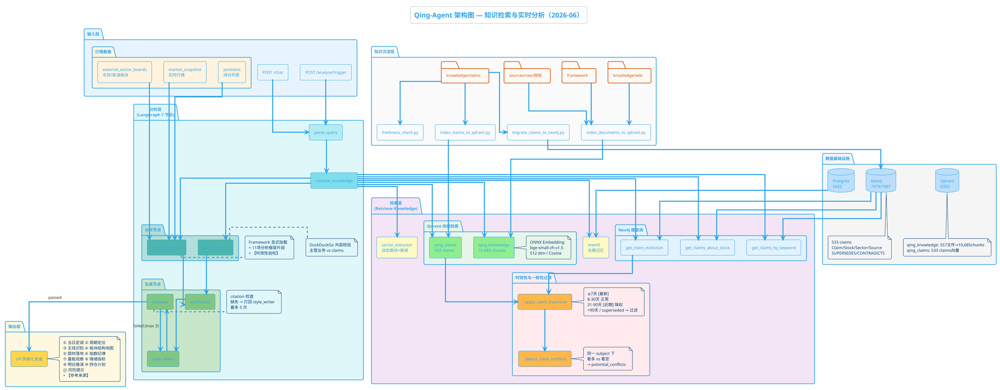

# Qing-Agent 技术设计文档

> 版本: 2026-06-05  
> 对应 Commit: `e8d2e9e`

---

## 1. 概述

Qing-Agent 是 Hermes 股票监控系统的"大脑"，负责把原始行情数据、博主知识库、外部板块行情统一分析，输出 UP（青枫浦上Q）风格的投资复盘与操作建议。

核心设计原则：
- **数据诚实**：外部数据源不可用时直接报错，不让 LLM 虚空编造板块涨跌
- **多源降级**：板块数据走 "东方财富 → 新浪 → 报错" 的级联 fallback
- **结构化输出**：市场分析强制 JSON，持仓计划带具体价格位
- **UP 人格一致性**：风格化层将专业草稿改写为 UP 口吻，周期自适应语气

---

## 2. 整体架构

Qing-Agent 基于 **LangGraph** 构建有向图工作流，共 7 个节点 + 1 条条件边。



**简化版数据流：**

```
输入层 (Chat/Trigger) ──▶ parse_query ──▶ retrieve_knowledge ──┬──▶ market_analyst ──┐
                                                                   └──▶ stock_analyst ───┼──▶ synthesize ──▶ style_writer ──▶ reviewer ──▶ END
                                                                (时效过滤+矛盾检测)     (UP风格+来源标注)   (citation检查,最多3次打回)
```

| 节点 | 职责 | 是否调用 LLM |
|------|------|-------------|
| `parse_query` | 意图解析：提取 stock_code / analysis_type / urgency | ✅ |
| `retrieve_knowledge` | 从 Neo4j/Qdrant/mem0 检索知识 | ❌（本地查询） |
| `market_analyst` | 大盘/板块维度分析，输出结构化 JSON | ✅ |
| `stock_analyst` | 个股地位、多空证据、触发/失效条件 | ✅ |
| `synthesize` | 将 market + stock 分析合成为统一草稿 | ❌（规则拼接） |
| `style_writer` | 改写为 UP 口吻，注入人格特征 | ✅ |
| `reviewer` | 事实核查：禁用词检测、claims 引用验证 | ✅ |
| `review_router` | 审核通过则 END，不通过则回写 style_writer（最多 3 次） | ❌ |

---

## 3. 各节点详解

### 3.1 parse_query

**输入**: `query` (用户原始问题或 Hermes 触发标题)  
**输出**: `parsed_intent` JSON

```json
{
  "stock_code": "300394",
  "analysis_type": "stock",
  "urgency": "scheduled",
  "focus": "分析一下天孚通信"
}
```

- `analysis_type` 决定后续分析路径：
  - `stock` → 走 `stock_analyst`
  - `market` / `portfolio` → 跳过 `stock_analyst`，纯市场分析

### 3.2 retrieve_knowledge

**知识库四层架构**（2026-06 升级后）：

| 存储 | 内容 | 用途 | 检索方式 |
|------|------|------|---------|
| **Qdrant `qing_knowledge`** | 557 文件 → 10,685 chunks（wiki + framework + raw） | 向量语义检索原始文档和方法论片段 | ONNX 语义嵌入（512维），按来源类型 boost 排序 |
| **Qdrant `qing_claims`** | 511 claims 的语义向量索引 | claims 语义搜索（替代原 `CONTAINS` 字符串匹配） | ONNX 语义嵌入 |
| **Neo4j** | claims 图数据库（节点+关系） | 按股票代码精确查询、关联 claims 遍历 | Cypher 查询 |
| **mem0** | 本地记忆（框架 + 活跃 claims） | 长期方法论上下文 | 关键词匹配 |

**来源类型 Boost 排序**（Phase 3 新增）：
检索后对 wiki_snippets 按来源路径加权，确保高可信度内容优先：

| 来源前缀 | Boost |
|----------|-------|
| `framework/` | +0.15 |
| `wiki/投资方法论` | +0.10 |
| `wiki/市场分析` | +0.05 |
| `sources/raw` | +0.00 |

**Claims 双索引策略**（Phase 3.3 新增）：
1. **向量召回**：用 Qdrant `qing_claims` 做语义搜索，召回相关 claims
2. **图验证**：用 Neo4j 查召回 claims 的关联 claims（同一主题、同一股票）
3. **时效衰减过滤**（P0 新增）：
   - ≤7 天：标 `[最新]`，优先使用
   - 8-30 天：正常展示
   - 31-90 天：标 `[近期]`，降权使用
   - >90 天 或 `superseded`：**直接过滤**，不返回给 Agent
   - 按 `days_ago` 排序，最新的 claim 排最前
4. **同一主题矛盾检测**（P1 新增）：
   - 按 `subject` 分组，检测同一组内是否存在方向相反的 active claims
   - 方向词表：`_BULLISH_WORDS`（看多/主线/加仓等）vs `_BEARISH_WORDS`（看空/回避/减仓等）
   - 若检测到矛盾，在 `potential_conflicts` 中列出矛盾 claims 的 ID、日期和方向
   - Agent 在 prompt 中被要求必须处理这些矛盾，给出判断依据

**动态板块提取** (`sector_extractor.py`)：
- 扫描 `sources/raw/财经/` 最近 3 天文档
- 命中预定义板块关键词（光互连/CPO、半导体、PCB 等 13 个板块）
- 对识别出的 Top-K 板块调用 DuckDuckGo 搜索最新新闻

**外部板块数据** (`sector_data.py`)：
- 从 state 透传 `external_sector_boards`（见第 5 章）

### 3.3 market_analyst

**核心逻辑**：
1. **可用性检查**：`analysis_type` 为 `market`/`portfolio` 时，若 `external_sector_boards.available == false`，直接返回 `"数据不可用"`，拒绝生成分析
2. **Framework 显式加载**（Phase 1 新增）：根据 `analysis_type` 从 `framework/` 目录加载对应的 playbook 文件（如 `market-cycle-framework.md`、`sector-diffusion-framework.md`），截断到 4000 字符注入 prompt
3. **动态分析框架片段**（Phase 3 新增）：通过 `_load_analysis_framework()` 加载 `market_analysis_framework.txt` 中的 11 项分析框架，替换 prompt 中的 `{analysis_framework}` 占位符
4. **Prompt 截断**：`market_snapshot.quotes` 超过 50 条时，只保留指数 + 持仓/观察池 + 涨跌幅 TOP15，减少 token
5. **时效性自检**（P0 新增）：prompt 强制要求 Agent 检查 claim 的 `freshness_label`，标注过时观点，处理 framework 与实时数据的矛盾
6. **强制 JSON 输出**：包含以下字段

```json
{
  "market_summary": "当日定调",
  "market_phase": "回暖期",
  "phase_reasoning": "...",
  "main_themes": ["PCB", "MLCC"],
  "sector_map": {
    "主攻层": [{"name": "...", "status": "...", "key_stocks": [], "logic": "..."}],
    "上游层": [...],
    "防御层": [...],
    "其他": []
  },
  "themes_in_focus": [{"theme": "...", "catalyst": "...", "risk": "..."}],
  "index_discipline": {"support": "4033", "resistance": "4130", ...},
  "volume_note": "...",
  "emotion_signals": {"涨停": 50, "跌停": 8},
  "tomorrow_watch": [...],
  "position_plans": [
    {
      "code": "600246.SH",
      "name": "万通发展",
      "trigger": "站稳19元持有",
      "invalidation": "跌破18.5元减仓",
      "position_advice": "5-6成"
    }
  ],
  "risk_notes": "...",
  "citations": ["claim-xxx", "sources/raw/财经/..."]
}
```

**板块结构地图的数据来源优先级**：
1. `external_sector_boards`（东方财富/新浪完整板块涨跌）
2. `sector_context`（UP  raw 文档动态 + 网络新闻）
3. `sector_strengths`（项目内部持仓相关板块，样本量小，仅作持仓参考）

### 3.4 stock_analyst

**触发条件**：`analysis_type == "stock"` 且 `stock_code` 存在。

**外部标的业务校验**（P2 新增）：
1. `_get_stock_name()` 从 `market_snapshot.quotes` 或 `watchlist` 中提取股票名称
2. `_fetch_stock_external_info()` 用 DuckDuckGo 搜索 `{股票名} {代码} 主营业务 最新`
3. 搜索结果作为 `external_validation` 注入 prompt
4. Agent 被强制要求：如果 claims 中对标的的描述（如"CPO 龙头"）与外部搜索结果不一致，必须指出不一致并说明判断依据

输出 JSON 包含：
- `stock_role`: 龙头/中军/跟风/独立
- `bullish_evidence` / `bearish_evidence`: 多空证据列表
- `trigger_conditions` / `invalidation_conditions`: 触发与失效条件
- `technical_position`: 技术位置描述

**market/portfolio 查询自动跳过**，避免浪费 LLM token。

### 3.5 synthesize

**纯规则拼接，不调用 LLM**，确保速度和确定性。

- **个股模式** (`stock` 分支)：组合 `market_context` + `stock_analysis`，追加持仓计划
- **市场模式** (`market`/`portfolio` 分支)：组合板块地图、题材落地、指数纪律、量能观察、情绪信号、明日跟踪、风险提示

**【参考来源】注入**（Phase 3 新增）：
synthesize 在 draft 末尾追加【参考来源】段落，包含：
- `market_context.citations` 中引用的 claim IDs 和 wiki 路径
- `framework_rules` 中使用的 playbook 文件名
- 格式：`\n\n【参考来源】\n- claim-xxx\n- framework/market-cycle-framework.md\n- ...`

**持仓计划注入**：
- 从 `market_context.position_plans` 提取
- 按持仓股逐条输出：触发条件 / 失效条件 / 仓位建议
- 若 LLM 未生成 plan，fallback 为"待补充"占位

### 3.6 style_writer

**UP 人格注入**：
- 口头禅："不见长虹不回头"、"先把弹药留出来"
- 周期自适应语气：
  - 冰点期 → 安抚鼓励
  - 回暖期 → 谨慎乐观
  - 高潮期 → 劝退警示
  - 退潮期 → 收缩防御

**持仓处理规则**：
- 每日复盘 **必须包含**【持仓操作计划】
- 使用具体价格位（如"站稳19元"、"跌破18.5元且30分钟不收回应减仓"）
- 禁止无条件"买入"/"卖出"指令

**数据诚实规则**：
- 草稿中标注"数据不可用"的板块必须保留，不得编造

### 3.7 reviewer + review_router

**审核维度**：
- 禁用词检测（"无条件买入"、"一定涨"等）
- claims 引用验证（输出中引用的 claim ID 是否在检索列表中）
- **citation 完整性检查**（Phase 3 新增）：检查输出是否包含【参考来源】段落。若缺失，标记 `review_passed = false`，将 `review_notes` 回写至 `style_writer`，要求补充来源标注。最多打回 **3 次**。

**路由逻辑**：
- `review_passed == true` → END
- `review_passed == false` 且 `_retry_count < 3` → 回写 `review_notes` 到 `style_writer`
- `_retry_count >= 3` → 强制 END（避免死循环）

---

## 4. 数据流详解

### 4.1 输入层 (AgentState)

| 字段 | 来源 | 说明 |
|------|------|------|
| `query` | 用户输入 / Hermes 触发标题 | 分析意图 |
| `trigger` | Hermes | 触发类型、时间、原因 |
| `alerts` | Hermes 规则引擎 | 风控/减仓/板块轮动信号 |
| `market_snapshot` | Hermes 行情接口 | 实时行情快照（quotes 会被截断） |
| `positions` | Hermes `positions.yaml` + 实时 quote | 持仓列表，含 `latest` / `pct_change` |
| `watchlist` | Hermes `watchlist.yaml` | 观察池标的及条件 |
| `sector_strengths` | Hermes 内部板块计算 | 项目定义的 sector_groups 涨跌 |
| `external_sector_boards` | `sector_data.py` | 东财/新浪完整板块数据 |

### 4.2 检索层

```
query ──▶ Neo4j (claims) ──┐
         Qdrant (wiki) ────┼──▶ AgentState (claims, wiki_snippets, sector_context,
         mem0 (memory) ────┘        external_sector_boards, memories)
```

### 4.3 分析层

```
claims + wiki + sector_context + external_sector_boards + market_snapshot
    ──▶ market_analyst ──▶ market_context (JSON)

claims + wiki + positions
    ──▶ stock_analyst ──▶ stock_analysis (JSON)
```

### 4.4 生成层

```
market_context + stock_analysis + position_plans
    ──▶ synthesize ──▶ draft_analysis (结构化文本)

draft_analysis + tone + examples
    ──▶ style_writer ──▶ styled_output (UP 口吻)

styled_output + claims
    ──▶ reviewer ──▶ final_output (审核后文本)
```

---

## 5. 板块数据源设计（核心）

### 5.1 为什么需要外部板块数据

项目内部 `sector_groups` 只包含 10+ 只成分股，样本量过小，无法代表全市场板块真实涨跌。例如：
- 内部 "光通信/CPO" 只跟踪 3 只龙头股
- 东方财富概念板块有 486 个概念，覆盖全市场

### 5.2 双源级联 Fallback

```
┌─────────────────┐     失败     ┌─────────────┐     失败     ┌─────────────────┐
│  东方财富 API   │─────────────▶│  新浪 API   │─────────────▶│ SectorDataUnavailableError │
│  (概念+行业)    │   重试3次    │ (概念+行业) │   重试3次    │   (明确报错，不编造)       │
└─────────────────┘              └─────────────┘              └─────────────────┘
```

**东方财富 API** (`push2.eastmoney.com`)：
- 概念板块：`fs=m:90+t:3`（板块指数涨跌幅，已排序）
- 行业板块：`fs=m:90+t:2`
- 字段：`f12` 代码, `f14` 名称, `f3` 涨跌幅, `f6` 成交额

**新浪 API** (`money.finance.sina.com.cn`)：
- 返回 JS 变量，GBK 编码，需正则提取 JSON
- 字段：成分股平均涨跌幅（非板块指数，数据粒度不同但可作参考）

**降级行为**：
- 东财超时/断开 → 自动切新浪
- 新浪也失败 → 抛出 `SectorDataUnavailableError`
- Agent 捕获后：market 分析返回 `"数据不可用"`，明确告知用户

### 5.3 Agent 侧的可用性守卫

```python
if analysis_type in ("market", "portfolio") and not esb.get("available"):
    return {
        "market_context": {
            "market_phase": "数据不可用",
            "risk_notes": "外部行情源板块数据缺失，本次分析被中止...",
            ...
        }
    }
```

---

## 6. 持仓操作建议机制

### 6.1 数据 enrichment

`stock_monitor._agent_context_data` 自动为每个 `position` 注入：
- `latest`: 实时最新价
- `pct_change`: 当日涨跌幅

这样 market_analyst 能看到每只持仓的实时盈亏状态。

### 6.2 LLM 生成结构化计划

`market_analyst` prompt 强制要求输出 `position_plans`：

```json
{
  "code": "600246.SH",
  "name": "万通发展",
  "shares": 300,
  "cost": 16.203,
  "latest": 18.87,
  "trigger": "板块联动且站稳19元持有/加仓；放量突破19.5元可小幅加仓",
  "invalidation": "跌破18.5元且30分钟不收回应减仓；跌破18元风控",
  "position_advice": "5-6成内，不追高"
}
```

### 6.3 合成与风格化

`synthesize` 将 `position_plans` 格式化为 Markdown 列表，注入 draft。

`style_writer` 确保：
- 每日复盘 **必须保留**【持仓操作计划】段落
- 使用 UP 口头禅和具体价格位
- 禁止无条件买卖指令

---

## 7. 知识库层

### 7.1 Neo4j（图数据库）

**节点类型**：`Claim`, `Stock`, `Sector`, `Source`  
**关系类型**：`ABOUT`, `SUPERSEDES`, `CONTRADICTS`, `CITED_IN`, `EXTRACTED_FROM`

**查询方式**：
- `get_claims_about_stock(stock_code)` → 某股票相关的历史观点
- `get_claims_by_keyword(keyword)` → 按关键词查询（用于 market/sector 查询）

### 7.2 Qdrant（向量数据库）

**Collection `qing_knowledge`**（文档向量）：
- Chunk 级别：paragraph-level，共 10,685 chunks（557 文件）
- Embedding: **ONNX Runtime** + `Xenova/bge-small-zh-v1.5`（量化版，512维）
- 用途：语义检索 wiki、framework、raw 文档片段
- 来源 boost：`framework/` +0.15, `wiki/投资方法论` +0.10, `wiki/市场分析` +0.05

**Collection `qing_claims`**（claims 语义索引，Phase 3.3 新增）：
- 511 claims 的向量索引
- Embedding: 同上 ONNX 模型
- 用途：claims 语义搜索，替代原 `CONTAINS` 字符串匹配
- Payload: `id`, `subject`, `statement`, `status`, `source_date`

**Embedding 统一**：索引脚本和检索使用同一 `OnnxEmbeddingModel`，消除了之前 hash embedding 的语义断层。

### 7.3 mem0（记忆层）

- 本地 JSON fallback: `infra/data/local_memories.json`
- 内容：13 个 framework 文件 + 50 条活跃 claims → 63 条记忆
- 用途：长期方法论和博主核心观点的上下文

---

## 8. API 接口

### 8.1 核心端点

```
GET  /health
POST /analyze/trigger  ← Hermes 调用
POST /chat             ← 占位
POST /memory/add       ← 占位
```

### 8.2 TriggerRequest 字段

```python
class TriggerRequest(BaseModel):
    trigger: dict           # Hermes 触发信息
    alerts: list[dict]      # 规则信号列表
    market_snapshot: dict   # 行情快照
    positions: list[dict]   # 当前持仓（含 latest/pct_change）
    watchlist: list[dict]   # 观察池
    sector_strengths: list[dict]   # 内部板块涨跌
    external_sector_boards: dict   # 外部板块数据（概念+行业）
    session_id: str
    query: str
```

### 8.3 TriggerResponse 字段

```python
class TriggerResponse(BaseModel):
    final_output: str       # UP 风格化最终文本
    claims_cited: list[str] # 引用的 claim IDs
    data_sources: list[str] # 数据来源
    confidence: str         # high/medium/low
    review_passed: bool     # 事实核查是否通过
    reasoning_steps: list[str]
```

---

## 9. Hermes 集成

### 9.1 数据流向

```
┌─────────────────┐     --agent-json-context     ┌──────────────┐
│ stock_monitor.py│─────────────────────────────▶│ hermes_stock │
│                 │  (JSON: quotes/positions/    │ _monitor_    │
│                 │   sector_strengths/           │ agent.py     │
│                 │   external_sector_boards)     │              │
└─────────────────┘                                └──────┬───────┘
                                                          │ POST
                                                          ▼
                                                   ┌──────────────┐
                                                   │ qing-agent   │
                                                   │ /analyze/    │
                                                   │ trigger      │
                                                   └──────────────┘
```

### 9.2 关键调用链

1. `stock_monitor.py --agent-json-context` 触发
2. `_agent_context_data()` 构建结构化数据：
   - 获取实时行情（东财 quote API）
   - 获取外部板块数据（`sector_data.py`）
   - Enrich positions（注入 latest/pct_change）
3. `hermes_stock_monitor_agent.py` 读取 JSON，POST 到 `qing-agent`
4. `qing-agent` 运行 LangGraph，返回 `final_output`
5. 若 qing-agent 不可用，fallback 输出原始监控上下文

---

## 10. 部署与配置

### 10.1 环境变量

```bash
export LLM_PROVIDER=deepseek          # 或 kimi
export DEEPSEEK_API_KEY=sk-xxx
export KIMI_API_KEY=sk-xxx            # 若使用 kimi
export QING_AGENT_URL=http://127.0.0.1:8000/analyze/trigger
export QING_AGENT_TIMEOUT=45          # 注意：完整链路约 30-40s
```

### 10.2 启动服务

```bash
cd learning-investment-strategies
uv run uvicorn qing_investment.agent.main:app --host 127.0.0.1 --port 8000
```

### 10.3 依赖容器

| 服务 | 端口 | 用途 |
|------|------|------|
| qing-neo4j | 7474/7687 | Claims 图数据库 |
| qing-qdrant | 6333 | 文档向量检索 |
| qing-postgres | 5432 | mem0 存储 |

---

## 11. 性能与优化

### 11.1 当前耗时分布（典型 market 分析）

| 阶段 | 耗时 | 说明 |
|------|------|------|
| `retrieve_knowledge` | 3-10s | Qdrant(wiki+claims) + Neo4j + mem0（ONNX 本地嵌入） |
| `market_analyst` | 15-25s | DeepSeek 调用，prompt 最大（含 framework 文件 + 分析框架片段） |
| `style_writer` | 10-15s | DeepSeek 调用 |
| `reviewer` | 5-10s | DeepSeek 调用（含 citation 检查，可能触发 1-3 次 retry） |
| **总计** | **35-60s** | 含知识检索 + 3 次 LLM 调用 + reviewer retry |

### 11.2 已做的优化

1. **Quotes 截断**：market_snapshot 从 154 只截断到 ~30 只（指数+持仓+TOP15），减少 60%+ token
2. **stock_analyst 跳过**：market/portfolio 查询不调用个股分析，节省 1 次 LLM
3. **Prompt 缓存**：system prompt 从文件读取后复用

### 11.3 待优化

1. **Embedding 缓存**：Qdrant 查询每次都重新编码，可缓存高频 query 向量
2. **异步并行**：Neo4j / Qdrant(wiki+claims) / mem0 / sector_data 可并行查询
3. **LLM 调用合并**：reviewer 和 style_writer 可考虑合并为一次调用
4. **预热机制**：早盘前预生成 sector_context 和 external_sector_boards
5. **API Embedding 迁移**：若 ONNX 术语召回率不足，可迁移至 OpenAI/Zhipu API embedding（需重建 collection）

---

## 12. 文件清单

| 文件 | 职责 |
|------|------|
| `src/qing_investment/agent/main.py` | FastAPI 入口，/analyze/trigger |
| `src/qing_investment/agent/models/schemas.py` | Pydantic 模型 |
| `src/qing_investment/agent/graph/builder.py` | LangGraph 组装 |
| `src/qing_investment/agent/graph/state.py` | AgentState TypedDict |
| `src/qing_investment/agent/graph/nodes.py` | 7 个节点实现 |
| `src/qing_investment/agent/graph/edges.py` | review_router |
| `src/qing_investment/agent/tools/sector_data.py` | 外部板块数据源（东财+新浪） |
| `src/qing_investment/agent/tools/sector_extractor.py` | 动态板块识别+网络搜索 |
| `src/qing_investment/agent/tools/neo4j_client.py` | Claims 图数据库 |
| `src/qing_investment/agent/tools/qdrant_client.py` | 文档向量检索（REST API 兼容 Qdrant 1.9.7） |
| `src/qing_investment/agent/tools/mem0_client.py` | 记忆层 |
| `src/qing_investment/agent/tools/llm_client.py` | LLM 统一封装 + Embedding 工厂（ONNX 优先） |
| `src/qing_investment/agent/prompts/system/market_analyst.txt` | 市场分析主 prompt（含 `{analysis_framework}` 占位符） |
| `src/qing_investment/agent/prompts/system/market_analysis_framework.txt` | 11 项分析框架片段（被 market_analyst 动态加载） |
| `src/qing_investment/agent/prompts/system/style_writer.txt` | UP 风格化 prompt（强制保留来源标注） |
| `src/qing_investment/stock_monitor.py` | Hermes 监控核心，_agent_context_data |
| `scripts/hermes_stock_monitor_agent.py` | Hermes cron 入口 |
| `scripts/index_claims_to_qdrant.py` | Claims 语义索引脚本（Qdrant `qing_claims`） |
| `scripts/freshness_check.py` | 每日知识库健康检查（未处理 raw、stale claims） |
