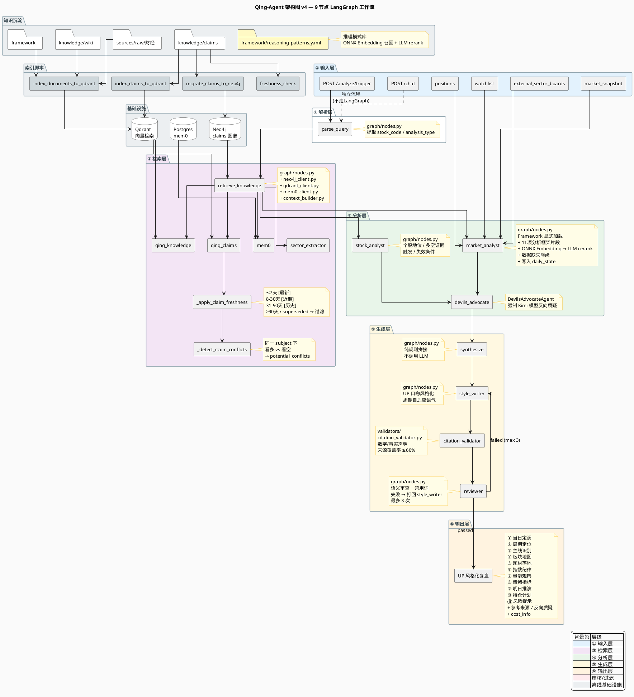

# Qing-Agent 技术设计文档

> 版本: 2026-06-26 (v4)
> 对应 Commit: `88e0753` 及当前工作区
> 最后更新：基于 `src/qing_investment/agent/` 真实代码重写；旧版 `v3` 已归档至 `docs/archived/qing-agent-technical-design-v3-20260612.md`

---

## 1. 概述

Qing-Agent 是 Hermes/Bridge 股票监控系统的分析大脑，负责把行情快照、持仓/观察池、外部板块数据与 UP 知识库（claims + wiki + framework）统一分析，输出 UP（青枫浦上Q）风格的投资复盘与操作建议。

核心设计原则：
- **数据诚实**：外部数据源不可用时明确降级，不让 LLM 虚空编造实时数据。
- **多源降级**：板块数据走 "东方财富/新浪传入 → 知识库 fallback" 的级联降级。
- **结构化输出**：市场分析强制 JSON，持仓计划带具体价格位与触发条件。
- **UP 人格一致性**：风格化层将专业草稿改写为 UP 口吻，语气按市场周期自适应。
- **成本可观测**：每个节点记录 LLM 调用次数与估算成本，聚合到响应中。

---

## 2. 代码目录结构

```
src/qing_investment/agent/
├── main.py                  # FastAPI 入口：/health、/analyze/trigger、/chat
├── base.py                  # Agent 基类、AgentOutput、LLMProtocol
├── config.py                # Agent 配置（LLM provider、模型名、开关等）
├── graph/
│   ├── builder.py           # LangGraph 图构建
│   ├── state.py             # AgentState TypedDict + reducer
│   ├── edges.py             # review_router 条件边
│   └── nodes.py             # 9 个图节点实现
├── agents/
│   ├── market_analyst.py    # 独立 market_analyst Agent 实现（备用）
│   ├── stock_analyst.py     # 独立 stock_analyst Agent 实现（备用）
│   └── devils_advocate.py   # Devil's Advocate 反向质疑 Agent
├── validators/
│   └── citation_validator.py# 数字/事实声明引用校验
├── prompts/system/          # 图节点 prompt 模板
│   ├── market_analyst.txt
│   ├── stock_analyst.txt
│   ├── market_analysis_framework.txt
│   ├── style_writer.txt
│   ├── reviewer.txt
│   ├── trader_mindset.txt
│   └── cron_*.txt           # 定时播报类 prompt
└── tools/                   # 工具函数与客户端
    ├── llm_client.py        # LLM/Embedding 客户端统一入口
    ├── neo4j_client.py      # claims 图数据库
    ├── qdrant_client.py     # 向量检索
    ├── mem0_client.py       # 长期记忆
    ├── claim_freshness.py   # claims 时效性过滤
    ├── context_builder.py   # 市场上下文构建
    ├── sector_extractor.py  # 动态板块提取 + 网络新闻
    ├── stock_data.py        # 个股/指数实时数据获取
    └── cost_tracker.py      # 单次调用成本追踪
```

---

## 3. 整体架构

### 3.1 LangGraph 工作流

Qing-Agent 基于 **LangGraph** 构建有向图，共 **9 个节点 + 1 条条件边**。



**简化版数据流（/analyze/trigger）**：

```
parse_query
    │
    ▼
retrieve_knowledge ─────┐
    │                    │
    ▼                    │
market_analyst           │
    │                    │
    ▼                    │
devils_advocate ◄────────┘
    │
    ▼
synthesize
    │
    ▼
style_writer
    │
    ▼
citation_validator
    │
    ▼
reviewer ──[pass]──▶ END
    │
  [fail]
    │
    ▼
style_writer (最多 3 次 retry)
```

**说明**：
- `market_analyst` 与 `stock_analyst` 从 `retrieve_knowledge` 并行出发，二者完成后共同进入 `devils_advocate`。
- `stock_analyst` 仅在 `analysis_type == "stock"` 时输出有效个股分析；市场/持仓复盘时该节点返回空，不阻塞后续流程。
- `reviewer` 失败后回写 `review_notes` 到 `style_writer`，最多重试 3 次，超过强制放行。

### 3.2 两个入口的差异

| 维度 | `POST /analyze/trigger` | `POST /chat` |
|---|---|---|
| 调用方 | Bridge/Hermes cron 任务 | 用户直接对话 |
| 是否走 LangGraph | ✅ 走完整 9 节点图 | ❌ 独立检索→LLM 流程 |
| 输入来源 | 结构化 `TriggerRequest`（market_snapshot、positions、watchlist、external_sector_boards 等） | 自然语言 query |
| 记忆检索 | 不查 mem0 | 查 mem0 + Neo4j 图遍历 |
| 实时数据 | 外部传入 `market_snapshot` / `external_sector_boards` | Agent 自行实时获取 |
| 写入 daily_state | ✅ `market_analyst` 写入 | ❌ 不写入 |
| 输出 | `TriggerResponse`（final_output、claims_cited、cost_info 等） | `ChatResponse`（reply） |
| 降级路径 | Qing-Agent 离线 → 纯文本 LLM fallback | 无降级，直接报错 |

---

## 4. 数据模型

### 4.1 AgentState

定义见 `src/qing_investment/agent/graph/state.py`，采用 `TypedDict` + `Annotated` reducer：

```python
class AgentState(TypedDict, total=False):
    # 输入层
    query: str
    session_id: str
    trigger: dict | None
    alerts: list[dict]
    market_snapshot: dict          # 行情快照（quotes、indices 等）
    positions: list[dict]          # 持仓列表
    watchlist: list[dict]          # 观察池
    sector_strengths: list[dict]
    external_sector_boards: dict   # 外部板块数据
    parsed_intent: dict

    # 检索层
    claims: list[dict]             # Neo4j/Qdrant 召回的 claims
    wiki_snippets: list[dict]      # Qdrant 召回的 wiki/framework
    sector_context: list[dict]
    knowledge_graph: dict
    memories: list[dict]
    few_shot_examples: list[str]
    potential_conflicts: list[dict]
    stock_contexts: list[dict]
    direction_signals: dict

    # 分析层
    market_context: dict           # market_analyst JSON 输出
    stock_analysis: dict           # stock_analyst JSON 输出
    devils_advocate_findings: list[dict]
    draft_analysis: str

    # 生成层
    styled_output: str
    citation_report: dict | None
    review_notes: list[str]

    # 输出层
    final_output: str
    claims_cited: list[str]
    data_sources: list[str]
    confidence: str
    review_passed: bool
    reasoning_steps: list[str]

    # 成本与内部控制
    cost_tracking: list[dict]
    _retry_count: int
    _data_missing_note: str
```

---

## 5. 节点详解

### 5.1 parse_query

- **位置**：`graph/nodes.py:653`
- **输入**：`query`
- **输出**：`parsed_intent`
- **逻辑**：调用 LLM 从 query 中提取 `stock_code`、`analysis_type`（stock/market/portfolio）、`urgency`、`focus`；解析失败时默认按 `analysis_type=stock` 继续。

### 5.2 retrieve_knowledge

- **位置**：`graph/nodes.py:856`
- **输入**：`query`、`parsed_intent`、`session_id`
- **输出**：`claims`、`wiki_snippets`、`memories`、`sector_context`、`stock_contexts`、`direction_signals`、`potential_conflicts`
- **数据源**：
  - **Neo4j**：个股查询用 `get_claims_with_evolution(stock_code)` 做图遍历；非个股查询用 Qdrant 召回 claim_id 后回 Neo4j 取全文。
  - **Qdrant `qing_claims`**：语义召回 claims（ONNX 512 维 embedding）。
  - **Qdrant `qing_knowledge`**：语义召回 wiki + framework + raw 文档；按来源类型 boost 排序（`framework/` > `wiki/投资方法论` > `wiki/市场分析` > `sources/raw`）。
  - **mem0**：`mem0.search(query, user_id=session_id)`。
  - **sector_extractor**：扫描 `sources/raw/财经/` 近 3 天文档，识别 Top-K 板块并补充网络新闻（仅 market/portfolio 查询）。
  - **context_builder**：为 positions/watchlist/entry_points 预构建 claims 摘要与方向信号。
- **过滤逻辑**：
  - `apply_claim_freshness`：≤7 天 [最新]、8-30 天 [近期]、31-90 天 [历史]、>90 天或 superseded 过滤。
  - `_apply_intensity_weight`：个股查询过滤 low intensity claims。
  - `_detect_claim_conflicts`：检测同一 subject 下方向相反的 claims。

### 5.3 market_analyst

- **位置**：`graph/nodes.py:1158`
- **输入**：`market_snapshot`、`external_sector_boards`、`claims`、`wiki_snippets`、`watchlist`、`positions`、`sector_context` 等
- **输出**：`market_context`
- **关键逻辑**：
  1. **数据可用性守卫**：`market`/`portfolio` 分析且实时数据缺失时，注入 `_data_missing_note` 降级说明，不再拒绝分析。
  2. **行情截断**：`quotes > 50` 时只保留指数 + 持仓/观察池 + 涨跌幅 TOP15。
  3. **Framework 加载**：按 `analysis_type` 从 `framework/` 加载对应 playbook。
  4. **分析框架片段**：加载 `market_analysis_framework.txt` 中的 11 项框架替换 prompt 占位符。
  5. **推理模式匹配**：从 `framework/reasoning-patterns.yaml` 中匹配主题，ONNX Embedding 召回 Top 5 → LLM rerank Top 1-3。
  6. **Watchlist 优先级分组**：主板标的进入 `watchlist_summary`（可交易，P1-P3）；创业板/科创板（300/688）自动归为 P4-锚点，仅作情绪参考。
  7. **技术指标注入**：多级别 MACD、神奇九转、斐波那契时间分析报告。
  8. **Daily State 持久化**：写入 `config/stock_monitor/daily_state.json`。
  9. **强制 JSON 输出**，包含 `market_summary`、`market_phase`、`sector_map`、`index_discipline`、`position_plans`、`risk_notes` 等字段。

### 5.4 stock_analyst

- **位置**：`graph/nodes.py:1534`
- **输入**：`parsed_intent`、`market_context`、`claims`、`wiki_snippets`
- **输出**：`stock_analysis`
- **逻辑**：个股地位判断（龙头/补涨/跟风）、多空证据、技术位置、触发/失效条件、风险点；非个股分析返回空。

### 5.5 devils_advocate

- **位置**：`graph/nodes.py:1634`
- **输入**：`market_context`、`stock_analysis`、`claims_cited`
- **输出**：`devils_advocate_findings`
- **逻辑**：实例化 `DevilsAdvocateAgent`，强制使用 Kimi 模型家族对 market + stock 结论做反向质疑；无分析内容时跳过。

### 5.6 synthesize

- **位置**：`graph/nodes.py:1804`
- **输入**：`market_context`、`stock_analysis`、`positions`、`devils_advocate_findings`
- **输出**：`draft_analysis`
- **逻辑**：纯规则拼接草稿（不调用 LLM），区分"有个股分析"和"纯市场分析"两种模板；注入持仓操作计划、反向质疑块、【参考来源】段落。

### 5.7 style_writer

- **位置**：`graph/nodes.py:1939`
- **输入**：`draft_analysis`、`market_phase`、`few_shot_examples`、`review_notes`
- **输出**：`styled_output`
- **逻辑**：加载 `style_writer.txt`，按市场周期选择语气，将专业草稿改写为 UP 口吻；注入人格特征（犀利、不劝赌、非机构腔），**不再强制使用固定口头禅**。

### 5.8 citation_validator

- **位置**：`graph/nodes.py:1984` / `validators/citation_validator.py`
- **输入**：`styled_output`
- **输出**：`citation_report`
- **逻辑**：规则引擎提取数字/事实声明，检查附近是否有来源标注；覆盖率阈值 60%，生成问题列表。**非阻断**，仅供 reviewer 参考。

### 5.9 reviewer

- **位置**：`graph/nodes.py:2049`
- **输入**：`styled_output`、`claims`
- **输出**：`review_passed`、`review_notes`、`final_output`
- **逻辑**：LLM 审核禁用词、语义一致性、引用覆盖；不通过则返回修改意见，由 `review_router` 决定重试或强制结束。

---

## 6. 知识检索架构

```
┌─────────────────┐     ┌─────────────────┐     ┌─────────────────┐
│   sources/raw   │     │  framework/     │     │  knowledge/     │
│   wiki/claims   │────▶│ reasoning-      │────▶│ claims/wiki     │
└─────────────────┘     │ patterns.yaml   │     └─────────────────┘
                        └─────────────────┘              │
                                                         ▼
┌─────────────────────────────────────────────────────────────────┐
│                         索引管线                                 │
│  index_documents_to_qdrant  │  migrate_claims_to_neo4j           │
│  index_claims_to_qdrant     │  freshness_check                   │
└─────────────────────────────────────────────────────────────────┘
                         │                    │
                         ▼                    ▼
                 ┌─────────────┐      ┌─────────────┐
                 │   Qdrant    │      │   Neo4j     │
                 │qing_knowledge      │ claims graph│
                 │qing_claims  │      │(relations)  │
                 └─────────────┘      └─────────────┘
                         │                    │
                         └────────┬───────────┘
                                  ▼
                        ┌─────────────────┐
                        │ retrieve_knowledge│
                        │  · 时效过滤       │
                        │  · 强度加权       │
                        │  · 矛盾检测       │
                        └─────────────────┘
```

---

## 7. 幻觉防御层

| 层级 | 实现 | 说明 |
|---|---|---|
| 数据源可用性 | `market_analyst` 数据缺失降级 | 实时数据不可用时明确标注，基于知识库继续 |
| Claims 时效过滤 | `claim_freshness.py` | >90 天/superseded 过滤，31-90 天降权 |
| 矛盾检测 | `_detect_claim_conflicts` | 同一 subject 下方向相反 claims 告警 |
| 引用校验 | `citation_validator.py` | 数字/事实声明要求来源标注，覆盖率阈值 60% |
| 输出审核 | `reviewer` | 禁用词检测、语义审查、引用复核 |
| 反向质疑 | `DevilsAdvocateAgent` | 强制不同模型家族对结论挑错 |
| 行情截断 | `market_analyst` | quotes 超 50 只时截断，减少 token 与幻觉 |

> ** reviewer 局限性**：不做数值事实核查（价格、涨跌幅正确性由 Hermes 采集层保证），不交叉验证外部新闻真实性。

---

## 8. Prompt 体系

| Prompt 文件 | 用途 | 关键占位符 |
|---|---|---|
| `market_analyst.txt` | 市场/板块分析 | `{market_snapshot}`、`{analysis_framework}`、`{watchlist_summary}`、`{reasoning_patterns}` |
| `stock_analyst.txt` | 个股地位分析 | `{stock_code}`、`{claims}`、`{market_context}` |
| `market_analysis_framework.txt` | 11 项分析框架片段 | 被替换进 `market_analyst.txt` |
| `style_writer.txt` | UP 口吻风格化 | `{draft}`、`{tone}`、`{examples}` |
| `reviewer.txt` | 输出审核 | `{output}`、`{claims}` |
| `trader_mindset.txt` | 交易员心态/纪律 | 独立使用 |
| `cron_*.txt` | 定时播报（早盘/午盘/收盘/尾盘等） | 供 cron 任务直接调用 |

---

## 9. 部署与调用

### 9.1 启动

```bash
cd src
uvicorn qing_investment.agent.main:app --host 0.0.0.0 --port 8000
```

### 9.2 健康检查

```bash
curl http://localhost:8000/health
```

### 9.3 /analyze/trigger 示例

```bash
curl -X POST http://localhost:8000/analyze/trigger \
  -H "Content-Type: application/json" \
  -d '{
    "analysis_type": "market",
    "query": "收盘复盘",
    "trigger": {"title": "收盘复盘", "reason": "收盘触发"},
    "market_snapshot": {"quotes": [...]},
    "positions": [...],
    "watchlist": [...],
    "external_sector_boards": {"available": true, "boards": [...]}
  }'
```

### 9.4 与 Bridge/Hermes 集成

- Bridge cron 通过 `scripts/hermes_stock_monitor_agent.py` 调用 Qing-Agent。
- 若 Qing-Agent 不可达，降级到 `stock_monitor.py --agent-context-on-trigger` 的纯文本 LLM 流程。

---

## 10. 成本追踪

每个 LLM 调用节点内部使用 `CostTracker` 记录：

```python
{"llm_calls": 1, "total_cost_usd": "0.0012"}
```

通过 `AgentState.cost_tracking`（`Annotated` reducer）在节点间累加，最终由 `main.py` 的 `_aggregate_cost` 汇总到 `TriggerResponse.cost_info`。

---

## 11. 变更日志

| 日期 | 变更 |
|---|---|
| 2026-06-26 | v4 重写：基于真实代码更新架构图、节点说明、知识检索与幻觉防御层；移除对 UP 固定口头禅的描述 |
| 2026-06-12 | v3：新增指数多级别 K 线管线、日志系统、Watchlist P1-P4 优先级 |
| 2026-06-11 | 全量文档同步：幻觉防御层、P3 K-line、poll 字段、买入信号 |
| 2026-06-06 | 检索升级：Qdrant 语义召回 + Neo4j 图验证 + claims 时效过滤 |
