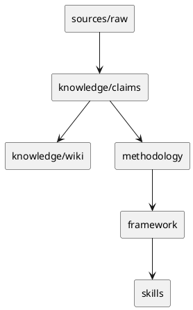

# 持续学习型投资方法论系统 Implementation Plan

> **For agentic workers:** REQUIRED SUB-SKILL: Use superpowers:subagent-driven-development (recommended) or superpowers:executing-plans to implement this plan task-by-task. Steps use checkbox (`- [ ]`) syntax for tracking.

**Goal:** 按中文技术方案落地一个可持续 ingest 博主内容、沉淀投资方法论、并基于 GLM stock analyst + F10 方法论进行个股分析的 skills 工程仓库。

**Architecture:** 仓库采用 `sources -> knowledge/claims -> knowledge/wiki -> methodology -> framework -> skills -> evals` 分层。LLM 负责语义学习、观点抽取、方法论更新和个股解释；Python 脚本只做确定性辅助，包括待处理文件发现、索引构建、知识库 lint、mention 抽取和 GLM vendor 同步。`qing-stock-analysis` 直接 vendor/copy `zai-org/GLM-skills/skills/glmv-stock-analyst`，再叠加博主框架和 F10 基本面分析。

**Tech Stack:** Python 3.11+、pytest、PyYAML、Markdown 文件、PlantUML 文档块、GitHub SSH remote `github-personal`、vendored GLM-skills Apache-2.0。

---

## 0. 执行约定

- 本计划必须逐任务执行，每个任务完成后单独提交。
- 文档使用中文；图示只使用 PlantUML fenced block。
- 所有 Python 脚本必须可以用 `python3 -m pytest` 覆盖基础行为。
- 任何需要访问网络的命令必须显式说明用途；GLM vendor 同步优先使用上游 GitHub，但脚本必须支持本地 source fallback，便于测试。
- 首版必须迁移旧 `赛博青哥 Wiki` 的所有 UP 原始数据：递归发现所有模块的 `Raw`、`raw`、`原始数据`、`原文`、`原数据` 目录，保留模块路径迁移到 `sources/raw/<module>/...`；当前机器只发现 `财经/Raw`，387 篇是验收下限，不是写死的模块范围。
- 不实现自动交易，不输出无来源买卖建议。

## 1. 文件结构总览

最终首版应创建或修改这些文件：

```text
README.md
LICENSE
NOTICE
pyproject.toml
src/qing_investment/__init__.py
src/qing_investment/paths.py
src/qing_investment/claim_schema.py
src/qing_investment/processed_log.py
src/qing_investment/index_builder.py
src/qing_investment/mention_extractor.py
src/qing_investment/knowledge_linter.py
src/qing_investment/glm_vendor.py
scripts/find_unprocessed.py
scripts/build_indexes.py
scripts/extract_mentions.py
scripts/lint_knowledge.py
scripts/migrate_legacy_up_raw.py
scripts/sync_glmv_stock_analyst.py
migration/legacy-manifest.json
migration/legacy-source-map.md
sources/raw/README.md
sources/incoming/README.md
sources/processed-log.md
knowledge/claims/README.md
knowledge/claims/index.md
knowledge/wiki/index.md
knowledge/wiki/log.md
knowledge/wiki/投资方法论/.gitkeep
knowledge/wiki/市场分析/.gitkeep
knowledge/wiki/每日复盘/.gitkeep
knowledge/wiki/博主/.gitkeep
knowledge/wiki/数据/.gitkeep
knowledge/cases/README.md
knowledge/cases/sector-cases/.gitkeep
knowledge/cases/stock-cases/.gitkeep
knowledge/cases/methodology-cases/.gitkeep
methodology/index.md
methodology/market-cycle.md
methodology/sector-rotation.md
methodology/stock-selection.md
methodology/f10-fundamental-analysis.md
methodology/technical-analysis.md
methodology/position-risk.md
methodology/decision-flow.md
framework/README.md
framework/learning-update-protocol.md
framework/stock-analysis-playbook.md
framework/methodology-review-protocol.md
framework/contradiction-policy.md
framework/output-contracts.md
skills/qing-learning/SKILL.md
skills/qing-learning/references/ingest-protocol.md
skills/qing-learning/references/claim-schema.md
skills/qing-learning/scripts/find_unprocessed.py
skills/qing-methodology-review/SKILL.md
skills/qing-methodology-review/references/methodology-review-protocol.md
skills/qing-methodology-review/references/contradiction-policy.md
skills/qing-stock-analysis/SKILL.md
skills/qing-stock-analysis/references/glmv-stock-analyst-workflow.md
skills/qing-stock-analysis/references/f10-financial-analysis.md
skills/qing-stock-analysis/references/qing-stock-framework.md
skills/qing-stock-analysis/references/report-contract.md
skills/qing-stock-analysis/scripts/run_glm_fetch.py
third_party/GLM-skills/VENDOR.md
third_party/GLM-skills/LICENSE
third_party/GLM-skills/skills/glmv-stock-analyst/...
skills/qing-stock-analysis/vendor/glmv-stock-analyst/PATCHES.md
skills/qing-stock-analysis/vendor/glmv-stock-analyst/...
evals/README.md
evals/learning/raw/2026-05-16-早盘-样例.md
evals/learning/expected-claims.md
evals/methodology-review/review-window.md
evals/stock-analysis/sample-stock-context.md
tests/test_claim_schema.py
tests/test_processed_log.py
tests/test_find_unprocessed.py
tests/test_index_builder.py
tests/test_mention_extractor.py
tests/test_knowledge_linter.py
tests/test_glm_vendor.py
tests/test_legacy_migration.py
tests/test_skill_metadata.py
tests/test_documentation_contracts.py
```

---

### Task 1: 仓库基础与 Python 项目骨架

**Files:**
- Create: `README.md`
- Create: `LICENSE`
- Create: `NOTICE`
- Create: `pyproject.toml`
- Create: `src/qing_investment/__init__.py`
- Create: `src/qing_investment/paths.py`
- Create: `tests/test_documentation_contracts.py`
- Create: `tests/test_paths.py`

- [ ] **Step 1: 写 README、LICENSE、NOTICE 和 pyproject**

Create `README.md`:

```markdown
# learning-investment-strategies

持续学习型投资方法论系统，用于长期学习财经博主的投资框架，将方法论沉淀为 agent skills，并基于最新框架进行个股分析。

## 核心链路



## 首版能力

- `qing-learning`：持续 ingest 博主新内容，更新 claims、wiki、methodology 和 framework。
- `qing-methodology-review`：周期性检查方法论变化、矛盾、过期和降权。
- `qing-stock-analysis`：基于 vendored GLM stock analyst、博主框架和 F10 方法论分析个股。

## 开发命令

```bash
python3 -m pip install -e ".[dev]"
python3 -m pytest
python3 scripts/lint_knowledge.py
```

## 免责声明

本项目用于学习和研究投资方法论，不构成投资建议，不连接券商交易接口，不自动下单。
```

Create `LICENSE` with MIT license text for this repository's original code:

```text
MIT License

Copyright (c) 2026 zhoudirac-C

Permission is hereby granted, free of charge, to any person obtaining a copy
of this software and associated documentation files (the "Software"), to deal
in the Software without restriction, including without limitation the rights
to use, copy, modify, merge, publish, distribute, sublicense, and/or sell
copies of the Software, and to permit persons to whom the Software is
furnished to do so, subject to the following conditions:

The above copyright notice and this permission notice shall be included in all
copies or substantial portions of the Software.

THE SOFTWARE IS PROVIDED "AS IS", WITHOUT WARRANTY OF ANY KIND, EXPRESS OR
IMPLIED, INCLUDING BUT NOT LIMITED TO THE WARRANTIES OF MERCHANTABILITY,
FITNESS FOR A PARTICULAR PURPOSE AND NONINFRINGEMENT. IN NO EVENT SHALL THE
AUTHORS OR COPYRIGHT HOLDERS BE LIABLE FOR ANY CLAIM, DAMAGES OR OTHER
LIABILITY, WHETHER IN AN ACTION OF CONTRACT, TORT OR OTHERWISE, ARISING FROM,
OUT OF OR IN CONNECTION WITH THE SOFTWARE OR THE USE OR OTHER DEALINGS IN THE
SOFTWARE.
```

Create `NOTICE`:

```text
learning-investment-strategies

This repository contains original project code and documentation under the MIT License.

Third-party components:

- zai-org/GLM-skills, skill: glmv-stock-analyst
  Source: https://github.com/zai-org/GLM-skills/tree/main/skills/glmv-stock-analyst
  License: Apache License 2.0
  Usage: Vendored as the data collection and report-generation base for qing-stock-analysis.
  Upstream commit is recorded in third_party/GLM-skills/VENDOR.md when vendored.
```

Create `pyproject.toml`:

```toml
[build-system]
requires = ["setuptools>=68", "wheel"]
build-backend = "setuptools.build_meta"

[project]
name = "qing-investment-learning"
version = "0.1.0"
description = "Continuous investment methodology learning system and skills"
requires-python = ">=3.11"
dependencies = [
  "PyYAML>=6.0.1",
]

[project.optional-dependencies]
dev = [
  "pytest>=8.0",
]

[tool.setuptools.packages.find]
where = ["src"]

[tool.pytest.ini_options]
testpaths = ["tests"]
pythonpath = ["src"]
```

Create `src/qing_investment/__init__.py`:

```python
"""Utilities for the Qing investment learning repository."""

__all__ = ["__version__"]

__version__ = "0.1.0"
```

- [ ] **Step 2: 写路径工具测试**

Create `tests/test_paths.py`:

```python
from pathlib import Path

from qing_investment.paths import repo_root, resolve_repo_path


def test_repo_root_points_to_project_root():
    root = repo_root()
    assert (root / "pyproject.toml").exists()
    assert root.name == "learning-investment-strategies"


def test_resolve_repo_path_joins_parts():
    expected = repo_root() / "knowledge" / "claims"
    assert resolve_repo_path("knowledge", "claims") == expected
```

- [ ] **Step 3: 运行测试确认失败**

Run:

```bash
python3 -m pytest tests/test_paths.py -v
```

Expected: FAIL with `ModuleNotFoundError` or `ImportError` because `qing_investment.paths` does not exist.

- [ ] **Step 4: 实现路径工具**

Create `src/qing_investment/paths.py`:

```python
from __future__ import annotations

from pathlib import Path


def repo_root() -> Path:
    """Return the repository root by walking up from this file."""
    return Path(__file__).resolve().parents[2]


def resolve_repo_path(*parts: str) -> Path:
    """Resolve a path under the repository root."""
    return repo_root().joinpath(*parts)
```

- [ ] **Step 5: 写文档规范测试**

Create `tests/test_documentation_contracts.py`:

```python
from pathlib import Path


def test_design_spec_is_chinese_and_uses_plantuml():
    spec = Path("docs/superpowers/specs/2026-05-16-continuous-investment-learning-system-design.md")
    text = spec.read_text(encoding="utf-8")
    assert "持续学习型投资方法论系统技术方案" in text
    assert "```plantuml" in text
    assert "@startuml" in text
    assert "@enduml" in text
    assert "```mermaid" not in text


def test_no_placeholder_markers_in_docs():
    forbidden = ["T" + "BD", "TO" + "DO", "待" + "定", "以后" + "再", "place" + "holder"]
    for path in Path("docs").rglob("*.md"):
        text = path.read_text(encoding="utf-8")
        for marker in forbidden:
            assert marker not in text, f"{path} contains {marker}"
```

- [ ] **Step 6: 运行测试确认通过**

Run:

```bash
python3 -m pytest tests/test_paths.py tests/test_documentation_contracts.py -v
```

Expected: PASS, 4 tests pass.

- [ ] **Step 7: 提交**

Run:

```bash
git add README.md LICENSE NOTICE pyproject.toml src/qing_investment/__init__.py src/qing_investment/paths.py tests/test_paths.py tests/test_documentation_contracts.py
git commit -m "chore: initialize repository foundation"
```

---

### Task 2: 知识库目录、processed log 与 claim schema

**Files:**
- Create: `sources/raw/README.md`
- Create: `sources/incoming/README.md`
- Create: `sources/processed-log.md`
- Create: `knowledge/claims/README.md`
- Create: `knowledge/claims/index.md`
- Create: `knowledge/wiki/index.md`
- Create: `knowledge/wiki/log.md`
- Create: `knowledge/wiki/投资方法论/.gitkeep`
- Create: `knowledge/wiki/市场分析/.gitkeep`
- Create: `knowledge/wiki/每日复盘/.gitkeep`
- Create: `knowledge/wiki/博主/.gitkeep`
- Create: `knowledge/wiki/数据/.gitkeep`
- Create: `knowledge/cases/README.md`
- Create: `knowledge/cases/sector-cases/.gitkeep`
- Create: `knowledge/cases/stock-cases/.gitkeep`
- Create: `knowledge/cases/methodology-cases/.gitkeep`
- Create: `src/qing_investment/claim_schema.py`
- Create: `src/qing_investment/processed_log.py`
- Create: `tests/test_claim_schema.py`
- Create: `tests/test_processed_log.py`

- [ ] **Step 1: 写 claim schema 测试**

Create `tests/test_claim_schema.py`:

```python
import pytest

from qing_investment.claim_schema import Claim, validate_claim_dict


def valid_claim_dict():
    return {
        "id": "claim-20260516-001",
        "source_path": "sources/raw/财经/2026-05-16-早盘-样例.md",
        "source_date": "2026-05-16",
        "source_type": "早盘",
        "extracted_at": "2026-05-16T09:00:00+08:00",
        "claim_type": "market-cycle",
        "subject": "国产算力",
        "timeframe": "trend",
        "statement": "国产算力仍是当前主线之一。",
        "evidence_quote": "国产算力这条线还没有结束。",
        "interpretation": "该表述应进入板块主线跟踪，但是否升级为长期方法论需要后续 review。",
        "confidence": "high",
        "status": "active",
        "supersedes": [],
        "contradicts": [],
        "links": {"wiki_pages": [], "methodology_pages": [], "cases": []},
    }


def test_validate_claim_accepts_complete_claim():
    claim = validate_claim_dict(valid_claim_dict())
    assert isinstance(claim, Claim)
    assert claim.id == "claim-20260516-001"
    assert claim.claim_type == "market-cycle"


def test_validate_claim_rejects_missing_required_field():
    data = valid_claim_dict()
    data.pop("evidence_quote")
    with pytest.raises(ValueError, match="evidence_quote"):
        validate_claim_dict(data)


def test_validate_claim_rejects_unknown_enum():
    data = valid_claim_dict()
    data["status"] = "fresh"
    with pytest.raises(ValueError, match="status"):
        validate_claim_dict(data)
```

- [ ] **Step 2: 写 processed log 测试**

Create `tests/test_processed_log.py`:

```python
from pathlib import Path

from qing_investment.processed_log import load_processed_sources, append_processed_source


def test_load_processed_sources_ignores_comments_and_blank_lines(tmp_path):
    log = tmp_path / "processed-log.md"
    log.write_text("# processed\n\n- sources/raw/财经/a.md\n- sources/raw/宏观/b.md\n", encoding="utf-8")
    assert load_processed_sources(log) == {"sources/raw/财经/a.md", "sources/raw/宏观/b.md"}


def test_append_processed_source_adds_bullet_once(tmp_path):
    log = tmp_path / "processed-log.md"
    log.write_text("# processed\n", encoding="utf-8")
    append_processed_source(log, Path("sources/raw/财经/a.md"))
    append_processed_source(log, Path("sources/raw/财经/a.md"))
    text = log.read_text(encoding="utf-8")
    assert text.count("- sources/raw/财经/a.md") == 1
```

- [ ] **Step 3: 运行测试确认失败**

Run:

```bash
python3 -m pytest tests/test_claim_schema.py tests/test_processed_log.py -v
```

Expected: FAIL because `claim_schema.py` and `processed_log.py` do not exist.

- [ ] **Step 4: 实现 claim schema**

Create `src/qing_investment/claim_schema.py`:

```python
from __future__ import annotations

from dataclasses import dataclass
from typing import Any

VALID_CLAIM_TYPES = {
    "market-cycle",
    "sector-theme",
    "stock-view",
    "methodology",
    "risk",
    "technical-signal",
    "macro",
    "operation",
}

VALID_TIMEFRAMES = {"intraday", "short-term", "trend", "industry", "permanent"}
VALID_CONFIDENCE = {"high", "medium", "low"}
VALID_STATUS = {"active", "superseded", "contradicted", "expired", "case-only"}

REQUIRED_FIELDS = {
    "id",
    "source_path",
    "source_date",
    "source_type",
    "extracted_at",
    "claim_type",
    "subject",
    "timeframe",
    "statement",
    "evidence_quote",
    "interpretation",
    "confidence",
    "status",
    "supersedes",
    "contradicts",
    "links",
}


@dataclass(frozen=True)
class Claim:
    id: str
    source_path: str
    source_date: str
    source_type: str
    extracted_at: str
    claim_type: str
    subject: str
    timeframe: str
    statement: str
    evidence_quote: str
    interpretation: str
    confidence: str
    status: str
    supersedes: list[str]
    contradicts: list[str]
    links: dict[str, list[str]]


def validate_claim_dict(data: dict[str, Any]) -> Claim:
    missing = sorted(REQUIRED_FIELDS - set(data))
    if missing:
        raise ValueError(f"Missing required claim fields: {', '.join(missing)}")

    _require_enum("claim_type", data["claim_type"], VALID_CLAIM_TYPES)
    _require_enum("timeframe", data["timeframe"], VALID_TIMEFRAMES)
    _require_enum("confidence", data["confidence"], VALID_CONFIDENCE)
    _require_enum("status", data["status"], VALID_STATUS)

    if not isinstance(data["supersedes"], list):
        raise ValueError("supersedes must be a list")
    if not isinstance(data["contradicts"], list):
        raise ValueError("contradicts must be a list")
    if not isinstance(data["links"], dict):
        raise ValueError("links must be a dict")

    links = {
        "wiki_pages": list(data["links"].get("wiki_pages", [])),
        "methodology_pages": list(data["links"].get("methodology_pages", [])),
        "cases": list(data["links"].get("cases", [])),
    }

    return Claim(
        id=str(data["id"]),
        source_path=str(data["source_path"]),
        source_date=str(data["source_date"]),
        source_type=str(data["source_type"]),
        extracted_at=str(data["extracted_at"]),
        claim_type=str(data["claim_type"]),
        subject=str(data["subject"]),
        timeframe=str(data["timeframe"]),
        statement=str(data["statement"]),
        evidence_quote=str(data["evidence_quote"]),
        interpretation=str(data["interpretation"]),
        confidence=str(data["confidence"]),
        status=str(data["status"]),
        supersedes=[str(item) for item in data["supersedes"]],
        contradicts=[str(item) for item in data["contradicts"]],
        links=links,
    )


def _require_enum(field: str, value: str, allowed: set[str]) -> None:
    if value not in allowed:
        raise ValueError(f"Invalid {field}: {value}. Allowed: {', '.join(sorted(allowed))}")
```

- [ ] **Step 5: 实现 processed log**

Create `src/qing_investment/processed_log.py`:

```python
from __future__ import annotations

from pathlib import Path


def load_processed_sources(path: Path) -> set[str]:
    if not path.exists():
        return set()
    processed: set[str] = set()
    for line in path.read_text(encoding="utf-8").splitlines():
        stripped = line.strip()
        if stripped.startswith("- "):
            processed.add(stripped[2:].strip())
    return processed


def append_processed_source(path: Path, source_path: Path) -> None:
    source = source_path.as_posix()
    processed = load_processed_sources(path)
    if source in processed:
        return
    if not path.exists():
        path.parent.mkdir(parents=True, exist_ok=True)
        path.write_text("# 已处理 Raw 文件\n\n", encoding="utf-8")
    with path.open("a", encoding="utf-8") as handle:
        handle.write(f"- {source}\n")
```

- [ ] **Step 6: 创建知识库目录和说明文档**

Create `sources/raw/README.md`:

```markdown
# Raw 原始材料

这里保存不可随意改写的博主原始文字稿。文件命名使用 `sources/raw/<module>/YYYY-MM-DD-类型-标题.md`，例如 `sources/raw/财经/2026-05-16-早盘-标题.md`。

除明确标记的转写修正外，raw 文件在 ingest 后不直接修改。
```

Create `sources/incoming/README.md`:

```markdown
# Incoming 待整理材料

这里保存尚未清洗或尚未确认命名的输入材料。确认后移动到 `sources/raw/<module>/`。
```

Create `sources/processed-log.md`:

```markdown
# 已处理 Raw 文件

```

Create `knowledge/claims/README.md`:

```markdown
# Claims 原子观点

每条 claim 是一个可追溯观点单元，必须包含来源、日期、原文证据、LLM 解释、置信度和状态。
```

Create `knowledge/claims/index.md`:

```markdown
# Claims Index

> 由 `scripts/build_indexes.py` 生成或更新。
```

Create `knowledge/wiki/index.md`:

```markdown
# Wiki Index

> 由 `scripts/build_indexes.py` 生成或更新。
```

Create `knowledge/wiki/log.md`:

```markdown
# 操作日志

```

Create `knowledge/cases/README.md`:

```markdown
# Cases 历史案例

案例用于学习和回归验证。每个案例记录当时市场状态、博主观点、后续走势、对应方法论和当前状态。
```

Create `.gitkeep` files in the directories listed in this task.

- [ ] **Step 7: 运行测试确认通过**

Run:

```bash
python3 -m pytest tests/test_claim_schema.py tests/test_processed_log.py -v
```

Expected: PASS, 5 tests pass.

- [ ] **Step 8: 提交**

Run:

```bash
git add sources knowledge src/qing_investment/claim_schema.py src/qing_investment/processed_log.py tests/test_claim_schema.py tests/test_processed_log.py
git commit -m "feat: add knowledge schema foundation"
```


---

### Task 3: 历史 UP 原始数据迁移脚本与导入

**Files:**
- Create: `src/qing_investment/legacy_migration.py`
- Create: `scripts/migrate_legacy_up_raw.py`
- Create: `tests/test_legacy_migration.py`
- Create when running migration: `migration/legacy-manifest.json`
- Create when running migration: `migration/legacy-source-map.md`
- Create when running migration: `sources/raw/<module>/*.md`

- [ ] **Step 1: 写历史 UP 原始数据迁移测试**

Create `tests/test_legacy_migration.py`:

```python
from pathlib import Path

from qing_investment.legacy_migration import discover_raw_source_dirs, migrate_legacy_up_raw


def build_legacy_fixture(root: Path) -> Path:
    legacy = root / "赛博青哥wiki"
    (legacy / "财经" / "Raw").mkdir(parents=True)
    (legacy / "宏观" / "raw").mkdir(parents=True)
    (legacy / "访谈" / "原文").mkdir(parents=True)
    (legacy / "财经" / "Wiki" / "每日复盘").mkdir(parents=True)
    (legacy / "财经" / "scripts").mkdir(parents=True)
    (legacy / "财经" / "Raw" / "2026-05-16-早盘-a.md").write_text("raw a", encoding="utf-8")
    (legacy / "财经" / "Raw" / "2026-05-16-午盘-b.md").write_text("raw b", encoding="utf-8")
    (legacy / "宏观" / "raw" / "2026-05-16-宏观.md").write_text("macro raw", encoding="utf-8")
    (legacy / "访谈" / "原文" / "2026-05-16-访谈.txt").write_text("interview raw", encoding="utf-8")
    (legacy / "财经" / "Wiki" / "每日复盘" / "2026-05-16.md").write_text("wiki should not migrate", encoding="utf-8")
    (legacy / "SKILL.md").write_text("skill should not migrate", encoding="utf-8")
    (legacy / "财经" / "scripts" / "coarse_screen.py").write_text("print('should not migrate')", encoding="utf-8")
    return legacy


def test_discover_raw_source_dirs_finds_all_up_raw_dirs(tmp_path):
    legacy = build_legacy_fixture(tmp_path)

    dirs = {path.relative_to(legacy).as_posix() for path in discover_raw_source_dirs(legacy)}

    assert dirs == {"财经/Raw", "宏观/raw", "访谈/原文"}


def test_migrate_legacy_up_raw_copies_all_raw_modules_only(tmp_path):
    legacy = build_legacy_fixture(tmp_path)
    target = tmp_path / "target"

    manifest = migrate_legacy_up_raw(legacy_root=legacy, target_root=target)

    assert manifest["scope"] == "up-raw-only"
    assert manifest["raw_count"] == 4
    assert {entry["module"] for entry in manifest["raw_files"]} == {"财经", "宏观", "访谈"}
    assert (target / "sources" / "raw" / "财经" / "2026-05-16-早盘-a.md").exists()
    assert (target / "sources" / "raw" / "财经" / "2026-05-16-午盘-b.md").exists()
    assert (target / "sources" / "raw" / "宏观" / "2026-05-16-宏观.md").exists()
    assert (target / "sources" / "raw" / "访谈" / "2026-05-16-访谈.txt").exists()
    assert not (target / "knowledge" / "wiki" / "每日复盘" / "2026-05-16.md").exists()
    assert not (target / "knowledge" / "legacy" / "finance-wiki.SKILL.md").exists()
    assert not (target / "knowledge" / "legacy" / "scripts" / "coarse_screen.py").exists()
    assert (target / "migration" / "legacy-manifest.json").exists()
    assert (target / "migration" / "legacy-source-map.md").exists()
```

- [ ] **Step 2: 运行测试确认失败**

Run:

```bash
python3 -m pytest tests/test_legacy_migration.py -v
```

Expected: FAIL because `legacy_migration.py` does not exist.

- [ ] **Step 3: 实现历史 UP 原始数据迁移模块**

Create `src/qing_investment/legacy_migration.py`:

```python
from __future__ import annotations

import hashlib
import json
import shutil
from pathlib import Path
from typing import Any

RAW_DIR_NAMES = {"raw", "原始数据", "原文", "原数据"}
EXCLUDED_FILE_NAMES = {".DS_Store"}
EXCLUDED_DIR_NAMES = {".git", ".obsidian", "__pycache__", "Wiki", "wiki", "scripts", "log"}


def discover_raw_source_dirs(legacy_root: Path) -> list[Path]:
    legacy_root = legacy_root.resolve()
    if not legacy_root.exists():
        return []
    raw_dirs: list[Path] = []
    for path in sorted(item for item in legacy_root.rglob("*") if item.is_dir()):
        if _is_excluded_path(path, legacy_root):
            continue
        if _is_raw_dir_name(path.name):
            raw_dirs.append(path)
    return raw_dirs


def migrate_legacy_up_raw(legacy_root: Path, target_root: Path) -> dict[str, Any]:
    legacy_root = legacy_root.resolve()
    target_root = target_root.resolve()
    migration_dir = target_root / "migration"
    raw_dirs = discover_raw_source_dirs(legacy_root)

    raw_files: list[dict[str, str]] = []
    raw_directory_records: list[dict[str, str]] = []
    for raw_dir in raw_dirs:
        module = _module_name_for(raw_dir, legacy_root)
        raw_directory_records.append(
            {"source": raw_dir.relative_to(legacy_root).as_posix(), "module": module}
        )
        raw_files.extend(_copy_tree(raw_dir, target_root / "sources" / "raw" / module, module))

    manifest = {
        "legacy_root": str(legacy_root),
        "scope": "up-raw-only",
        "raw_directories": raw_directory_records,
        "raw_count": len(raw_files),
        "raw_files": raw_files,
        "excluded": [
            "*/Wiki/**",
            "*/scripts/**",
            "SKILL.md",
            "README.md",
            "*/schema.md",
            "*/trade_template.md",
            "log/**",
        ],
    }
    migration_dir.mkdir(parents=True, exist_ok=True)
    (migration_dir / "legacy-manifest.json").write_text(
        json.dumps(manifest, ensure_ascii=False, indent=2) + "\n",
        encoding="utf-8",
    )
    (migration_dir / "legacy-source-map.md").write_text(_source_map_markdown(manifest), encoding="utf-8")
    return manifest


def _is_raw_dir_name(name: str) -> bool:
    return name.lower() == "raw" or name in RAW_DIR_NAMES


def _is_excluded_path(path: Path, legacy_root: Path) -> bool:
    relative_parts = path.relative_to(legacy_root).parts
    return any(part in EXCLUDED_DIR_NAMES for part in relative_parts)


def _module_name_for(raw_dir: Path, legacy_root: Path) -> str:
    parent = raw_dir.parent.relative_to(legacy_root)
    if parent.parts == ():
        return "_root"
    return parent.as_posix()


def _copy_tree(source_root: Path, target_root: Path, module: str) -> list[dict[str, str]]:
    records: list[dict[str, str]] = []
    for source in sorted(path for path in source_root.rglob("*") if path.is_file()):
        if source.name in EXCLUDED_FILE_NAMES:
            continue
        relative = source.relative_to(source_root)
        target = target_root / relative
        target.parent.mkdir(parents=True, exist_ok=True)
        shutil.copy2(source, target)
        records.append(_file_record(source, target, module))
    return records


def _file_record(source: Path, target: Path, module: str) -> dict[str, str]:
    return {
        "module": module,
        "source": str(source),
        "target": str(target),
        "sha256": _sha256(target),
    }


def _sha256(path: Path) -> str:
    digest = hashlib.sha256()
    with path.open("rb") as handle:
        for chunk in iter(lambda: handle.read(1024 * 1024), b""):
            digest.update(chunk)
    return digest.hexdigest()


def _source_map_markdown(manifest: dict[str, Any]) -> str:
    lines = [
        "# Legacy UP Raw Source Map",
        "",
        f"- legacy_root: `{manifest['legacy_root']}`",
        "- scope: up-raw-only",
        f"- raw_count: {manifest['raw_count']}",
        "",
        "## 迁移规则",
        "",
        "| 来源 | 目标 |",
        "| --- | --- |",
    ]
    for record in manifest["raw_directories"]:
        lines.append(f"| `{record['source']}/**` | `sources/raw/{record['module']}/**` |")
    lines.extend(
        [
            "",
            "## 明确不迁移",
            "",
            "- `*/Wiki/**`",
            "- `*/scripts/**`",
            "- `SKILL.md`",
            "- `README.md`",
            "- `*/schema.md`",
            "- `*/trade_template.md`",
            "- `log/**`",
            "",
        ]
    )
    return "\n".join(lines)
```

- [ ] **Step 4: 实现历史 UP 原始数据迁移脚本**

Create `scripts/migrate_legacy_up_raw.py`:

```python
#!/usr/bin/env python3
from __future__ import annotations

import argparse
import sys
from pathlib import Path

from qing_investment.legacy_migration import migrate_legacy_up_raw

DEFAULT_LEGACY_ROOT = Path("/Users/cong.zhou/Documents/quantitative/赛博青哥wiki")


def main() -> int:
    parser = argparse.ArgumentParser()
    parser.add_argument("--legacy-root", type=Path, default=DEFAULT_LEGACY_ROOT)
    parser.add_argument("--target-root", type=Path, default=Path.cwd())
    parser.add_argument("--min-raw", type=int, default=387)
    args = parser.parse_args()

    manifest = migrate_legacy_up_raw(args.legacy_root, args.target_root)
    print(f"scope={manifest['scope']}")
    print(f"raw_directories={len(manifest['raw_directories'])}")
    print(f"raw_count={manifest['raw_count']}")

    if manifest["raw_count"] < args.min_raw:
        print(f"raw_count below expected minimum: {manifest['raw_count']} < {args.min_raw}", file=sys.stderr)
        return 1
    return 0


if __name__ == "__main__":
    raise SystemExit(main())
```

- [ ] **Step 5: 运行迁移测试确认通过**

Run:

```bash
python3 -m pytest tests/test_legacy_migration.py -v
```

Expected: PASS, 2 tests pass.

- [ ] **Step 6: 执行真实历史 UP 原始数据迁移**

Run:

```bash
python3 scripts/migrate_legacy_up_raw.py --legacy-root /Users/cong.zhou/Documents/quantitative/赛博青哥wiki --target-root . --min-raw 387
```

Expected output includes:

```text
scope=up-raw-only
raw_directories=1
raw_count=387
```

Current local legacy repo has only `财经/Raw`, so `raw_directories=1` is expected today. If old project later contains more UP raw directories, both directory count and raw file count may be greater. Count below minimum fails the task.

- [ ] **Step 7: 提交**

Run:

```bash
git add src/qing_investment/legacy_migration.py scripts/migrate_legacy_up_raw.py tests/test_legacy_migration.py migration sources/raw
git commit -m "feat: migrate legacy up raw sources"
```

---

### Task 4: 待处理文件发现、mention 抽取、索引构建和知识库 lint

**Files:**
- Create: `src/qing_investment/index_builder.py`
- Create: `src/qing_investment/mention_extractor.py`
- Create: `src/qing_investment/knowledge_linter.py`
- Create: `scripts/find_unprocessed.py`
- Create: `scripts/build_indexes.py`
- Create: `scripts/extract_mentions.py`
- Create: `scripts/lint_knowledge.py`
- Create: `tests/test_find_unprocessed.py`
- Create: `tests/test_index_builder.py`
- Create: `tests/test_mention_extractor.py`
- Create: `tests/test_knowledge_linter.py`

- [ ] **Step 1: 写 find_unprocessed 测试**

Create `tests/test_find_unprocessed.py`:

```python
from pathlib import Path

from scripts.find_unprocessed import find_unprocessed


def test_find_unprocessed_excludes_processed(tmp_path):
    raw = tmp_path / "sources" / "raw" / "财经"
    raw.mkdir(parents=True)
    (raw / "2026-05-16-早盘-a.md").write_text("a", encoding="utf-8")
    (raw / "2026-05-16-午盘-b.md").write_text("b", encoding="utf-8")
    log = tmp_path / "sources" / "processed-log.md"
    log.write_text("# 已处理\n\n- sources/raw/财经/2026-05-16-早盘-a.md\n", encoding="utf-8")

    result = find_unprocessed(tmp_path)

    assert result == [Path("sources/raw/财经/2026-05-16-午盘-b.md")]
```

- [ ] **Step 2: 写 mention extractor 测试**

Create `tests/test_mention_extractor.py`:

```python
from qing_investment.mention_extractor import extract_mentions


def test_extract_mentions_finds_stock_codes_and_known_terms():
    text = "中际旭创 300308 和 中国长城 000066 属于国产算力与 CPO 方向。"
    mentions = extract_mentions(text)
    assert "300308" in mentions.stock_codes
    assert "000066" in mentions.stock_codes
    assert "中际旭创" in mentions.stock_names
    assert "中国长城" in mentions.stock_names
    assert "国产算力" in mentions.sectors
    assert "CPO" in mentions.sectors
```

- [ ] **Step 3: 写 index builder 测试**

Create `tests/test_index_builder.py`:

```python
from pathlib import Path

from qing_investment.index_builder import build_markdown_index


def test_build_markdown_index_lists_markdown_files(tmp_path):
    root = tmp_path / "knowledge" / "wiki"
    (root / "每日复盘").mkdir(parents=True)
    (root / "每日复盘" / "2026-05-16.md").write_text("# 复盘", encoding="utf-8")
    (root / "index.md").write_text("# old", encoding="utf-8")

    index = build_markdown_index(root, title="Wiki Index")

    assert "# Wiki Index" in index
    assert "每日复盘/2026-05-16.md" in index
    assert "index.md" not in index
```

- [ ] **Step 4: 写 linter 测试**

Create `tests/test_knowledge_linter.py`:

```python
from qing_investment.knowledge_linter import lint_markdown_placeholders


def test_lint_markdown_placeholders_reports_forbidden_markers(tmp_path):
    doc = tmp_path / "a.md"
    doc.write_text("这里有 " + ("TO" + "DO"), encoding="utf-8")
    issues = lint_markdown_placeholders(tmp_path)
    assert len(issues) == 1
    assert issues[0].path == doc
    assert issues[0].marker == "TO" + "DO"
```

- [ ] **Step 5: 运行测试确认失败**

Run:

```bash
python3 -m pytest tests/test_find_unprocessed.py tests/test_mention_extractor.py tests/test_index_builder.py tests/test_knowledge_linter.py -v
```

Expected: FAIL because modules/scripts do not exist.

- [ ] **Step 6: 实现 mention extractor**

Create `src/qing_investment/mention_extractor.py`:

```python
from __future__ import annotations

import re
from dataclasses import dataclass

KNOWN_STOCK_NAMES = {
    "中际旭创",
    "中国长城",
    "寒武纪",
    "海光信息",
    "兆易创新",
    "江波龙",
    "新易盛",
    "天孚通信",
    "网宿科技",
}

KNOWN_SECTORS = {"国产算力", "CPO", "AI", "存储", "半导体", "电力", "商业航天", "机器人"}
STOCK_CODE_RE = re.compile(r"(?<!\d)(?:[0368]\d{5})(?!\d)")


@dataclass(frozen=True)
class Mentions:
    stock_codes: list[str]
    stock_names: list[str]
    sectors: list[str]


def extract_mentions(text: str) -> Mentions:
    codes = sorted(set(STOCK_CODE_RE.findall(text)))
    stock_names = sorted(name for name in KNOWN_STOCK_NAMES if name in text)
    sectors = sorted(sector for sector in KNOWN_SECTORS if sector in text)
    return Mentions(stock_codes=codes, stock_names=stock_names, sectors=sectors)
```

- [ ] **Step 7: 实现 index builder**

Create `src/qing_investment/index_builder.py`:

```python
from __future__ import annotations

from pathlib import Path


def build_markdown_index(root: Path, title: str) -> str:
    lines = [f"# {title}", "", "> 自动生成索引。", ""]
    files = sorted(path for path in root.rglob("*.md") if path.name != "index.md")
    for path in files:
        rel = path.relative_to(root).as_posix()
        lines.append(f"- [{rel}]({rel})")
    lines.append("")
    return "\n".join(lines)


def write_markdown_index(root: Path, title: str, index_name: str = "index.md") -> Path:
    index_path = root / index_name
    index_path.parent.mkdir(parents=True, exist_ok=True)
    index_path.write_text(build_markdown_index(root, title), encoding="utf-8")
    return index_path
```

- [ ] **Step 8: 实现 knowledge linter**

Create `src/qing_investment/knowledge_linter.py`:

```python
from __future__ import annotations

from dataclasses import dataclass
from pathlib import Path

FORBIDDEN_MARKERS = ("T" + "BD", "TO" + "DO", "待" + "定", "以后" + "再", "place" + "holder")


@dataclass(frozen=True)
class LintIssue:
    path: Path
    marker: str
    line_number: int
    line: str


def lint_markdown_placeholders(root: Path) -> list[LintIssue]:
    issues: list[LintIssue] = []
    for path in sorted(root.rglob("*.md")):
        text = path.read_text(encoding="utf-8")
        for idx, line in enumerate(text.splitlines(), start=1):
            for marker in FORBIDDEN_MARKERS:
                if marker in line:
                    issues.append(LintIssue(path=path, marker=marker, line_number=idx, line=line))
    return issues
```

- [ ] **Step 9: 实现 root scripts**

Create `scripts/find_unprocessed.py`:

```python
#!/usr/bin/env python3
from __future__ import annotations

import sys
from pathlib import Path

from qing_investment.processed_log import load_processed_sources


def find_unprocessed(repo_root: Path) -> list[Path]:
    raw_dir = repo_root / "sources" / "raw"
    log_path = repo_root / "sources" / "processed-log.md"
    processed = load_processed_sources(log_path)
    result: list[Path] = []
    for path in sorted(raw_dir.glob("*.md")):
        rel = path.relative_to(repo_root)
        if rel.as_posix() not in processed:
            result.append(rel)
    return result


def main() -> int:
    root = Path.cwd()
    for path in find_unprocessed(root):
        print(path.as_posix())
    return 0


if __name__ == "__main__":
    sys.exit(main())
```

Create `scripts/build_indexes.py`:

```python
#!/usr/bin/env python3
from __future__ import annotations

import sys
from pathlib import Path

from qing_investment.index_builder import write_markdown_index


def main() -> int:
    root = Path.cwd()
    write_markdown_index(root / "knowledge" / "wiki", "Wiki Index")
    write_markdown_index(root / "knowledge" / "claims", "Claims Index")
    write_markdown_index(root / "knowledge" / "cases", "Cases Index")
    print("indexes rebuilt")
    return 0


if __name__ == "__main__":
    sys.exit(main())
```

Create `scripts/extract_mentions.py`:

```python
#!/usr/bin/env python3
from __future__ import annotations

import sys
from pathlib import Path

from qing_investment.mention_extractor import extract_mentions


def main() -> int:
    if len(sys.argv) != 2:
        print("Usage: extract_mentions.py <markdown-file>", file=sys.stderr)
        return 2
    path = Path(sys.argv[1])
    mentions = extract_mentions(path.read_text(encoding="utf-8"))
    print("stock_codes:", ",".join(mentions.stock_codes))
    print("stock_names:", ",".join(mentions.stock_names))
    print("sectors:", ",".join(mentions.sectors))
    return 0


if __name__ == "__main__":
    sys.exit(main())
```

Create `scripts/lint_knowledge.py`:

```python
#!/usr/bin/env python3
from __future__ import annotations

import sys
from pathlib import Path

from qing_investment.knowledge_linter import lint_markdown_placeholders


def main() -> int:
    root = Path.cwd()
    issues = lint_markdown_placeholders(root)
    for issue in issues:
        print(f"{issue.path}:{issue.line_number}: forbidden marker {issue.marker}: {issue.line}")
    return 1 if issues else 0


if __name__ == "__main__":
    sys.exit(main())
```

- [ ] **Step 10: 运行测试确认通过**

Run:

```bash
python3 -m pytest tests/test_find_unprocessed.py tests/test_mention_extractor.py tests/test_index_builder.py tests/test_knowledge_linter.py -v
```

Expected: PASS, 4 tests pass.

- [ ] **Step 11: 运行脚本 smoke test**

Run:

```bash
python3 scripts/build_indexes.py
python3 scripts/lint_knowledge.py
```

Expected: `indexes rebuilt`; linter exits 0.

- [ ] **Step 12: 提交**

Run:

```bash
git add src/qing_investment/index_builder.py src/qing_investment/mention_extractor.py src/qing_investment/knowledge_linter.py scripts tests knowledge/claims/index.md knowledge/wiki/index.md knowledge/cases/index.md
git commit -m "feat: add knowledge helper scripts"
```

---

### Task 5: methodology 与 framework 文档骨架，纳入 F10 方法论

**Files:**
- Create: `methodology/index.md`
- Create: `methodology/market-cycle.md`
- Create: `methodology/sector-rotation.md`
- Create: `methodology/stock-selection.md`
- Create: `methodology/f10-fundamental-analysis.md`
- Create: `methodology/technical-analysis.md`
- Create: `methodology/position-risk.md`
- Create: `methodology/decision-flow.md`
- Create: `framework/README.md`
- Create: `framework/learning-update-protocol.md`
- Create: `framework/stock-analysis-playbook.md`
- Create: `framework/methodology-review-protocol.md`
- Create: `framework/contradiction-policy.md`
- Create: `framework/output-contracts.md`
- Update: `tests/test_documentation_contracts.py`

- [ ] **Step 1: 扩展文档测试**

Append to `tests/test_documentation_contracts.py`:

```python

def test_core_methodology_and_framework_files_exist():
    required = [
        "methodology/index.md",
        "methodology/market-cycle.md",
        "methodology/sector-rotation.md",
        "methodology/stock-selection.md",
        "methodology/f10-fundamental-analysis.md",
        "methodology/technical-analysis.md",
        "methodology/position-risk.md",
        "methodology/decision-flow.md",
        "framework/README.md",
        "framework/learning-update-protocol.md",
        "framework/stock-analysis-playbook.md",
        "framework/methodology-review-protocol.md",
        "framework/contradiction-policy.md",
        "framework/output-contracts.md",
    ]
    for file_name in required:
        assert Path(file_name).exists(), file_name


def test_f10_methodology_contains_required_sequence():
    text = Path("methodology/f10-fundamental-analysis.md").read_text(encoding="utf-8")
    required_phrases = [
        "先识别公司类型",
        "三大报表质量检查",
        "ROE",
        "杜邦",
        "PE / PB / PEG / PS",
        "字段缺失",
    ]
    for phrase in required_phrases:
        assert phrase in text
```

- [ ] **Step 2: 运行测试确认失败**

Run:

```bash
python3 -m pytest tests/test_documentation_contracts.py -v
```

Expected: FAIL because methodology and framework files do not exist.

- [ ] **Step 3: 创建 methodology 文档**

Create `methodology/index.md`:

```markdown
# 投资方法论索引

本目录沉淀从博主内容中持续学习得到的长期方法论。`framework/` 会从这里编译出更短、更可执行的 playbook。

## 页面

- [市场周期](market-cycle.md)
- [板块轮动](sector-rotation.md)
- [选股框架](stock-selection.md)
- [F10 基本面分析](f10-fundamental-analysis.md)
- [技术分析](technical-analysis.md)
- [仓位与风控](position-risk.md)
- [决策流程](decision-flow.md)
```

Create concise initial files for `market-cycle.md`, `sector-rotation.md`, `stock-selection.md`, `technical-analysis.md`, `position-risk.md`, and `decision-flow.md` with this exact pattern, replacing title and bullets per file:

```markdown
# 市场周期

## 当前状态

首版仅建立页面结构。具体规则由 `qing-learning` 从 raw 内容和 claims 中持续更新。

## 需要沉淀的问题

- 市场处于上升、混沌、退潮、冰点、高潮时的判断条件。
- 不同阶段对应的仓位和操作纪律。
- 观点变化时需要保留 source path 与 claim id。
```

Use these titles and focus bullets:

- `sector-rotation.md`: 标题 `# 板块轮动`；关注主线、支线、高低切、补涨、拥挤度。
- `stock-selection.md`: 标题 `# 选股框架`；关注核心股、跟风股、补涨股、案例股、过期股。
- `technical-analysis.md`: 标题 `# 技术分析`；关注布林线、均线、量价、顶部/底部结构。
- `position-risk.md`: 标题 `# 仓位与风控`；关注加仓、减仓、等待、证伪、止损、不做条件。
- `decision-flow.md`: 标题 `# 决策流程`；关注市场状态、主线判断、标的定位、买卖点、仓位和证伪。

Create `methodology/f10-fundamental-analysis.md` by copying the core content from `/Users/cong.zhou/Documents/quantitative/vnpy/docs/community/info/f10_financial_analysis_methodology.md`, keeping these sections:

```markdown
# F10 公司基本面分析方法论

> 来源：`/Users/cong.zhou/Documents/quantitative/vnpy/docs/community/info/f10_financial_analysis_methodology.md`
> 用途：作为 `qing-stock-analysis` 的基本面分析一等方法论。

## 核心原则

财务分析不能先套指标，而是先判断公司类型，再选择估值和质量检查方法。

错误路径：

```text
看到 PE/PB/ROE 数值 -> 直接判断便宜或贵
```

正确路径：

```text
识别行业和商业模式 -> 检查三大报表质量 -> 选择 PE/PB/PEG/PS/ROE/杜邦分析 -> 输出估值结论和风险点
```

## 公司类型识别

| 公司类型 | 典型行业 | 核心定价锚 | 优先方法 |
| --- | --- | --- | --- |
| 稳定盈利龙头 | 白酒、消费、医药器械、部分公用事业 | 利润确定性、ROE、现金流 | ROE、PE、现金流质量 |
| 资产驱动公司 | 银行、保险、券商、地产 | 净资产质量、资产回报率 | PB、ROE、资产质量 |
| 强周期公司 | 钢铁、煤炭、有色、化工、养殖 | 周期位置、资产安全边际 | PB、周期位置，谨慎使用 PE |
| 高成长公司 | 半导体、AI、机器人、高端制造、军工 | 未来 1-3 年盈利增速 | PEG、PE、研发和订单验证 |
| 亏损或利润被压低公司 | 创新药、AI 应用、云计算、早期科技 | 营收增速、毛利率、盈利路径 | PS、毛利率、营收增速 |
| 博弈属性强的股票 | 次新股、纯题材股 | 流动性、筹码、情绪 | 财务估值仅作底线检查 |

## 固定分析流程

1. 公司类型识别。
2. 三大报表质量检查。
3. 盈利能力分析：毛利率、净利率、ROE。
4. 杜邦拆解：净利率、总资产周转率、权益乘数。
5. 增长质量检查：营收、利润、经营现金流是否同步。
6. 资产负债风险检查：现金、应收、存货、负债。
7. 估值方法选择：PE / PB / PEG / PS。
8. 结合行业、利率、成交量调整估值容忍度。
9. 输出低估 / 合理 / 高估 / 不可估判断。
10. 输出风险点和下一期财报需要跟踪的字段。

## 字段缺失与降级

如果缺少市值、PE、PB、PS、PEG、未来一致预期、行业同业分位、现金流或三大报表，必须输出字段缺失和分析降级，不允许假装完成完整估值。
```

- [ ] **Step 4: 创建 framework 文档**

Create `framework/README.md`:

```markdown
# Framework 可执行框架

本目录保存 skills 直接读取的 playbook。它比 `methodology/` 更短、更流程化。
```

Create `framework/learning-update-protocol.md`:

```markdown
# qing-learning 更新协议

1. 用脚本列出未处理 raw。
2. LLM 逐篇阅读全文。
3. 先抽取 claims，再更新 wiki、methodology、framework。
4. 只有满足 durable rule 的观点才进入 framework。
5. 更新 index 和 log。
6. 输出 Learning Update Report。
```

Create `framework/stock-analysis-playbook.md`:

```markdown
# 个股分析 Playbook

1. 确认标的身份、代码、市场。
2. 获取真实行情、K 线、分时、资金、财务和新闻。
3. 检索本地 claims/wiki/cases 中的标的、板块和主线。
4. 判断市场周期和板块阶段。
5. 判断个股是核心、跟风、补涨、案例还是过期标的。
6. 执行 F10 基本面分析。
7. 区分证据、解释、推断。
8. 输出证伪条件、下一期跟踪字段和风险提示。
```

Create `framework/methodology-review-protocol.md`:

```markdown
# 方法论 Review 协议

默认 review 最近 7 天 claims 和 wiki log。将变化标记为 no-change、clarification、extension、correction、contradiction 或 expiration。只有满足 durable rule 的变化才更新 framework。
```

Create `framework/contradiction-policy.md`:

```markdown
# 矛盾处理规则

冲突分类：

| 类型 | 含义 |
| --- | --- |
| timeframe-shift | 短期与长期视角不同 |
| cycle-shift | 市场阶段变化导致观点变化 |
| logic-broken | 个股或板块逻辑被证伪 |
| risk-repriced | 宏观、流动性或风险偏好改变估值容忍度 |
| true-conflict | 暂无清晰解释，需要人工 review |

新 claim 与旧 claim 冲突时，不删除旧 claim，必须通过 `contradicts` 或 `supersedes` 连接。
```

Create `framework/output-contracts.md`:

```markdown
# 输出契约

## Learning Update Report

- 处理来源
- 新增 Claims
- 方法论更新
- Framework 更新
- 标的/板块追踪更新
- 矛盾、过期或被替代观点
- 需要人工确认
- 变更文件

## Methodology Review Report

- Review 窗口
- 长期方法论变化
- 方法论澄清
- 矛盾观点
- 过期或降权 Claims
- 更新的 Framework 文件
- 遗留问题

## 个股分析报告

- 标的身份与数据覆盖
- 博主框架定位
- 市场与板块语境
- 技术面与资金面分析
- F10 基本面分析
- 博主历史提及与观点演化
- 多空证据表
- 证伪条件
- 下一期跟踪字段
- 学习结论
- 风险提示
```

- [ ] **Step 5: 运行测试确认通过**

Run:

```bash
python3 -m pytest tests/test_documentation_contracts.py -v
python3 scripts/lint_knowledge.py
```

Expected: tests pass; linter exits 0.

- [ ] **Step 6: 提交**

Run:

```bash
git add methodology framework tests/test_documentation_contracts.py
git commit -m "docs: add methodology and framework foundations"
```

---

### Task 6: `qing-learning` skill

**Files:**
- Create: `skills/qing-learning/SKILL.md`
- Create: `skills/qing-learning/references/ingest-protocol.md`
- Create: `skills/qing-learning/references/claim-schema.md`
- Create: `skills/qing-learning/scripts/find_unprocessed.py`
- Create: `tests/test_skill_metadata.py`

- [ ] **Step 1: 写 skill metadata 测试**

Create `tests/test_skill_metadata.py`:

```python
from pathlib import Path

import yaml


def load_frontmatter(path: Path) -> dict:
    text = path.read_text(encoding="utf-8")
    assert text.startswith("---\n")
    _, frontmatter, _ = text.split("---", 2)
    return yaml.safe_load(frontmatter)


def test_qing_learning_skill_metadata():
    meta = load_frontmatter(Path("skills/qing-learning/SKILL.md"))
    assert meta["name"] == "qing-learning"
    assert "Use when" in meta["description"]
    assert "ingest" in meta["description"] or "学习" in meta["description"]


def test_all_skill_docs_are_chinese_after_frontmatter():
    for path in Path("skills").glob("*/SKILL.md"):
        text = path.read_text(encoding="utf-8")
        body = text.split("---", 2)[-1]
        assert "##" in body
        assert any(ch in body for ch in "学习方法论个股分析")
```

- [ ] **Step 2: 运行测试确认失败**

Run:

```bash
python3 -m pytest tests/test_skill_metadata.py -v
```

Expected: FAIL because `skills/qing-learning/SKILL.md` does not exist.

- [ ] **Step 3: 创建 qing-learning SKILL.md**

Create `skills/qing-learning/SKILL.md`:

```markdown
---
name: qing-learning
description: Use when the user asks to ingest, learn, digest, or update new blogger investment content, including ing, 学习今天内容, 消化早盘, 更新方法论, or processing Raw files.
---

# qing-learning

## 目标

持续学习博主新内容，更新 `sources`、`knowledge/claims`、`knowledge/wiki`、`methodology`、`framework` 和日志。

## 触发

用户表达以下意图时使用：

- `ing`
- 学习今天内容
- 消化这篇早盘/午盘/复盘
- 更新博主方法论
- 处理 Raw 中的新稿

## 必读参考

1. 先读 `framework/learning-update-protocol.md`。
2. 抽取 claim 前读 `skills/qing-learning/references/claim-schema.md`。
3. 遇到矛盾观点时读 `framework/contradiction-policy.md`。

## 工作流程

1. 运行 `scripts/find_unprocessed.py` 找未处理 raw。
2. 每次默认只处理一篇 raw，除非用户明确要求批量。
3. LLM 必须阅读全文后再写入任何结论。
4. 先抽取 claims，再更新 wiki、methodology、framework。
5. 只有满足 durable rule 的观点才进入 framework。
6. 更新 `knowledge/wiki/index.md`、`knowledge/claims/index.md` 和 `knowledge/wiki/log.md`。
7. 输出 Learning Update Report。

## 禁止事项

- 不用脚本替代 LLM 判断方法论变化。
- 不把单日语境直接提升为长期 framework。
- 不创建没有 source path 和 evidence quote 的 claim。
- 不删除旧观点；冲突观点使用 supersedes 或 contradicts 连接。
```

- [ ] **Step 4: 创建 qing-learning references 和 wrapper**

Create `skills/qing-learning/references/ingest-protocol.md`:

```markdown
# Ingest Protocol

1. 确认 source path、date、source_type。
2. 阅读全文。
3. 抽取 atomic claims。
4. 分类 claim_type、timeframe、confidence。
5. 对比现有 claims 和 methodology。
6. 更新 wiki/cases。
7. 只有 durable rule 成立才更新 methodology/framework。
8. 更新 index/log。
9. 输出 Learning Update Report。
```

Create `skills/qing-learning/references/claim-schema.md`:

```markdown
# Claim Schema

必填字段与枚举以 `src/qing_investment/claim_schema.py` 为准。每条 claim 必须包含来源、日期、类型、主题、原文证据、LLM 解释、置信度、状态和 links。
```

Create `skills/qing-learning/scripts/find_unprocessed.py`:

```python
#!/usr/bin/env python3
from __future__ import annotations

import runpy
from pathlib import Path

if __name__ == "__main__":
    root_script = Path(__file__).resolve().parents[3] / "scripts" / "find_unprocessed.py"
    runpy.run_path(str(root_script), run_name="__main__")
```

- [ ] **Step 5: 运行测试确认通过**

Run:

```bash
python3 -m pytest tests/test_skill_metadata.py -v
```

Expected: PASS for qing-learning metadata.

- [ ] **Step 6: 提交**

Run:

```bash
git add skills/qing-learning tests/test_skill_metadata.py
git commit -m "feat: add qing learning skill"
```

---

### Task 7: GLM stock analyst vendor 同步脚本与 vendor 文档

**Files:**
- Create: `src/qing_investment/glm_vendor.py`
- Create: `scripts/sync_glmv_stock_analyst.py`
- Create: `tests/test_glm_vendor.py`
- Create when running sync: `third_party/GLM-skills/VENDOR.md`
- Create when running sync: `third_party/GLM-skills/LICENSE`
- Create when running sync: `third_party/GLM-skills/skills/glmv-stock-analyst/...`
- Create when running sync: `skills/qing-stock-analysis/vendor/glmv-stock-analyst/PATCHES.md`
- Create when running sync: `skills/qing-stock-analysis/vendor/glmv-stock-analyst/...`

- [ ] **Step 1: 写 vendor 脚本测试**

Create `tests/test_glm_vendor.py`:

```python
from pathlib import Path

from qing_investment.glm_vendor import copy_glm_skill, write_vendor_metadata


def test_copy_glm_skill_copies_required_files(tmp_path):
    source_root = tmp_path / "source"
    skill = source_root / "skills" / "glmv-stock-analyst"
    skill.mkdir(parents=True)
    (skill / "SKILL.md").write_text("---\nname: glmv-stock-analyst\ndescription: test\n---\n", encoding="utf-8")
    (source_root / "LICENSE").write_text("Apache License 2.0", encoding="utf-8")

    third_party = tmp_path / "third_party" / "GLM-skills"
    vendor = tmp_path / "skills" / "qing-stock-analysis" / "vendor" / "glmv-stock-analyst"

    copy_glm_skill(source_root=source_root, third_party_root=third_party, vendor_root=vendor)

    assert (third_party / "skills" / "glmv-stock-analyst" / "SKILL.md").exists()
    assert (third_party / "LICENSE").read_text(encoding="utf-8") == "Apache License 2.0"
    assert (vendor / "SKILL.md").exists()
    assert (vendor / "PATCHES.md").exists()


def test_write_vendor_metadata_records_commit(tmp_path):
    write_vendor_metadata(tmp_path, upstream_url="https://github.com/zai-org/GLM-skills", commit="abc123", synced_date="2026-05-16")
    text = (tmp_path / "VENDOR.md").read_text(encoding="utf-8")
    assert "abc123" in text
    assert "Apache-2.0" in text
```

- [ ] **Step 2: 运行测试确认失败**

Run:

```bash
python3 -m pytest tests/test_glm_vendor.py -v
```

Expected: FAIL because `glm_vendor.py` does not exist.

- [ ] **Step 3: 实现 vendor 工具**

Create `src/qing_investment/glm_vendor.py`:

```python
from __future__ import annotations

import shutil
from pathlib import Path


def copy_glm_skill(source_root: Path, third_party_root: Path, vendor_root: Path) -> None:
    source_skill = source_root / "skills" / "glmv-stock-analyst"
    if not source_skill.exists():
        raise FileNotFoundError(f"Missing upstream skill directory: {source_skill}")

    third_party_skill = third_party_root / "skills" / "glmv-stock-analyst"
    if third_party_skill.exists():
        shutil.rmtree(third_party_skill)
    third_party_skill.parent.mkdir(parents=True, exist_ok=True)
    shutil.copytree(source_skill, third_party_skill)

    license_source = source_root / "LICENSE"
    third_party_root.mkdir(parents=True, exist_ok=True)
    if license_source.exists():
        shutil.copy2(license_source, third_party_root / "LICENSE")

    if vendor_root.exists():
        shutil.rmtree(vendor_root)
    vendor_root.parent.mkdir(parents=True, exist_ok=True)
    shutil.copytree(third_party_skill, vendor_root)
    patches = vendor_root / "PATCHES.md"
    patches.write_text(
        "# 本地 Patch 记录\n\n当前为 upstream 初始 vendor copy，尚未应用本地 patch。\n",
        encoding="utf-8",
    )


def write_vendor_metadata(third_party_root: Path, upstream_url: str, commit: str, synced_date: str) -> None:
    third_party_root.mkdir(parents=True, exist_ok=True)
    (third_party_root / "VENDOR.md").write_text(
        "# GLM-skills Vendor Metadata\n\n"
        f"- Upstream: {upstream_url}\n"
        f"- Component: skills/glmv-stock-analyst\n"
        f"- Commit: {commit}\n"
        f"- Synced Date: {synced_date}\n"
        f"- License: Apache-2.0\n",
        encoding="utf-8",
    )
```

- [ ] **Step 4: 实现 sync 脚本**

Create `scripts/sync_glmv_stock_analyst.py`:

```python
#!/usr/bin/env python3
from __future__ import annotations

import argparse
import subprocess
import tempfile
from datetime import date
from pathlib import Path

from qing_investment.glm_vendor import copy_glm_skill, write_vendor_metadata

UPSTREAM_URL = "https://github.com/zai-org/GLM-skills.git"
DEFAULT_COMMIT = "2ecd31c37e75671a4767342ba3a68a84c8f1b848"


def clone_upstream(target: Path, commit: str) -> None:
    subprocess.run(["git", "clone", UPSTREAM_URL, str(target)], check=True)
    subprocess.run(["git", "checkout", commit], cwd=target, check=True)


def main() -> int:
    parser = argparse.ArgumentParser()
    parser.add_argument("--source", type=Path, help="Use an existing GLM-skills checkout instead of cloning")
    parser.add_argument("--commit", default=DEFAULT_COMMIT)
    args = parser.parse_args()

    repo = Path.cwd()
    third_party_root = repo / "third_party" / "GLM-skills"
    vendor_root = repo / "skills" / "qing-stock-analysis" / "vendor" / "glmv-stock-analyst"

    if args.source:
        source = args.source.resolve()
        copy_glm_skill(source, third_party_root, vendor_root)
    else:
        with tempfile.TemporaryDirectory() as tmp:
            source = Path(tmp) / "GLM-skills"
            clone_upstream(source, args.commit)
            copy_glm_skill(source, third_party_root, vendor_root)

    write_vendor_metadata(
        third_party_root,
        upstream_url="https://github.com/zai-org/GLM-skills",
        commit=args.commit,
        synced_date=date.today().isoformat(),
    )
    print(f"vendored glmv-stock-analyst at {args.commit}")
    return 0


if __name__ == "__main__":
    raise SystemExit(main())
```

- [ ] **Step 5: 运行测试确认通过**

Run:

```bash
python3 -m pytest tests/test_glm_vendor.py -v
```

Expected: PASS, 2 tests pass.

- [ ] **Step 6: 执行实际 vendor 同步**

Preferred command using local installed skill as source if available:

```bash
mkdir -p /private/tmp/GLM-skills-local/skills
cp -R /Users/cong.zhou/.codex/skills/glmv-stock-analyst /private/tmp/GLM-skills-local/skills/glmv-stock-analyst
printf 'Apache License\nVersion 2.0, January 2004\n' > /private/tmp/GLM-skills-local/LICENSE
python3 scripts/sync_glmv_stock_analyst.py --source /private/tmp/GLM-skills-local --commit 2ecd31c37e75671a4767342ba3a68a84c8f1b848
```

If a fresh upstream clone is required and network is available:

```bash
python3 scripts/sync_glmv_stock_analyst.py --commit 2ecd31c37e75671a4767342ba3a68a84c8f1b848
```

Expected: `vendored glmv-stock-analyst at 2ecd31c37e75671a4767342ba3a68a84c8f1b848`; vendored `SKILL.md` exists in both third-party and runtime vendor paths.

- [ ] **Step 7: 提交**

Run:

```bash
git add src/qing_investment/glm_vendor.py scripts/sync_glmv_stock_analyst.py tests/test_glm_vendor.py third_party skills/qing-stock-analysis/vendor
git commit -m "feat: vendor glmv stock analyst"
```

---

### Task 8: `qing-stock-analysis` skill 与 F10 references

**Files:**
- Create: `skills/qing-stock-analysis/SKILL.md`
- Create: `skills/qing-stock-analysis/references/glmv-stock-analyst-workflow.md`
- Create: `skills/qing-stock-analysis/references/f10-financial-analysis.md`
- Create: `skills/qing-stock-analysis/references/qing-stock-framework.md`
- Create: `skills/qing-stock-analysis/references/report-contract.md`
- Create: `skills/qing-stock-analysis/scripts/run_glm_fetch.py`
- Update: `tests/test_skill_metadata.py`

- [ ] **Step 1: 扩展 skill metadata 测试**

Append to `tests/test_skill_metadata.py`:

```python

def test_qing_stock_analysis_skill_metadata():
    meta = load_frontmatter(Path("skills/qing-stock-analysis/SKILL.md"))
    assert meta["name"] == "qing-stock-analysis"
    assert "Use when" in meta["description"]
    assert "stock" in meta["description"] or "个股" in meta["description"]


def test_qing_stock_analysis_references_include_f10_and_glm():
    f10 = Path("skills/qing-stock-analysis/references/f10-financial-analysis.md").read_text(encoding="utf-8")
    glm = Path("skills/qing-stock-analysis/references/glmv-stock-analyst-workflow.md").read_text(encoding="utf-8")
    assert "PE / PB / PEG / PS" in f10
    assert "glmv-stock-analyst" in glm
```

- [ ] **Step 2: 运行测试确认失败**

Run:

```bash
python3 -m pytest tests/test_skill_metadata.py -v
```

Expected: FAIL because qing-stock-analysis files do not exist.

- [ ] **Step 3: 创建 qing-stock-analysis SKILL.md**

Create `skills/qing-stock-analysis/SKILL.md`:

```markdown
---
name: qing-stock-analysis
description: Use when the user asks to analyze an individual stock through the blogger framework, F10 fundamentals, GLM stock data workflow, stock reports, K-line review, or 个股分析.
---

# qing-stock-analysis

## 目标

基于 vendored `glmv-stock-analyst` 的真实数据采集和图表流程，叠加博主投资框架、历史 claims/cases 和 F10 基本面方法论，输出个股分析报告。

## 必读参考

1. `framework/stock-analysis-playbook.md`
2. `skills/qing-stock-analysis/references/glmv-stock-analyst-workflow.md`
3. `skills/qing-stock-analysis/references/f10-financial-analysis.md`
4. `skills/qing-stock-analysis/references/qing-stock-framework.md`
5. `skills/qing-stock-analysis/references/report-contract.md`

## 流程

1. 搜索确认股票代码和上市市场。
2. 调用 `skills/qing-stock-analysis/scripts/run_glm_fetch.py` 获取真实数据。
3. 读取 `summary.json`、`data.json` 并查看 K 线和分时图。
4. 搜索精准新闻、公告和研报。
5. 检索本地 `knowledge/claims`、`knowledge/wiki`、`knowledge/cases`。
6. 按博主框架判断市场、板块、个股地位。
7. 按 F10 方法论执行公司类型识别、报表质量、ROE/杜邦、现金流和估值方法选择。
8. 生成 `report.md`、`report.html` 和聊天窗口精简总结。

## 禁止事项

- 不编造价格、财务、新闻或博主观点。
- 不跳过看图步骤。
- 不把“买/卖”作为无条件结论。
- 缺字段时必须输出分析降级说明。
```

- [ ] **Step 4: 创建 references**

Create `skills/qing-stock-analysis/references/glmv-stock-analyst-workflow.md`:

```markdown
# glmv-stock-analyst 工作流

本 skill 基于 vendored `glmv-stock-analyst`，保留以下流程：

1. 先搜索确认股票代码。
2. 运行 vendored `fetch_all.py` 获取数据和图表。
3. 读取 `summary.json` 和 `data.json`。
4. 亲自查看日 K 与分时图。
5. 搜索精准相关新闻和研报。
6. 写 `report.md`。
7. 用 vendored `md2html.py` 转为 HTML。
8. 用户需要时再导出 PDF。
```

Create `skills/qing-stock-analysis/references/f10-financial-analysis.md` by copying the same required content from `methodology/f10-fundamental-analysis.md`.

Create `skills/qing-stock-analysis/references/qing-stock-framework.md`:

```markdown
# 博主个股分析框架

个股分析顺序：

1. 判断市场周期和情绪阶段。
2. 判断所属板块是否是当前主线。
3. 判断个股地位：核心、跟风、补涨、案例、过期。
4. 检索博主历史提及和观点演化。
5. 判断当前逻辑是否仍有效。
6. 结合技术位置和资金面判断风险收益。
7. 输出证伪条件和下一期跟踪字段。
```

Create `skills/qing-stock-analysis/references/report-contract.md`:

```markdown
# 个股分析报告契约

报告必须包含：

1. 标的身份与数据覆盖。
2. 博主框架定位。
3. 市场与板块语境。
4. 技术面与资金面分析。
5. F10 基本面分析。
6. 博主历史提及与观点演化。
7. 多空证据表。
8. 证伪条件。
9. 下一期跟踪字段。
10. 学习结论。
11. 风险提示。
```

- [ ] **Step 5: 创建 GLM fetch wrapper**

Create `skills/qing-stock-analysis/scripts/run_glm_fetch.py`:

```python
#!/usr/bin/env python3
from __future__ import annotations

import subprocess
import sys
from pathlib import Path


def main() -> int:
    if len(sys.argv) < 2:
        print("Usage: run_glm_fetch.py <stock-code> [extra args...]", file=sys.stderr)
        return 2
    skill_root = Path(__file__).resolve().parents[1]
    fetch_script = skill_root / "vendor" / "glmv-stock-analyst" / "scripts" / "fetch_all.py"
    python_bin = skill_root / "vendor" / "glmv-stock-analyst" / "scripts" / "venv" / "bin" / "python"
    command = [str(python_bin if python_bin.exists() else sys.executable), str(fetch_script), *sys.argv[1:]]
    return subprocess.run(command, check=False).returncode


if __name__ == "__main__":
    raise SystemExit(main())
```

- [ ] **Step 6: 运行测试确认通过**

Run:

```bash
python3 -m pytest tests/test_skill_metadata.py -v
```

Expected: PASS for qing-learning and qing-stock-analysis metadata/reference checks.

- [ ] **Step 7: 提交**

Run:

```bash
git add skills/qing-stock-analysis tests/test_skill_metadata.py
git commit -m "feat: add qing stock analysis skill"
```

---

### Task 9: `qing-methodology-review` skill

**Files:**
- Create: `skills/qing-methodology-review/SKILL.md`
- Create: `skills/qing-methodology-review/references/methodology-review-protocol.md`
- Create: `skills/qing-methodology-review/references/contradiction-policy.md`
- Update: `tests/test_skill_metadata.py`

- [ ] **Step 1: 扩展 metadata 测试**

Append to `tests/test_skill_metadata.py`:

```python

def test_qing_methodology_review_skill_metadata():
    meta = load_frontmatter(Path("skills/qing-methodology-review/SKILL.md"))
    assert meta["name"] == "qing-methodology-review"
    assert "Use when" in meta["description"]
    assert "methodology" in meta["description"] or "方法论" in meta["description"]
```

- [ ] **Step 2: 运行测试确认失败**

Run:

```bash
python3 -m pytest tests/test_skill_metadata.py -v
```

Expected: FAIL because methodology review skill does not exist.

- [ ] **Step 3: 创建 SKILL.md 和 references**

Create `skills/qing-methodology-review/SKILL.md`:

```markdown
---
name: qing-methodology-review
description: Use when the user asks to review methodology changes, contradictions, stale claims, framework drift, weekly review, or 方法论复盘.
---

# qing-methodology-review

## 目标

周期性检查 claims、wiki、methodology 和 framework，识别长期方法论变化、矛盾、过期观点和需要人工确认的问题。

## 必读参考

1. `framework/methodology-review-protocol.md`
2. `framework/contradiction-policy.md`
3. `skills/qing-methodology-review/references/methodology-review-protocol.md`
4. `skills/qing-methodology-review/references/contradiction-policy.md`

## 流程

1. 默认 review 最近 7 天。
2. 读取窗口内 claims 和 wiki log。
3. 按市场周期、板块、选股、F10、技术、仓位风控分组。
4. 标记变化类型：no-change、clarification、extension、correction、contradiction、expiration。
5. 只有满足 durable rule 才更新 framework。
6. 更新 claim status。
7. 输出 Methodology Review Report。
```

Create `skills/qing-methodology-review/references/methodology-review-protocol.md`:

```markdown
# Methodology Review Protocol

durable rule：明确规则、多次重复、解释旧冲突、改变操作纪律，满足任一条件才进入 framework。

非 durable 内容保留在 wiki/cases，不直接进入 framework。
```

Create `skills/qing-methodology-review/references/contradiction-policy.md`:

```markdown
# Contradiction Policy

冲突类型：timeframe-shift、cycle-shift、logic-broken、risk-repriced、true-conflict。旧观点不删除，只更新 status 并建立 links。
```

- [ ] **Step 4: 运行测试确认通过**

Run:

```bash
python3 -m pytest tests/test_skill_metadata.py -v
```

Expected: PASS for all three skill metadata tests.

- [ ] **Step 5: 提交**

Run:

```bash
git add skills/qing-methodology-review tests/test_skill_metadata.py
git commit -m "feat: add methodology review skill"
```

---

### Task 10: eval fixtures 与端到端 smoke contracts

**Files:**
- Create: `evals/README.md`
- Create: `evals/learning/raw/2026-05-16-早盘-样例.md`
- Create: `evals/learning/expected-claims.md`
- Create: `evals/methodology-review/review-window.md`
- Create: `evals/stock-analysis/sample-stock-context.md`
- Update: `tests/test_documentation_contracts.py`

- [ ] **Step 1: 扩展 eval 文件测试**

Append to `tests/test_documentation_contracts.py`:

```python

def test_eval_fixtures_exist():
    required = [
        "evals/README.md",
        "evals/learning/raw/2026-05-16-早盘-样例.md",
        "evals/learning/expected-claims.md",
        "evals/methodology-review/review-window.md",
        "evals/stock-analysis/sample-stock-context.md",
    ]
    for file_name in required:
        assert Path(file_name).exists(), file_name
```

- [ ] **Step 2: 运行测试确认失败**

Run:

```bash
python3 -m pytest tests/test_documentation_contracts.py -v
```

Expected: FAIL because eval fixtures do not exist.

- [ ] **Step 3: 创建 eval fixtures**

Create `evals/README.md`:

```markdown
# Evals

本目录保存用于回归验证的样例输入和期望输出契约。evals 不追求预测涨跌，而是检查 skill 是否遵守学习流程、证据追溯、方法论 durable rule 和 F10 降级规则。
```

Create `evals/learning/raw/2026-05-16-早盘-样例.md`:

```markdown
---
date: 2026-05-16
source_type: 早盘
source_author: 青枫浦上Q
source_url: ""
ingest_status: pending
---

# 2026-05-16 早盘样例

市场仍在上升趋势中，但连续放量后不能追高。国产算力仍是当前主线之一，CPO 和存储是其中弹性方向。个股上，核心票只要产业逻辑没有破坏，分歧时更适合观察低吸，而不是高潮日追涨。
```

Create `evals/learning/expected-claims.md`:

```markdown
# Expected Claims

此样例至少应抽取以下 claim 类型：

- `market-cycle`：市场仍在上升趋势，但连续放量后不能追高。
- `sector-theme`：国产算力是当前主线之一，CPO 和存储是弹性方向。
- `operation`：核心票产业逻辑未破坏时，分歧低吸优于高潮追涨。
```

Create `evals/methodology-review/review-window.md`:

```markdown
# Methodology Review Window

窗口内包含一个可能进入 framework 的规则：高潮日不追涨，分歧日观察低吸。是否进入 framework 取决于后续多篇内容是否重复，单篇样例只能进入 cases 或 wiki。
```

Create `evals/stock-analysis/sample-stock-context.md`:

```markdown
# Stock Analysis Sample Context

标的：中际旭创 300308
板块：CPO / 国产算力
预期行为：报告必须检索本地 claims，说明其板块语境，并按 F10 方法论识别为高成长公司，优先考虑 PEG、PE、研发/订单验证。缺少一致预期时必须输出估值降级。
```

- [ ] **Step 4: 运行测试确认通过**

Run:

```bash
python3 -m pytest tests/test_documentation_contracts.py -v
```

Expected: PASS.

- [ ] **Step 5: 提交**

Run:

```bash
git add evals tests/test_documentation_contracts.py
git commit -m "test: add eval fixtures"
```

---

### Task 11: 全量验证、分支推送与后续执行选择

**Files:**
- No new files required.

- [ ] **Step 1: 运行全量测试**

Run:

```bash
python3 -m pytest -v
```

Expected: all tests pass.

- [ ] **Step 2: 运行脚本验证**

Run:

```bash
python3 scripts/find_unprocessed.py
python3 scripts/build_indexes.py
python3 scripts/lint_knowledge.py
```

Expected:

- `find_unprocessed.py` exits 0; it may print no files if `sources/raw` is empty.
- `build_indexes.py` prints `indexes rebuilt`.
- `lint_knowledge.py` exits 0.

- [ ] **Step 3: 检查 Git 状态**

Run:

```bash
git status --short --branch
git log --oneline --decorate -10
```

Expected: clean working tree on `feature-continuous-learning-system-spec`.

- [ ] **Step 4: 推送分支**

Run:

```bash
git push
```

Expected: branch pushed to `origin/feature-continuous-learning-system-spec`.

- [ ] **Step 5: 汇报执行选择**

After this plan is implemented or when handing off execution, present exactly these options:

```text
Plan complete and saved to docs/superpowers/plans/2026-05-16-continuous-investment-learning-system.md. Two execution options:

1. Subagent-Driven (recommended) - dispatch a fresh subagent per task, review between tasks, fast iteration.
2. Inline Execution - execute tasks in this session using executing-plans, batch execution with checkpoints.

Which approach?
```

---

## Self-Review

### Spec Coverage

- 中文文档与 PlantUML 规范：Task 1 与 Task 5 覆盖。
- 持续学习系统目录：Task 2、Task 5、Task 6、Task 9 覆盖。
- claims 原子观点层：Task 2 覆盖 schema 与测试。
- 历史 UP 原始数据迁移：Task 3 覆盖所有可发现 UP 原始目录到 `sources/raw/<module>/...` 的迁移和 manifest 校验；当前机器上的最低验收样本是旧 `财经/Raw` 的 387 篇。
- helper scripts：Task 4 覆盖待处理文件、索引、mention、lint。
- F10 方法论：Task 5 与 Task 8 覆盖。
- GLM vendor/copy：Task 7 覆盖。
- `qing-learning`：Task 6 覆盖。
- `qing-stock-analysis`：Task 7 和 Task 8 覆盖。
- `qing-methodology-review`：Task 9 覆盖。
- evals 与回归：Task 10 覆盖。
- 全量验证与推送：Task 11 覆盖。

### Placeholder Scan

本文档不包含会被 linter 识别为占位符的直接字面量。所有任务均给出明确文件、代码、命令和期望结果。

### Type And Name Consistency

- Python package 统一使用 `qing_investment`。
- Root scripts 与 src modules 名称一致。
- Skill 名称统一为 `qing-learning`、`qing-methodology-review`、`qing-stock-analysis`。
- GLM upstream commit 统一使用 `2ecd31c37e75671a4767342ba3a68a84c8f1b848`。
