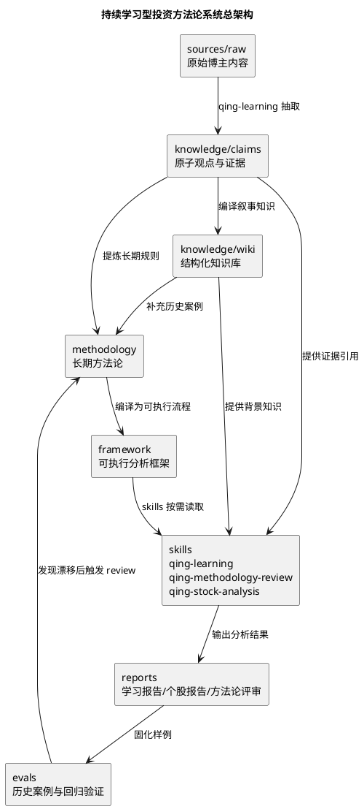
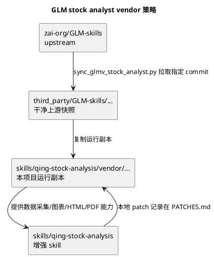
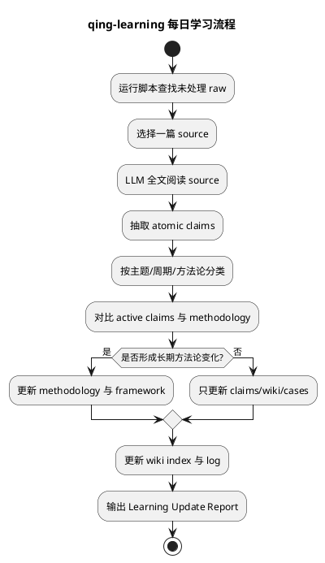
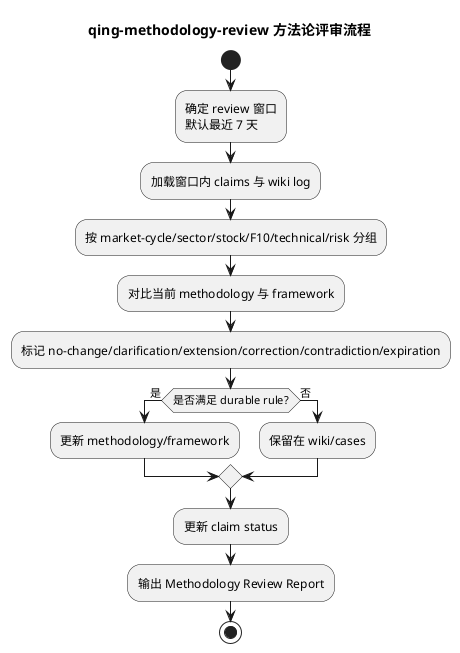
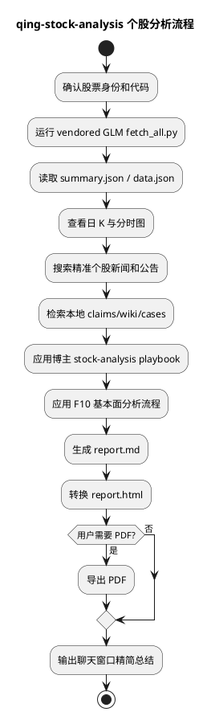

# 持续学习型投资方法论系统技术方案

> 日期：2026-05-16  
> 仓库：`learning-investment-strategies`  
> 分支：`docs/continuous-learning-system-spec`  
> 状态：用户评审稿  
> 上游个股分析底座：`zai-org/GLM-skills/skills/glmv-stock-analyst`，Apache-2.0，2026-05-16 观察到的 upstream main HEAD 为 `2ecd31c37e75671a4767342ba3a68a84c8f1b848`。  
> 本地 F10 方法论来源：`/Users/cong.zhou/Documents/quantitative/vnpy/docs/community/info/f10_financial_analysis_methodology.md`

## 1. 文档规范

本仓库的技术方案、任务文档、技能设计文档、评审文档默认使用中文书写。涉及架构图、流程图、状态图、时序图时，统一使用 PlantUML fenced block：

````markdown

```plantuml
@startuml
...
@enduml
```

````

除非用户明确要求，后续不使用 Mermaid、ASCII 框图或英文主文档作为主要交付格式。保留必要英文术语时，应在首次出现处给出中文解释或上下文。

## 2. 项目目标

本仓库要构建的是一个“持续学习型投资方法论系统”，用于长期学习某位财经博主的投资框架，将这套框架沉淀成可复用的 agent skills，并使用最新学习到的方法论进行个股分析。

它不是一个静态 skill 包，也不是简单把旧 `赛博青哥 Wiki` 搬到新仓库。它必须继承旧架构最重要的能力：持续 ingest 新内容、持续更新知识库、持续修正方法论、持续记录演化过程。

核心原则：

```text
每日博主内容 -> LLM 学习流程 -> claims/wiki/methodology 更新 -> framework 更新 -> skills 使用最新框架 -> 分析和复盘结果反哺方法论 review
```

## 3. 总体架构

系统由六层组成：

1. `sources`：原始材料层，保存不可随意改写的博主原始稿和待处理材料。
2. `knowledge/claims`：原子观点层，保存“观点 + 来源 + 日期 + 证据 + 状态”。
3. `knowledge/wiki`：叙事知识层，保留类 Obsidian Wiki 的可读知识网络。
4. `methodology`：方法论层，沉淀博主投资框架的长期结构。
5. `framework`：可执行框架层，为 skills 提供简洁、稳定、可操作的流程。
6. `skills`：agent 能力层，包括学习、方法论复盘、个股分析三个核心 skill。



## 4. 与原 `赛博青哥 Wiki` 的关系

原项目架构是：

```text
Raw -> Wiki -> schema/log -> AI 操作：ing/qry/trk/chk/sug
```

新项目不是否定这个架构，而是在它之上增加两层关键能力：

1. `claims`：把博主观点拆成可追溯的原子证据，避免 Wiki 摘要失真。
2. `framework`：把方法论编译成可执行 playbook，供 skills 稳定使用。

升级后的架构是：

```text
Raw -> Claims -> Wiki -> Methodology -> Framework -> Skills -> Evals
```

差异如下：

| 维度 | 原项目 | 新项目 |
| --- | --- | --- |
| 核心定位 | 内容知识库 + 查询/建议入口 | 持续学习型方法论系统 + skills |
| 原始材料 | `Raw/` | `sources/raw/` 与 `sources/incoming/` |
| 结构化知识 | `Wiki/` | `knowledge/wiki/` |
| 证据粒度 | 以页面摘要为主 | 增加 claim 级证据 |
| 方法论 | 散落在 Wiki 页面中 | 独立 `methodology/` 和 `framework/` |
| skills | 一个综合型 `finance-wiki` | 三个职责明确的 skill |
| 个股分析 | 简单脚本 + sug 模板 | 基于 GLM stock analyst + 博主框架 + F10 |
| 持续进化 | 有 ingest/log | ingest + claims + review + evals |

## 5. 核心目标

### 5.1 学习博主投资思路

系统必须能回答并持续更新以下问题：

- 博主如何判断市场周期和情绪阶段？
- 博主如何区分主线、支线、题材、补涨、退潮？
- 博主如何判断一只股票是核心股、跟风股、补涨股还是案例股？
- 博主什么时候选择持股、等待、减仓、加仓或放弃？
- 什么条件表示个股逻辑仍然有效？什么条件表示逻辑被证伪？
- 同一个板块或个股的观点如何随时间演变？
- 哪些历史案例支持或挑战某条方法论？

学习结果必须区分四层：

1. 原文事实：博主原始表达。
2. 原子观点：从原文抽取出的 claim。
3. 方法论解释：LLM 对 claim 的结构化归纳。
4. 分析推断：agent 在具体场景下的应用判断。

任何输出都不能把这四层混为一谈。

### 5.2 将理论整理成 skills

首版包含三个核心 skill：

1. `qing-learning`：每日或增量学习博主新内容，更新 claims、wiki、methodology、framework 和 log。
2. `qing-methodology-review`：周期性检查方法论是否发生变化、矛盾、降权或过期。
3. `qing-stock-analysis`：基于 GLM 个股分析底座、博主框架和 F10 方法论分析个股。

`qing-trade-review` 不纳入首版。等学习和个股分析闭环稳定后，再追加真实交易复盘 skill。

### 5.3 建立个股分析思路

`qing-stock-analysis` 必须整合三类证据：

1. GLM stock analyst 拉取的真实行情、K 线、资金、基本面、新闻和研报数据。
2. 本项目持续学习得到的博主框架、历史 claims、板块和个股案例。
3. F10 公司基本面分析方法论。

首版还必须迁移旧 `赛博青哥 Wiki` 的历史 UP 原始数据。迁移任务不能写死 `财经` 模块，而要递归发现旧项目中所有模块的原始稿目录，首版至少识别 `*/Raw`、`*/raw`、`*/原始数据`、`*/原文`、`*/原数据`，并保留模块路径迁移到 `sources/raw/<module>/...`。当前本机探查到旧项目实际只有一个原始稿目录：`财经/Raw`，包含 387 篇文件；因此 387 是当前验收下限，不是设计上限。迁移不包含旧 `SKILL.md`、旧脚本、旧模板、旧日志或旧 Wiki 页面，并生成 manifest 做数量校验。

个股分析优先输出“按博主框架如何理解这只股票”，而不是直接生成未经约束的买卖指令。

## 6. 非目标

首版不做以下事情：

- 不做自动交易系统。
- 不接券商交易接口。
- 不承诺收益率或预测准确率。
- 不把所有内容改成纯向量 RAG 并放弃 Wiki 工作流。
- 不用脚本写死博主未来观点。
- 不把 `sug` 或直接交易建议作为首要产品。
- 不接受没有来源追溯的一次性 LLM 摘要作为最终知识库。

## 7. 目标目录结构

```text
learning-investment-strategies/
├── README.md
├── LICENSE
├── NOTICE
├── pyproject.toml
├── docs/
│   └── superpowers/
│       ├── specs/
│       └── plans/
├── sources/
│   ├── raw/
│   │   ├── README.md
│   │   └── <module>/
│   ├── incoming/
│   │   └── README.md
│   └── processed-log.md
├── knowledge/
│   ├── claims/
│   │   ├── README.md
│   │   └── index.md
│   ├── wiki/
│   │   ├── index.md
│   │   ├── log.md
│   │   ├── 投资方法论/
│   │   ├── 市场分析/
│   │   ├── 每日复盘/
│   │   └── 博主/
│   └── cases/
│       ├── README.md
│       ├── sector-cases/
│       └── stock-cases/
├── methodology/
│   ├── index.md
│   ├── market-cycle.md
│   ├── sector-rotation.md
│   ├── stock-selection.md
│   ├── f10-fundamental-analysis.md
│   ├── technical-analysis.md
│   ├── position-risk.md
│   └── decision-flow.md
├── framework/
│   ├── README.md
│   ├── learning-update-protocol.md
│   ├── stock-analysis-playbook.md
│   ├── methodology-review-protocol.md
│   ├── contradiction-policy.md
│   └── output-contracts.md
├── skills/
│   ├── qing-learning/
│   │   ├── SKILL.md
│   │   ├── references/
│   │   └── scripts/
│   ├── qing-methodology-review/
│   │   ├── SKILL.md
│   │   ├── references/
│   │   └── scripts/
│   └── qing-stock-analysis/
│       ├── SKILL.md
│       ├── references/
│       ├── scripts/
│       └── vendor/
│           └── glmv-stock-analyst/
├── third_party/
│   └── GLM-skills/
│       └── skills/
│           └── glmv-stock-analyst/
├── migration/
│   ├── legacy-manifest.json
│   └── legacy-source-map.md
├── scripts/
│   ├── find_unprocessed.py
│   ├── lint_knowledge.py
│   ├── build_indexes.py
│   ├── extract_mentions.py
│   ├── migrate_legacy_up_raw.py
│   └── sync_glmv_stock_analyst.py
└── evals/
    ├── README.md
    ├── learning/
    ├── methodology-review/
    └── stock-analysis/
```

## 8. 第三方 GLM skill 的 vendor 策略

用户已确认：`qing-stock-analysis` 直接 vendor/copy `zai-org/GLM-skills/skills/glmv-stock-analyst` 到新仓库后改造。

### 8.1 双目录策略

使用两个目录保存 GLM 代码：

1. `third_party/GLM-skills/skills/glmv-stock-analyst/`：干净上游快照，用于追溯来源。
2. `skills/qing-stock-analysis/vendor/glmv-stock-analyst/`：运行时 vendor copy，用于本项目改造。



### 8.2 归属和许可证要求

GLM-skills 上游许可证为 Apache-2.0。vendoring 时必须：

1. 保留上游 `LICENSE` 到 `third_party/GLM-skills/LICENSE`。
2. 在根目录 `NOTICE` 中声明 vendored component。
3. 在 `third_party/GLM-skills/VENDOR.md` 写明上游 URL、commit、同步日期、许可证。
4. 在 `skills/qing-stock-analysis/vendor/glmv-stock-analyst/PATCHES.md` 记录本地改动。
5. 不把上游脚本声明为本项目原创。

## 9. 数据与知识层设计

### 9.1 `sources/raw/`

保存不可随意改写的博主原始稿。除明确标记的转写修正外，raw 文件不在 ingest 后改写。历史迁移和后续人工整理都优先使用模块目录，标准路径为 `sources/raw/<module>/YYYY-MM-DD-类型-标题.md`，例如 `sources/raw/财经/2026-05-16-早盘-标题.md`。

文件命名格式：

```text
YYYY-MM-DD-类型-标题.md
```

示例：

```text
财经/2026-05-16-早盘-标题.md
财经/2026-05-16-复盘-标题.md
财经/2026-05-16-研报-标题.md
```

建议 frontmatter：

```yaml
---
date: 2026-05-16
source_type: 早盘
source_author: 青枫浦上Q
source_url: ""
ingest_status: pending
---
```

### 9.2 `knowledge/claims/`

claim 是最小可追溯观点单元。每条 claim 必须能回答：谁在什么时候基于什么原文说了什么，它现在仍然有效还是已经过期/被修正。

首版采用 Markdown + YAML block，便于人读和 Git diff。

必填字段：

```yaml
id: claim-20260516-001
source_path: sources/raw/财经/2026-05-16-早盘-标题.md
source_date: 2026-05-16
source_type: 早盘
extracted_at: 2026-05-16T00:00:00+08:00
claim_type: market-cycle | sector-theme | stock-view | methodology | risk | technical-signal | macro | operation
subject: "国产算力"
timeframe: intraday | short-term | trend | industry | permanent
statement: "..."
evidence_quote: "..."
interpretation: "..."
confidence: high | medium | low
status: active | superseded | contradicted | expired | case-only
supersedes: []
contradicts: []
links:
  wiki_pages: []
  methodology_pages: []
  cases: []
```

字段规则：

- `statement`：概括博主观点。
- `evidence_quote`：短引用原文证据，不放长段落。
- `interpretation`：LLM 对观点的解释，必须和原文区分。
- `status`：后续新内容证伪、修正或降权时必须更新。
- 证据不足时不创建 claim。

### 9.3 `knowledge/wiki/`

Wiki 是叙事知识层，负责可读性、交叉链接和历史脉络，不负责最小粒度证据。

固定保留以下结构：

```text
投资方法论/
市场分析/
每日复盘/
博主/
数据/
index.md
log.md
```

`index.md` 是导航入口；`log.md` 是追加式操作日志。

### 9.4 `knowledge/cases/`

案例层用于教学和回归测试。每个案例必须包含：

- 当时市场状态。
- 博主原始观点。
- 关联 claims。
- 后续发生了什么。
- 该案例支持或挑战哪条方法论。
- 当前状态：仍有效、历史案例、已证伪或仅作反例。

案例分类：

```text
sector-cases/       板块和主线演化案例
stock-cases/        个股演化案例
methodology-cases/  方法论案例
```

## 10. 方法论与框架层设计

### 10.1 `methodology/`

保存长期方法论，回答“博主的投资框架是什么”。

核心页面：

| 文件 | 职责 |
| --- | --- |
| `market-cycle.md` | 市场状态、情绪周期、窗口期、冰点/高潮/退潮 |
| `sector-rotation.md` | 主线、支线、高低切、拥挤度、补涨 |
| `stock-selection.md` | 核心股、跟风股、补涨股、案例股、过期股 |
| `f10-fundamental-analysis.md` | F10 公司基本面分析方法论 |
| `technical-analysis.md` | 布林线、均线、量价、顶部/底部结构 |
| `position-risk.md` | 仓位、加减仓、止损、证伪、不做条件 |
| `decision-flow.md` | 完整决策链路 |

### 10.2 `framework/`

保存 skills 直接执行的 playbook，比 `methodology/` 更短、更流程化。

核心页面：

| 文件 | 职责 |
| --- | --- |
| `learning-update-protocol.md` | qing-learning 的每日学习流程 |
| `stock-analysis-playbook.md` | qing-stock-analysis 的个股分析流程 |
| `methodology-review-protocol.md` | qing-methodology-review 的复盘流程 |
| `contradiction-policy.md` | 矛盾、证伪、过期、降权处理规则 |
| `output-contracts.md` | 三个 skill 的输出格式契约 |

skills 默认先读 `framework/`，只有需要深挖时再读 `methodology/`、`knowledge/claims` 或 `knowledge/wiki`。

## 11. 三个核心 skills

### 11.1 共同设计原则

所有 skill 必须遵守：

1. `SKILL.md` 只写触发条件、流程和路由，不塞完整知识库。
2. 详细知识放到 `references/`、`framework/` 和 `methodology/`。
3. 脚本只做确定性辅助：找文件、校验、索引、统计、拉数据。
4. LLM 负责语义工作：阅读全文、抽取观点、判断矛盾、更新方法论。
5. 关键判断必须引用 source path、claim id 或数据文件。
6. 不确定、缺字段、缺证据时必须显式说明。
7. 不编造行情数据、财务数据或博主观点。

### 11.2 `qing-learning`

用途：每日或增量学习博主新内容。

触发示例：

```text
ing
学习今天内容
消化这篇早盘
更新博主方法论
把 Raw 里的新稿入库
```

流程：



LLM 负责：

- 全文阅读。
- claim 抽取。
- 方法论分类。
- 矛盾识别。
- 判断短期语境还是长期规则。
- 更新叙事页面和 playbook。

脚本负责：

- 列出未处理 raw。
- 检查 processed log。
- 重建索引。
- 检查断链和缺 metadata。
- 统计标的、行业和关键词提及。

输出格式：

```markdown
# Learning Update Report

## 处理来源
## 新增 Claims
## 方法论更新
## Framework 更新
## 标的/板块追踪更新
## 矛盾、过期或被替代观点
## 需要人工确认
## 变更文件
```

### 11.3 `qing-methodology-review`

用途：周期性维护和清理持续演化的方法论。

触发示例：

```text
复盘最近一周方法论变化
检查博主框架有没有变
review methodology
查矛盾和过期观点
```

流程：



durable rule：新观点满足以下任一条件，才允许进入 `framework/`：

- 博主明确把它表达为规则、框架或纪律。
- 多篇内容重复出现。
- 能解释旧观点冲突，并改善决策流程。
- 改变加仓、减仓、等待、行动或证伪等操作规则。

只保留在 wiki/cases 的情况：

- 单日市场语境。
- 单只股票点评且无方法论含义。
- 临时宏观事件。
- 证据不足或含义模糊。

输出格式：

```markdown
# Methodology Review Report

## Review 窗口
## 长期方法论变化
## 方法论澄清
## 矛盾观点
## 过期或降权 Claims
## 更新的 Framework 文件
## 遗留问题
```

### 11.4 `qing-stock-analysis`

用途：基于 GLM 个股分析底座、博主框架和 F10 方法论分析个股。

该 skill 以 `zai-org/GLM-skills/skills/glmv-stock-analyst` 为底座，不从零重写。

保留 GLM 原能力：

- 搜索确认股票代码。
- 支持 A 股、港股、美股。
- 采集行情、基本面、K 线图、分时图、资金流、研报数据。
- 要求模型直接查看生成的图像。
- 使用精准新闻搜索，过滤泛市场无关快讯。
- 生成 `report.md`、`report.html` 和可选 PDF。

新增本项目能力：

1. 读取最新 `framework/stock-analysis-playbook.md`。
2. 搜索 `knowledge/claims`、`knowledge/wiki`、`knowledge/cases` 中的个股、行业和相关概念。
3. 应用 `methodology/f10-fundamental-analysis.md`。
4. 在报告中加入博主框架定位。
5. 区分证据和解释。
6. 输出证伪条件和下一期需要跟踪的字段。
7. 数据缺失时显式降级分析。

流程：



必备报告结构：

```markdown
# 个股分析报告

## 1. 标的身份与数据覆盖
## 2. 博主框架定位
## 3. 市场与板块语境
## 4. 技术面与资金面分析
## 5. F10 基本面分析
## 6. 博主历史提及与观点演化
## 7. 多空证据表
## 8. 证伪条件
## 9. 下一期跟踪字段
## 10. 学习结论
## 11. 风险提示
```

允许输出操作含义，但必须用框架解释的方式表达：

```text
推荐表达：按博主当前框架，这只股票更接近板块核心趋势候选，但当前位置不是低风险买点。
禁止表达：现在买。
```

## 12. F10 基本面方法论接入

用户提供的 F10 文件必须纳入两个位置：

```text
methodology/f10-fundamental-analysis.md
skills/qing-stock-analysis/references/f10-financial-analysis.md
```

F10 核心原则：

```text
不能先看指标下结论。必须先识别公司类型和商业模式，再选择适用的估值和质量检查方法。
```

固定分析顺序：

```text
1. 公司类型识别。
2. 三大报表质量检查。
3. 盈利能力：毛利率、净利率、ROE。
4. 杜邦拆解：净利率、总资产周转率、权益乘数。
5. 增长质量：营收、利润、经营现金流是否同步。
6. 资产负债风险：现金、应收、存货、负债。
7. 估值方法选择：PE / PB / PEG / PS。
8. 根据行业、利率、成交额、风险偏好调整估值容忍度。
9. 输出低估 / 合理 / 高估 / 不可估。
10. 输出风险点和下一期财报跟踪字段。
```

公司类型映射：

| 公司类型 | 优先方法 |
| --- | --- |
| 稳定盈利龙头 | ROE、PE、现金流质量 |
| 资产驱动公司 | PB、ROE、资产质量 |
| 强周期公司 | PB 和周期位置，谨慎使用 PE |
| 高成长公司 | PEG、PE、研发和订单验证 |
| 亏损或利润被压低公司 | PS、毛利率、营收增速、盈利路径 |
| 博弈属性强的股票 | 财务估值仅作底线风险检查 |

缺字段规则：

如果缺少 PE/PB/PS/PEG、市值、预测增速、行业同业估值、现金流或三大报表，报告必须写明哪一部分降级，不允许假装完成了完整估值。

## 13. 持续更新规则

### 13.1 每日 ingest 规则

每篇新 raw source 的处理规则：

1. 默认逐篇处理，除非用户明确要求批量。
2. 写入任何结论前必须阅读全文。
3. 先抽取 claims，再更新 wiki/methodology/framework。
4. 即使没有长期方法论变化，也要更新短期 daily page 或相关案例。
5. 只有满足 durable rule 才更新 framework。
6. 所有写入完成后更新 log。
7. 输出需要人工 review 的模糊点。

### 13.2 矛盾处理规则

新 claim 与旧 claim 冲突时：

1. 不删除旧 claim。
2. 用 `contradicts` 或 `supersedes` 连接新旧 claim。
3. 判断冲突原因是周期、时间尺度、个股逻辑、风险定价，还是无法解释的真冲突。
4. 原因明确时更新 wiki 和 methodology。
5. 原因不明确时标记人工 review。

冲突分类：

| 类型 | 含义 |
| --- | --- |
| `timeframe-shift` | 短期看空但长期看多，或反向 |
| `cycle-shift` | 市场阶段变化导致观点变化 |
| `logic-broken` | 个股或板块逻辑被证伪 |
| `risk-repriced` | 宏观、流动性、风险偏好改变估值容忍度 |
| `true-conflict` | 暂无清晰解释，需要人工 review |

### 13.3 方法论演化规则

每次方法论更新必须记录：

- 改了什么。
- 哪些 source 或 claims 触发变化。
- 类型是新增规则、澄清、例外还是废弃。
- 哪个 framework 页面发生变化。
- 后续个股分析需要如何改变行为。

### 13.4 skill 更新规则

每日观点变化不直接修改 `SKILL.md`。`SKILL.md` 只在以下情况修改：

- workflow 变化。
- 新工具或脚本加入。
- 输出契约变化。
- eval 暴露出持续性失败模式，需要加强技能指令。

## 14. 脚本职责边界

脚本是辅助工具，不是学习大脑。

允许脚本负责：

| 脚本 | 职责 |
| --- | --- |
| `find_unprocessed.py` | 找出未记录在 `sources/processed-log.md` 的 raw 文件 |
| `build_indexes.py` | 重建 wiki、claims、cases 索引 |
| `lint_knowledge.py` | 检查 metadata、断链、缺字段、重复 claim id、日志滞后 |
| `extract_mentions.py` | 提取股票名、代码、板块、日期，供 LLM review |
| `sync_glmv_stock_analyst.py` | 同步 GLM stock analyst 到 third_party 和 vendor |

新增历史迁移脚本职责：

| 脚本 | 职责 |
| --- | --- |
| `migrate_legacy_up_raw.py` | 从旧 `赛博青哥 Wiki` 递归发现所有 UP 原始数据目录，将 `*/Raw`、`*/raw`、`*/原始数据`、`*/原文`、`*/原数据` 迁移到 `sources/raw/<module>/...`，生成 `migration/legacy-manifest.json` 与 `migration/legacy-source-map.md` |

禁止脚本负责：

- 判断新投资观点是否成为长期方法论。
- 未经 LLM review 自动改写 framework。
- 无证据生成个股最终结论。
- 写死博主未来观点。

## 15. 评估策略

因为方法论会持续进化，必须有 eval 防止漂移。

### 15.1 learning eval

输入：历史 raw source。  
期望行为：

- 提取关键 claims。
- 更新 daily wiki page。
- 判断是否发生方法论变化。
- 不把单日语境过度提升为长期 framework。

### 15.2 methodology-review eval

输入：包含已知冲突或演化的 review window。  
期望行为：

- 找出被替代或被证伪 claim。
- 判断冲突类型。
- 只在 durable rule 满足时更新 methodology/framework。

### 15.3 stock-analysis eval

输入：股票名称/代码和已知历史语境。  
期望行为：

- 使用 GLM 风格的数据与图表流程。
- 使用本地 claims 和 cases。
- 基于公司类型应用 F10。
- 缺字段时输出 degraded analysis。
- 避免无依据买卖指令。

### 15.4 v1 验收标准

首版可验收条件：

1. 新 raw 文件可被 ingest 到 claims、wiki、methodology 和 log。
2. methodology review 能识别至少一个长期方法论变化和一个非长期单日语境。
3. stock analysis 能使用 vendored GLM 脚本，并加入 F10 和博主框架章节。
4. 所有重要判断能引用 source path、claim id 或数据文件。
5. 历史 UP 原始数据迁移可重复执行；迁移器不写死财经模块，并校验旧项目当前至少 387 篇 Raw 被迁移或记录。
6. `lint_knowledge.py` 能在仓库上通过。
7. GLM vendored 来源、许可证和本地 patch 已记录。

## 16. 实施阶段

### Phase 1：仓库基础

创建目录、根文档、许可证、NOTICE 和 Superpowers 文档。

交付物：

- `README.md`
- `LICENSE`
- `NOTICE`
- `docs/superpowers/specs/...`
- `docs/superpowers/plans/...`
- 需要先存在的目录使用 `.gitkeep` 保留。

### Phase 2：历史数据迁移

从旧 `赛博青哥 Wiki` 迁移历史 UP 原始数据到新仓库。迁移范围包括旧项目内所有可发现的原始稿目录，首版识别 `*/Raw`、`*/raw`、`*/原始数据`、`*/原文`、`*/原数据`，并保存到 `sources/raw/<module>/...`。当前机器上只发现 `财经/Raw`，但实现不能绑定财经模块。不迁移旧 `SKILL.md`、旧脚本、旧模板、旧日志或旧 Wiki 页面。迁移必须生成 manifest 和 source map，保留原路径、目标路径、模块名、文件数量和校验信息。

交付物：

- `scripts/migrate_legacy_up_raw.py`
- `migration/legacy-manifest.json`
- `migration/legacy-source-map.md`
- 迁移后的 `sources/raw/<module>/*.md`

### Phase 3：知识 schema 与辅助脚本

创建 raw、claims、wiki、methodology、framework 目录规范和 lint 脚本。

交付物：

- claim schema 文档。
- processed log 格式。
- index builder。
- knowledge linter。
- mention extractor。

### Phase 4：`qing-learning`

创建每日学习 skill。

交付物：

- `skills/qing-learning/SKILL.md`
- `skills/qing-learning/references/ingest-protocol.md`
- `skills/qing-learning/references/claim-schema.md`
- `skills/qing-learning/scripts/find_unprocessed.py`
- learning eval fixtures。

### Phase 5：F10 方法论接入

复制并规范化 F10 方法论。

交付物：

- `methodology/f10-fundamental-analysis.md`
- `skills/qing-stock-analysis/references/f10-financial-analysis.md`
- 个股分析报告契约中的 F10 章节。

### Phase 6：vendor GLM stock analyst

将 `zai-org/GLM-skills/skills/glmv-stock-analyst` vendor 到仓库。

交付物：

- `third_party/GLM-skills/skills/glmv-stock-analyst/`
- `skills/qing-stock-analysis/vendor/glmv-stock-analyst/`
- `third_party/GLM-skills/VENDOR.md`
- `skills/qing-stock-analysis/vendor/glmv-stock-analyst/PATCHES.md`

### Phase 7：`qing-stock-analysis`

基于 vendored GLM workflow 创建增强版个股分析 skill。

交付物：

- `skills/qing-stock-analysis/SKILL.md`
- GLM workflow、F10 workflow、博主 framework、报告契约 references。
- 调用 vendored GLM 脚本的 wrappers。
- 至少两只股票的示例报告。

### Phase 8：`qing-methodology-review`

创建周期性方法论 review skill。

交付物：

- `skills/qing-methodology-review/SKILL.md`
- contradiction policy reference。
- review output contract。
- 方法论漂移和矛盾处理 evals。

### Phase 9：端到端回归

跑通完整链路：

```text
raw source -> learning update -> methodology review -> stock analysis -> eval/lint pass
```

交付物：

- 示例 raw fixture。
- 示例 claim 输出。
- 示例个股报告。
- 通过的 lint。
- 最终实现说明。

## 17. 固定决策

为避免后续实现歧义，首版固定以下决策：

1. `qing-stock-analysis` vendor/copy `glmv-stock-analyst`，不只调用本机已安装 skill。
2. raw ingest 由 LLM 驱动，脚本只做确定性辅助。
3. F10 方法论是个股分析的一等组成部分，不是附录。
4. 首版必须迁移旧 `赛博青哥 Wiki` 的所有 UP 原始数据；迁移器按原始数据目录递归发现模块，并通过 manifest 校验当前至少 387 个 Raw 文件。
5. 系统目标是学习和分析，不是自动交易。
6. 每日方法论变化更新 `framework/`，`SKILL.md` 仅在 workflow 或输出契约变化时更新。
7. specs、plans 和 skill 设计文档使用中文书写；图示使用 PlantUML。

## 18. 风险与缓解

| 风险 | 影响 | 缓解 |
| --- | --- | --- |
| LLM 把单日观点过度提升为长期方法论 | framework 变噪 | durable rule + methodology review eval |
| 个股分析滑向无依据买卖建议 | 使用风险升高 | 输出契约要求框架解释、风险提示、证伪条件 |
| vendored GLM 代码与上游漂移 | 维护成本增加 | `VENDOR.md`、`PATCHES.md`、sync 脚本、commit 追踪 |
| claims 太冗长 | 难以 review | 原子 claim schema 和 index |
| raw/wiki/framework 不一致 | skill 使用过期逻辑 | learning workflow 同时更新相关层并记录变更文件 |
| F10 字段缺失 | 产生假精确 | 强制 degraded-analysis 章节 |
| SKILL.md 内容过大 | 上下文膨胀 | progressive disclosure，通过 references 按需加载 |

## 19. 实施前确认清单

开始写 implementation plan 前，需要确认：

- 本仓库定位是持续学习系统，不是静态 skill bundle。
- `qing-stock-analysis` 会 vendor/copy GLM stock analyst 并在本地改造。
- F10 方法论文件会复制进 methodology 和 qing-stock-analysis references。
- 首个 implementation plan 优先做仓库基础、历史 UP 原始数据迁移、schema、`qing-learning` 和 GLM vendor。
- 脚本只辅助，不替代 LLM 的语义学习。
