# Qing-Agent 架构梳理文档

> **版本**：v2026-06-30  
> **对应仓库**：`learning-investment-strategies`  
> **最后更新**：2026-06-30（新增 provider 路由可观测性、修复大盘技术面框架注入、新增技术面信号 → UP 历史操作建议检索）  
> **目标读者**：后续维护 Qing-Agent 与监控层的开发者  

---

## 1. 定位与目标

**Qing-Agent 是 Hermes 股票监控系统的“分析大脑”**，负责把原始行情、博主知识库（claims / wiki / framework）、外部板块行情统一分析，输出 UP（青枫浦上Q）风格的投资复盘与操作建议。

核心目标：

| 目标 | 说明 |
|------|------|
| **数据诚实** | 外部数据源不可用时明确报错，不让 LLM 编造板块涨跌或价格 |
| **多源降级** | 行情/板块数据走“东财 → 新浪 → 缓存/报错”的级联 fallback |
| **结构化输出** | 市场分析强制 JSON，持仓计划带具体价格位 |
| **UP 人格一致** | 风格化层将专业草稿改写为 UP 口吻，周期自适应语气 |
| **观点连续** | 通过 `daily_state.json` 在盘中各 cron 节点间维护一致的市场判断 |

---

## 2. 整体架构

系统由**两层**组成：

1. **监控层（Monitor Layer）**：`src/qing_investment/monitor/*` + `stock_monitor.py` + Hermes cron，负责定时采集行情、跑规则、构造 Agent 上下文、触发 Agent。
2. **分析层（Agent Layer）**：`src/qing_investment/agent/*`，基于 LangGraph 构建 9 节点工作流，输出 UP 风格的分析文本。

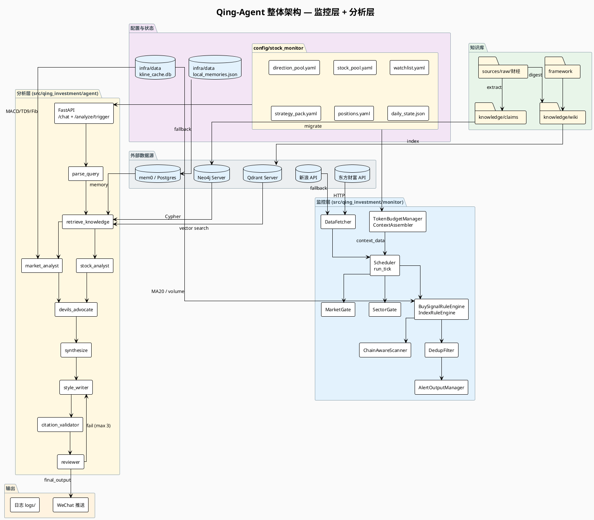

### 2.1 两层核心区别

| 维度 | 监控层（Monitor Layer） | 分析层（Agent Layer） |
|------|------------------------|----------------------|
| **职责** | 何时运行、采集数据、规则过滤、构造上下文 | 如何分析、生成 UP 风格文本 |
| **触发方式** | Hermes cron 每 N 分钟 / 排程时间 | `/analyze/trigger` 或 `/chat` |
| **是否调 LLM** | 否（纯规则） | 是（多节点 LLM pipeline） |
| **持久化** | `state.json`、`daily_state.json`、summary | `logs/qing-agent.log` |
| **核心文件** | `monitor/scheduler`, `monitor/rules`, `monitor/context` | `agent/graph/nodes.py`, `agent/main.py` |

---

## 3. 监控层架构详解

监控层解决“**什么情况下提醒用户、提醒什么内容**”。它已经从早期 `stock_monitor.py` 的 4300+ 行单体文件，重构为模块化结构。

### 3.1 监控层模块边界

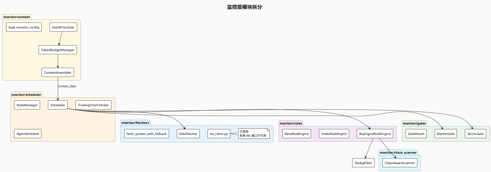

### 3.2 监控层数据流

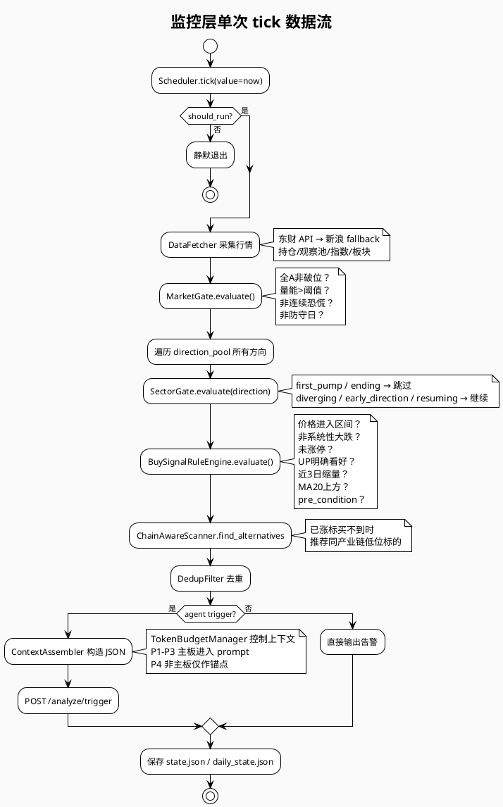

### 3.3 门控体系：四层过滤架构

监控层从早期“价格入区间 = 买入信号”改为**四层过滤**：

| 层级 | 组件 | 职责 | 当前实现位置 |
|------|------|------|-------------|
| **Layer 1** | `MarketGate` | 今天是否适合开新仓？ | `monitor/gates.py` |
| **Layer 2** | `SectorGate` | 该方向处于什么阶段？ | `monitor/gates.py` |
| **Layer 3** | `BuySignalRuleEngine` | 标的条件检查（价格/技术/claim） | `monitor/rules/__init__.py` |
| **Layer 4** | Qing-Agent `/analyze/trigger` | LLM 终判 + UP 风格化 | `agent/graph/nodes.py` |

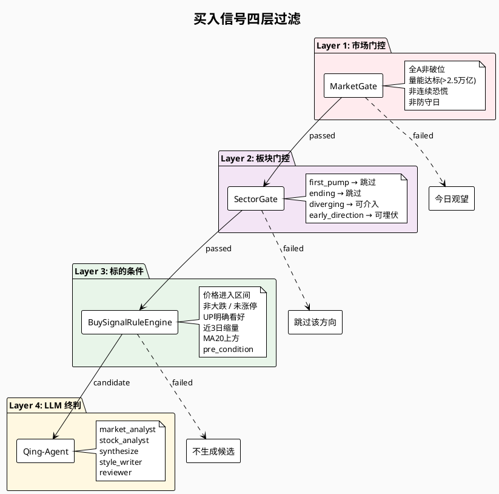

### 3.4 配置重构：direction_pool + stock_pool

原来的单层 `watchlist.yaml` 已被重构为**方向层 + 标的层**两层结构：

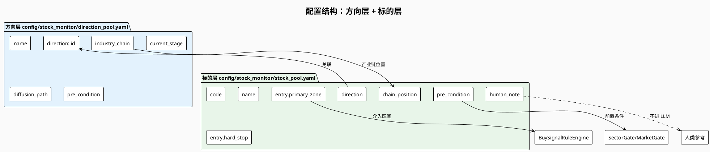

#### 字段契约（关键）

| 文件 | 字段 | 代码消费者 | LLM 可见 | 说明 |
|------|------|-----------|---------|------|
| `direction_pool.yaml` | `id` | `SectorGate`, `_build_direction_state` | ✅ | 方向键 |
| `direction_pool.yaml` | `current_stage` | `SectorGate`, `_build_direction_state` | ✅ | 阶段判断 |
| `direction_pool.yaml` | `industry_chain` | `ChainAwareScanner` | ✅ | 产业链替代标的 |
| `direction_pool.yaml` | `diffusion_path` | `_build_direction_state` | ✅ | 扩散节奏 |
| `stock_pool.yaml` | `direction` | `_build_direction_state` | ✅ | 归属方向 |
| `stock_pool.yaml` | `chain_position` | `_build_direction_state` | ✅ | 上游/中游/下游 |
| `stock_pool.yaml` | `entry.primary_zone` | `BuySignalRuleEngine` | ✅ | 介入区间 |
| `stock_pool.yaml` | `entry.hard_stop` | `_build_direction_state` | ✅ | 硬止损 |
| `stock_pool.yaml` | `pre_condition.*` | `BuySignalRuleEngine` (部分) | ✅ | 前置条件 |
| `stock_pool.yaml` | `human_note` | ❌ 不消费 | ❌ | 人类参考，被 `format_agent_json_context` 过滤 |

### 3.5 Token 预算管理

`TokenBudgetManager` 解决 watchlist 膨胀导致 LLM 超时问题：

- 总预算默认 8000 tokens
- 每只标的最多 200 tokens
- 最多 15 只标的进入 prompt
- 主板标的进入 `watchlist_summary`（可交易，P1-P3）
- 创业板/科创板（300/688 开头）自动归为 **P4-锚点**，仅作情绪参考，不可操作
- 上下文超预算时按 `memories → few_shot → sector_context → wiki → claims` 顺序裁剪

---


## 4. 分析层（Agent Layer）架构详解

分析层基于 **LangGraph** 构建有向图工作流，当前为 **9 个节点** + 1 条条件边。

### 4.1 LangGraph 节点拓扑

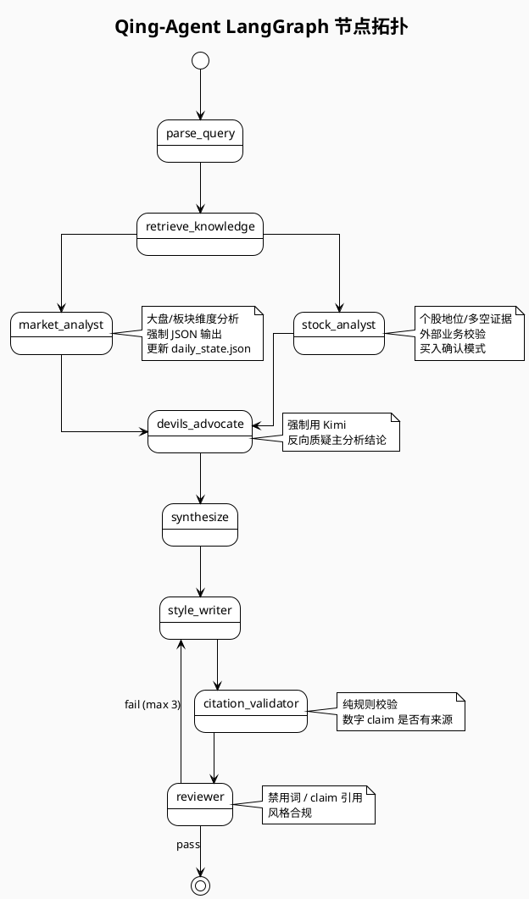

### 4.2 AgentState 定义

`AgentState` 是 LangGraph 的状态载体，字段按流程分层：

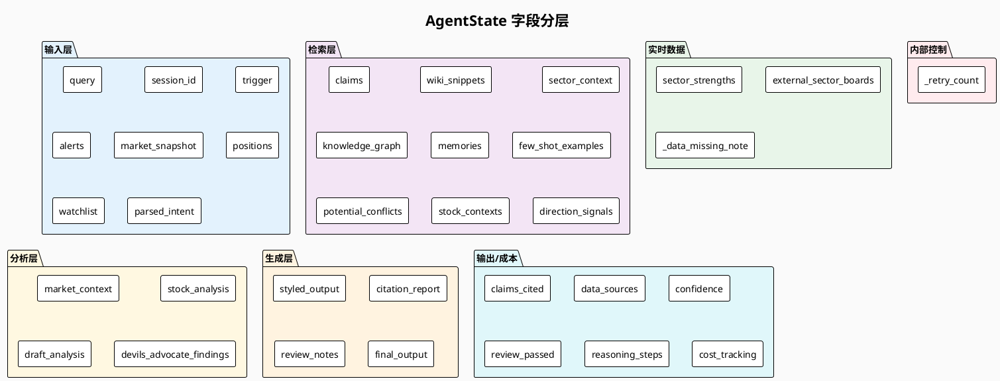

### 4.3 各节点职责

| 节点 | 文件位置 | 是否调 LLM | 核心职责 |
|------|---------|-----------|---------|
| `parse_query` | `graph/nodes.py:801` | ✅ | 从 query 提取 `stock_code` / `analysis_type` / `urgency` |
| `retrieve_knowledge` | `graph/nodes.py:1004` | ❌ | Neo4j 图遍历 + Qdrant 向量检索 + mem0 + sector_context + context_builder |
| `market_analyst` | `graph/nodes.py:1306` | ✅ | 大盘/板块分析，加载 framework + reasoning_patterns；生成 MACD/九转/斐波那契报告并检索 UP 同类历史操作建议；输出 JSON |
| `stock_analyst` | `graph/nodes.py:1694` | ✅ | 个股地位/多空证据，外部业务校验，买入确认模式；门控参考 `market_context` 中的多级别技术面结论 |
| `devils_advocate` | `graph/nodes.py:1794` | ✅ | 强制用 Kimi 反向质疑主分析结论；记录 provider 使用轨迹 |
| `synthesize` | `graph/nodes.py:1971` | ❌ | 规则拼接 market + stock 分析，注入持仓计划、参考来源、反向质疑 |
| `style_writer` | `graph/nodes.py:2106` | ✅ | 改写为 UP 口吻，周期自适应语气 |
| `citation_validator` | `graph/nodes.py:2151` | ❌ | 纯规则校验数字 claim 是否有来源标注 |
| `reviewer` | `graph/nodes.py:2245` | ✅ | 禁用词/claim 引用/风格合规检查，最多打回 3 次 |
| `review_router` | `graph/edges.py:8` | ❌ | 根据 `review_passed` 和 `_retry_count` 路由 |

### 4.4 检索层详解

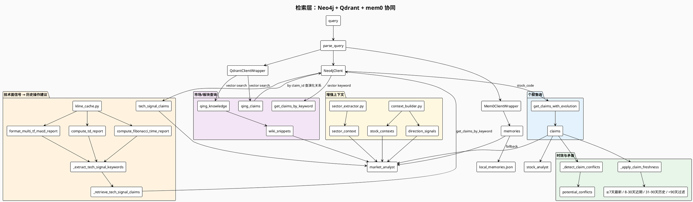

#### Claims 双索引策略

1. **向量召回**：Qdrant `qing_claims` 语义搜索，召回相关 claims
2. **图验证**：Neo4j 查召回 claims 的关联 claims（同一主题、同一股票）
3. **时效衰减**：≤7天 `[最新]` / 8-30天正常 / 31-90天 `[近期]` 降权 / >90天或 `superseded` 过滤
4. **矛盾检测**：按 `subject` 分组，检测同一组内看多 vs 看空的 active claims

#### 来源类型 Boost 排序（wiki）

| 来源前缀 | Boost |
|----------|-------|
| `framework/` | +0.15 |
| `wiki/投资方法论` | +0.10 |
| `wiki/市场分析` | +0.05 |
| `sources/raw` | +0.00 |

#### 技术面信号 → UP 历史操作建议检索

`market_analyst` 在生成 MACD/九转/斐波那契报告后，会按当前信号反向检索 UP 历史 claim：

1. **信号提取**：`_extract_tech_signal_keywords()` 从 `macd_multi_tf_report`、`td_sequential_report`、`fibonacci_time_report` 中识别 `高9`、`低9`、`MACD`、`顶背离`、`底背离`、`斐波那契` 等关键词
2. **Claim 检索**：`_retrieve_tech_signal_claims()` 对每个关键词调用 `Neo4jClient.get_claims_by_keyword()`，去重后按 `source_date` 倒序取前 15 条
3. **注入 prompt**：精简格式化为 `日期 subject: statement`，作为 `tech_signal_claims` 字段注入 `market_analyst` 的 prompt
4. **使用规则**：LLM 需将历史应对作为参考（非当前判断依据），在 `phase_reasoning` 中注明与当前信号的一致/矛盾关系，并据此调整仓位态度

### 4.5 `/analyze/trigger` vs `/chat` 核心区别

| 维度 | `/analyze/trigger` | `/chat` |
|------|-------------------|---------|
| **调用方** | Hermes cron（结构化 JSON） | 用户直接对话 |
| **流程** | 完整 LangGraph 9 节点 | 独立“检索 + 六步 prompt + LLM” |
| **记忆检索** | 不查 mem0 | 查 mem0 + Neo4j 图遍历 |
| **实时数据** | 外部传入 `market_snapshot` / `external_sector_boards` | Agent 自行获取 |
| **daily_state** | 写入 | 不写入 |
| **知识库** | Qdrant + Neo4j | Qdrant + Neo4j + mem0 |
| **输出** | `TriggerResponse`（UP 风格文本） | `ChatResponse`（reply） |

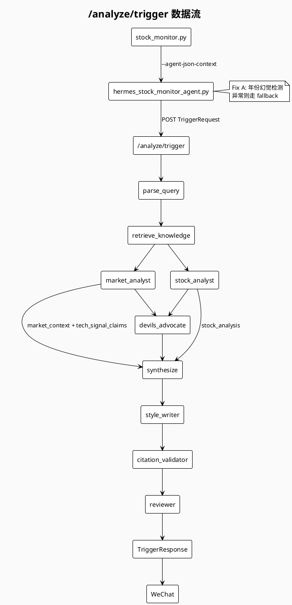

### 4.6 `/chat` 六步分析框架

`/chat` 不走 LangGraph，prompt 中的六步框架直接嵌入 `main.py`：

1. 判断市场周期和情绪阶段
2. 判断所属板块是否是当前主线
3. 判断个股地位
4. 检索博主历史提及
5. 结合技术位置和资金面判断风险收益
6. 输出证伪条件和跟踪字段

---

## 5. 本地数据存储

### 5.1 配置文件：`config/stock_monitor/`

| 文件 | 类型 | 用途 | 关键消费方 |
|------|------|------|-----------|
| `direction_pool.yaml` | YAML | 方向层：产业链图谱、阶段、扩散路径、前置条件 | `SectorGate`, `_build_direction_state`, `ChainAwareScanner` |
| `stock_pool.yaml` | YAML | 标的层：所属方向、产业链位置、介入区间、止损、前置条件 | `BuySignalRuleEngine`, `_build_direction_state` |
| `watchlist.yaml` | YAML | 传统观察池（逐步迁移到 stock_pool） | `BuySignalRuleEngine`（fallback） |
| `strategy_pack.yaml` | YAML | 市场框架、板块分组、`market_gate_rules`、排程 | `MarketGate`, `Scheduler` |
| `positions.yaml` | YAML | 持仓列表 | `BuySignalRuleEngine`, `format_agent_json_context` |
| `positions.example.yaml` | YAML | 持仓模板 | `load_monitor_config` |
| `daily_state.json` | JSON | 盘中观点连续性状态机 | `daily_state.py`, `market_analyst` |
| `state.json` | JSON | 监控层 tick 状态 | `StateManager` |
| `watchlist_hot_scores.json` | JSON | 标的 hot score 历史 | `hot_score.py` |
| `stock_sector_mapping.json` | JSON | 股票到板块映射 | `stock_sector_mapper.py` |

### 5.2 数据文件：`infra/data/`

| 文件 | 类型 | 用途 | 关键消费方 |
|------|------|------|-----------|
| `kline_cache.db` | SQLite | 指数/个股 K 线缓存，含 MACD/成交量 | `kline_cache.py`, `BuySignalRuleEngine` |
| `local_memories.json` | JSON | mem0 本地 fallback | `Mem0ClientWrapper` |
| `hot_scores_history.db` | SQLite | hot score 历史 | `hot_score.py` |
| `qdrant_local/` | 目录 | 已废弃（2026-06-16 后只连 Qdrant server） | - |

### 5.3 知识库文件

| 目录 | 类型 | 用途 | 同步目标 |
|------|------|------|---------|
| `knowledge/claims/*.yaml` | YAML | 结构化 claim | Neo4j + Qdrant `qing_claims` |
| `knowledge/wiki/` | Markdown | 博主方法论/复盘/市场分析 | Qdrant `qing_knowledge` |
| `framework/*.md` | Markdown | 交易规则、周期框架、分析 playbook | Qdrant `qing_knowledge` |
| `framework/reasoning-patterns.yaml` | YAML | 128 条推理模式 | `market_analyst`（ONNX 召回 + LLM rerank） |
| `sources/raw/财经/` | Markdown/文本 | 原始 UP 动态/复盘 | claim 提取 + wiki 消化 |

### 5.4 外部数据库

| 数据库 | 用途 | 连接配置 | 关键操作 |
|--------|------|---------|---------|
| **Neo4j** | claims 图数据库 | `settings.neo4j_uri` | `get_claims_with_evolution`, `get_related_claims`, `get_claims_by_keyword` |
| **Qdrant** | 向量检索 | `settings.qdrant_host:port` | `qing_knowledge` / `qing_claims` 语义搜索 |
| **mem0 / Postgres** | 长期记忆 | `settings.mem0_base_url` | `search`, `add`（失败 fallback 到 `local_memories.json`） |

### 5.5 数据持久化流程

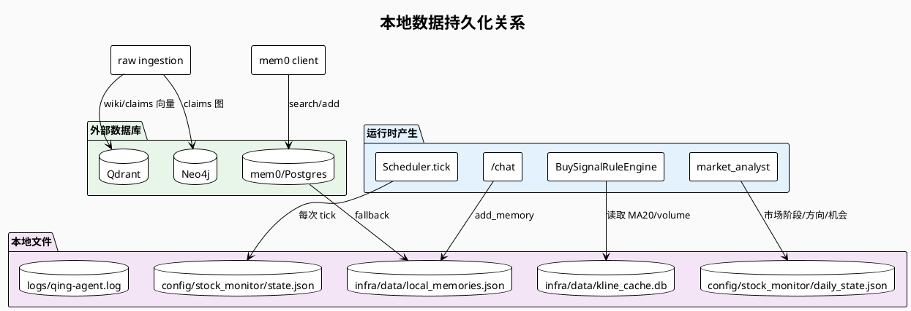

---

## 6. 指数多级别 K 线管线

### 6.1 为什么需要

UP 的大盘分析方法论核心之一是多级别顶底结构判断：

- **MACD 多级别背离/金叉/死叉** → 判断大盘顶底结构（日线/120min/90min/60min/30min）
- **神奇九转（TD Sequential）** → 判断涨跌持续时间
- **斐波那契数列** → 判断时间窗口是否到位（8/13/21/34/55 交易日）

**约束**：这些数据**只用于大盘**（上证/中证全指）顶底判断，**严禁用于个股分析**。

### 6.2 数据管线

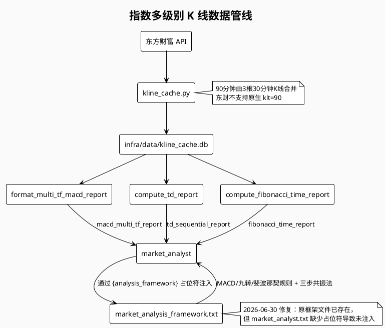

### 6.3 Prompt 注入机制

`market_analysis_framework.txt` 包含 MACD/九转/斐波那契的完整判断规则：

- **MACD 判断规则**：顶背离/底背离、金叉/死叉、多级别结构
- **九转序列规则**：高9/低9、主级正向波/逆向波、与 MACD 方向匹配
- **斐波那契规则**：8/13/21/34/55 交易日窗口、双窗口共振
- **三步共振法**：找共振 → 下结论 → 定操作，要求结论融入 `market_summary`

`market_analyst` 节点通过 `prompt_template.replace("{analysis_framework}", analysis_framework)` 将上述规则注入主 prompt。此前 `market_analyst.txt` 缺少 `{analysis_framework}` 占位符，导致框架规则未被 LLM 实际使用（2026-06-30 已修复）。

### 6.4 更新时序

| 时间 | 脚本 | 动作 |
|------|------|------|
| 06:30 | `scripts/hermes_pre_fetch_klines.py` | 预拉取全量 5 指数 × 4 时间级别 |
| 盘中每 30min | `scripts/update_index_klines_intraday.py` | 增量更新，INSERT OR REPLACE |
| 读取时 | `kline_cache.py` | 直接读 SQLite，不再重复计算 MACD |

---


## 7. 关键设计决策

### 7.1 监控层不用 LangGraph

- **决策**：监控层用线性 Pipeline + 规则引擎，不使用 LangGraph。
- **理由**：监控层是简单轮询 + 规则判断，LangGraph 过度设计；事件驱动或复杂状态流才需要图引擎。

### 7.2 LangGraph 限制在分析层

- **决策**：分析层继续使用 LangGraph。
- **理由**：分析层有循环/条件分支（reviewer 打回 style_writer），适合 LangGraph 状态机。

### 7.3 “LLM 是 writer，不是 knower”

- **原则**：数字来自 API/DB，LLM 只负责推理和写作。
- **落地**：
  - 行情、板块、K 线、成交量由代码获取并注入 prompt
  - `market_analyst` 输出强制 JSON，带具体价格位
  - `citation_validator` 校验数字 claim 是否有来源

### 7.4 数据诚实与降级

- **行情**：东财 → 新浪 → 报错
- **板块**：东财概念/行业 → 新浪 → `SectorDataUnavailableError`
- **mem0**：server → `local_memories.json` fallback
- **Qdrant**：只连 server，不再使用 embedded 本地模式（2026-06-16 移除）

### 7.5 P4 非主板标的仅作情绪锚点

- 300/688 开头股票自动归为 P4-锚点
- 不进 `watchlist_summary`，不进入机会扫描
- 只作为板块方向/情绪参考，不可操作

### 7.6 Claims 来源引用策略

- 当前策略：**移除 claim ID 引用**，只保留 `framework/` 和 `wiki/投资方法论` 作为【参考来源】。
- 原因：避免 LLM 编造 claim ID，减少幻觉。
- 相关实现：`_format_source_block()` 中 claims 引用被注释掉。

### 7.7 实时数据缺失时的降级

- 旧逻辑：`market`/`portfolio` 查询无 `external_sector_boards` 时直接拒绝。
- 新逻辑：注入 `_data_missing_note`，LLM 基于 claims 知识库继续分析，但 prompt 中明确提示时效性受限。

---

## 8. 核心代码映射

### 8.1 监控层文件职责

| 文件 | 核心类/函数 | 职责 |
|------|------------|------|
| `src/qing_investment/stock_monitor.py` | `MonitorConfig`, `MARKET_INDEXES` | 旧入口与配置 dataclass |
| `src/qing_investment/monitor/scheduler/__init__.py` | `Scheduler`, `StateManager`, `TradingTimeChecker`, `AgentSchedule` | 调度、状态持久化、交易时段判断 |
| `src/qing_investment/monitor/fetchers/__init__.py` | `DataFetcher`, `fetch_quotes_with_fallback` | 行情获取与降级 |
| `src/qing_investment/monitor/rules/__init__.py` | `BuySignalRuleEngine`, `IndexRuleEngine` | 规则引擎 |
| `src/qing_investment/monitor/gates.py` | `MarketGate`, `SectorGate`, `GateResult` | 市场/板块门控 |
| `src/qing_investment/monitor/chain_scanner.py` | `ChainAwareScanner`, `ChainAlternative` | 产业链替代标的 |
| `src/qing_investment/monitor/context/__init__.py` | `TokenBudgetManager`, `StockPrioritizer`, `format_agent_json_context`, `load_monitor_config` | Token 预算、上下文组装、配置加载 |
| `src/qing_investment/monitor/deduplicator.py` | `DedupEngine` | 告警去重 |
| `src/qing_investment/monitor/cache.py` | `AuctionCache` | 竞价量缓存 |

### 8.2 分析层文件职责

| 文件 | 核心类/函数 | 职责 |
|------|------------|------|
| `src/qing_investment/agent/main.py` | FastAPI app, `/chat`, `/analyze/trigger`, `/memory/add` | API 入口 |
| `src/qing_investment/agent/graph/builder.py` | `build_graph()` | LangGraph 构建 |
| `src/qing_investment/agent/graph/state.py` | `AgentState` | 状态定义 |
| `src/qing_investment/agent/graph/nodes.py` | `parse_query`, `retrieve_knowledge`, `market_analyst`, `stock_analyst`, `devils_advocate`, `synthesize`, `style_writer`, `citation_validator`, `reviewer`；新增 `_safe_llm_invoke` provider 轨迹记录、`_extract_tech_signal_keywords`、`_retrieve_tech_signal_claims` | 节点实现 |
| `src/qing_investment/agent/graph/edges.py` | `review_router` | 条件边 |
| `src/qing_investment/agent/base.py` | `Agent`, `AgentOutput`, `LLMProtocol` | Agent 基类 |
| `src/qing_investment/agent/agents/devils_advocate.py` | `DevilsAdvocateAgent` | 反向质疑 Agent |
| `src/qing_investment/agent/tools/neo4j_client.py` | `Neo4jClient` | claims 图查询 |
| `src/qing_investment/agent/tools/qdrant_client.py` | `QdrantClientWrapper` | 向量检索 |
| `src/qing_investment/agent/tools/mem0_client.py` | `Mem0ClientWrapper` | 记忆层 |
| `src/qing_investment/agent/tools/llm_client.py` | `get_llm_client`, `get_embedding_model`, `reset_provider_usage`, `record_provider_usage`, `format_provider_usage_summary` | LLM/embedding 客户端；按请求追踪 provider 使用轨迹（本地 Kimi Code CLI / 远端 API） |
| `src/qing_investment/agent/tools/daily_state.py` | `load_daily_state`, `save_daily_state`, `update_market_stage` | 盘中状态 |
| `src/qing_investment/agent/tools/context_builder.py` | `build_market_context` | 增强上下文 |
| `src/qing_investment/agent/validators/citation_validator.py` | `CitationValidator` | 引用校验 |
| `src/qing_investment/kline_cache.py` | `format_multi_tf_macd_report`, `compute_td_report`, `compute_fibonacci_time_report` | K 线缓存与计算 |

### 8.3 Prompt 文件

| 文件 | 用途 |
|------|------|
| `src/qing_investment/agent/prompts/system/market_analyst.txt` | 市场分析主 prompt |
| `src/qing_investment/agent/prompts/system/stock_analyst.txt` | 个股分析 prompt（含买入确认模式） |
| `src/qing_investment/agent/prompts/system/style_writer.txt` | UP 风格化 prompt |
| `src/qing_investment/agent/prompts/system/reviewer.txt` | 事实核查 prompt |
| `src/qing_investment/agent/prompts/system/market_analysis_framework.txt` | 11 项分析框架片段；含 MACD/九转/斐波那契判断规则与 UP 历史操作建议使用规则；通过 `{analysis_framework}` 占位符动态注入 `market_analyst.txt` |
| `src/qing_investment/agent/prompts/system/pattern_router.txt` | reasoning patterns rerank prompt |
| `src/qing_investment/agent/prompts/system/trader_mindset.txt` | 交易者人格注入 |

---

## 9. 近期重要变更（截至 2026-06-26）

### 9.1 配置重构落地

- `direction_pool.yaml` 与 `stock_pool.yaml` 已正式上线，每日随复盘更新。
- `watchlist.yaml` 保留旧配置作为 fallback，新标的优先写入 `stock_pool.yaml`。
- `BuySignalRuleEngine` 已支持从 `stock_pool[].entry.primary_zone` 读取介入区间，从 `pre_condition` 读取前置条件。

### 9.2 门控体系上线

- `MarketGate` / `SectorGate` 已接入 `BuySignalRuleEngine._evaluate_with_gates()`。
- 市场门控未通过时，当日不生成买入候选。
- 板块处于 `first_pump` / `ending` 时，该方向所有标的被跳过。

### 9.3 ChainAwareScanner 替代手动 fallback

- 原 `stock_pool[].fallback` 已废弃。
- 买入候选自动附加 `chain_alternatives`，推荐同产业链还没涨的环节标的。

### 9.4 daily_state 观点连续性

- `market_analyst` 节点每次运行后自动更新 `daily_state.json`。
- 记录市场阶段、方向优先级、持仓态度、活跃机会、盘中叙事。
- 跨 cron 节点共享观点上下文。

### 9.5 监控层 WebSocket 尝试已禁用

- 2026-06-15 注释掉 `ws_client.py` 调用。
- 原因：中国免费行情供应商均不提供公开 WS 接口，实际数据由 HTTP fetcher 获取。
- 未来如需实时推送，需接入付费供应商（Wind / Tushare Pro）。

### 9.6 日志系统

- `logs/qing-agent.log` 按天轮转，保留 30 天。
- 关键节点（market_analyst、style_writer、reviewer 等）记录结构化日志。
- 环境变量 `QING_AGENT_LOG_LEVEL=DEBUG` 开启模块级 DEBUG。

### 9.7 Provider 路由可观测性（2026-06-30）

- `llm_client.py` 新增 `contextvars` 隔离的 provider 使用轨迹跟踪：
  - `reset_provider_usage()` / `record_provider_usage()` / `format_provider_usage_summary()`
- `_safe_llm_invoke()` 与 `devils_advocate()` 每次调用本地 Kimi Code CLI 或远端 provider 时记录 attempt / success / failed / fallback。
- `/analyze/trigger` 请求结束时把轨迹摘要写入日志，并拼接到 `final_output` 顶部（如 `[模型路由：最终走 远端 deepseek]`）。
- `hermes_stock_monitor_agent.py` fallback 路径输出 `[模型路由：未调用 Qing-Agent，走本地规则 fallback]`。

### 9.8 大盘技术面分析框架注入修复（2026-06-30）

- `market_analysis_framework.txt` 已存在 MACD/九转/斐波那契判断规则，但 `market_analyst.txt` 此前缺少 `{analysis_framework}` 占位符，导致框架未实际进入 prompt。
- 修复：在 `market_analyst.txt` 的 JSON 输出格式前插入 `{analysis_framework}`。
- `market_analyst` 现在会按规则整合多级别 MACD、九转序列、斐波那契窗口，并把结论融入 `market_summary` / `phase_reasoning`。

### 9.9 技术面信号 → UP 历史操作建议检索（2026-06-30）

- `market_analyst` 生成 MACD/九转/斐波那契报告后，自动提取信号关键词（高9、低9、MACD、顶背离、底背离、斐波那契等）。
- 通过 `Neo4jClient.get_claims_by_keyword()` 检索 UP 在同类信号下的历史 claim，去重后按日期倒序取前 15 条。
- 检索结果以 `tech_signal_claims` 字段注入 `market_analyst` prompt，作为"UP 历史如何应对"的参考，要求 LLM 在 `phase_reasoning` 中注明一致/矛盾关系。
- `stock_analyst` 买入确认模式的三层门控新增要求：必须参考 `market_context.phase_reasoning` 中的多级别技术面结论。

---

## 10. 已知缺口与后续方向

### 10.1 当前缺口

| 缺口 | 说明 | 影响 |
|------|------|------|
| **Reviewer 不做数值事实核查** | 只检查禁用词、claim ID、来源段落 | 价格/时间幻觉仍可能发生 |
| **MarketGate 防守日规则简化** | `_check_not_defense_day` 恒返回 true | 银行保险领涨日未自动拦截 |
| **pre_condition 部分 LLM 化** | `sector_diverged` / `market_actionable` 目前主要注入 LLM | 缺少结构化实时判断 |
| **事件驱动未实现** | WebSocket 已禁用 | 仍依赖轮询，可能错过盘中突变 |

### 10.2 后续方向

1. **增强 MarketGate 实时判断**：接入板块轮动数据，自动识别防守日。
2. **结构化 pre_condition 检查**：把 `sector_diverged` 从 LLM 判断改为规则 + LLM 混合判断。
3. **Reviewer 数值校验**：对输出中的价格、涨跌幅、日期做抽取并与输入数据比对。
4. **事件驱动升级**：接入付费 WS 行情源，替换 HTTP 轮询。
5. **MCP Server**：将 Neo4j/Qdrant 查询封装为 MCP tools，供 Hermes 直接调用。

---

## 11. 附录

### 11.1 相关文档索引

| 文档 | 路径 | 说明 |
|------|------|------|
| Qing-Agent 技术设计 | `docs/qing-agent-technical-design.md` | 旧版完整描述 |
| Config 重构方案 | `docs/qing-agent-config-reconstruction.md` | direction_pool + stock_pool 设计 |
| 架构优化方案 | `docs/design/architecture-optimization-plan.md` | 竞品分析 + 6 层目标架构 |
| 数据契约 | `docs/config-data-contract.md` | 配置字段 LLM 可见性 |
| 监控技术设计 | `docs/hermes-stock-monitor-technical-design.md` | 监控层旧版设计 |
| 幻觉防御层 | `docs/hallucination-defense-layers.md` | Fix A/B/C 设计 |
| MCP 接入计划 | `docs/mcp-qdrant-neo4j-plan.md` | MCP Server 设计 |

### 11.2 启动与调试

```bash
# 启动 Qing-Agent 服务
cd /home/ubuntu/learning-investment-strategies
python -m src.qing_investment.agent.main

# 健康检查
curl http://localhost:8000/health

# 触发分析
curl -X POST http://localhost:8000/analyze/trigger \
  -H "Content-Type: application/json" \
  -d @config/stock_monitor/sample_trigger.json

# 查看日志
tail -f logs/qing-agent.log

# 开启 DEBUG
QING_AGENT_LOG_LEVEL=DEBUG python -m src.qing_investment.agent.main
```

### 11.3 测试

```bash
# 监控层测试
pytest tests/test_monitor_gates.py
pytest tests/test_chain_scanner.py
pytest tests/test_buy_signal_e2e.py

# Agent 层测试
pytest src/qing_investment/agent/tests/
```

---

*本文档为 Qing-Agent 与监控层的统一架构梳理，后续代码重构或新增模块时请同步更新本节。*
